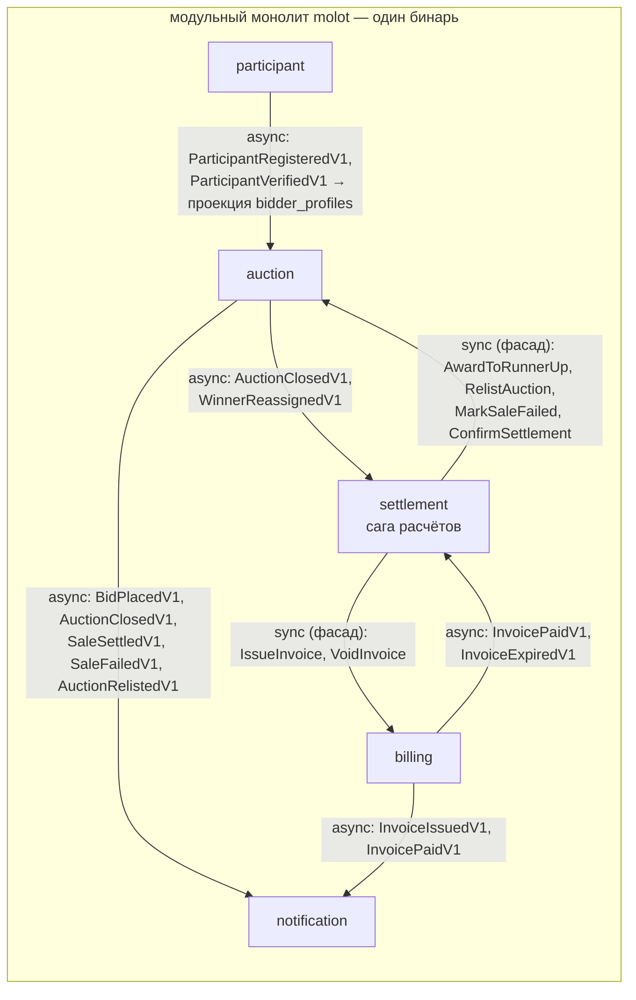
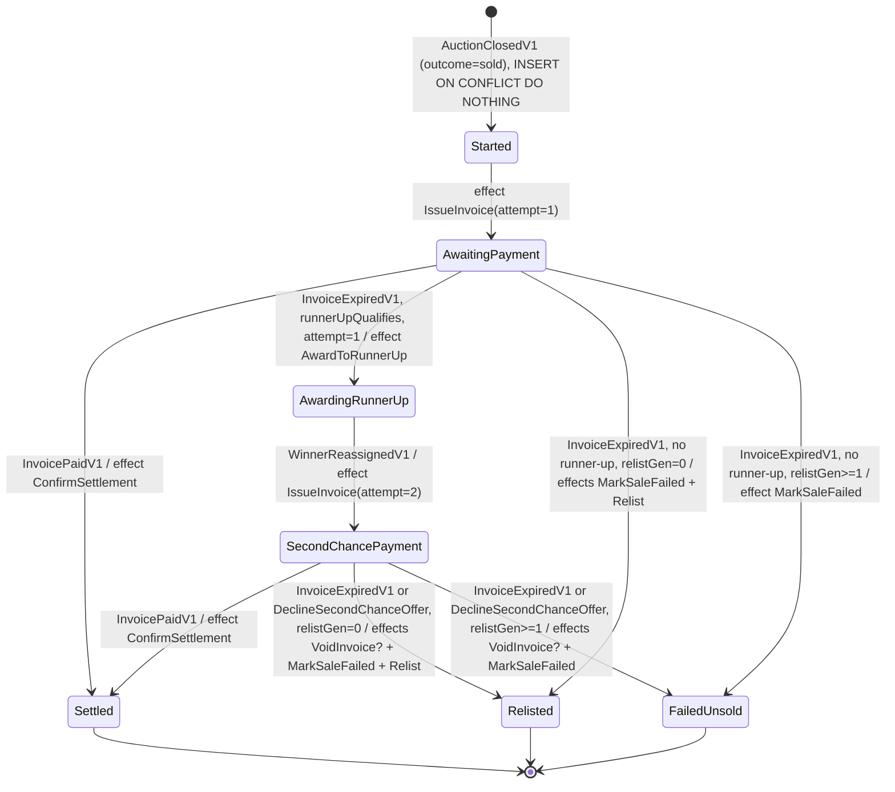

# Molot — финальная архитектура

> Эталонная аукционная площадка: модульный монолит, Go 1.26, DDD + CQRS + Clean Architecture, event-driven.
> Документ — рабочий: по нему пишется код. Ревьюится против контракта `docs/BOOK_AUDIT.md` §10 (55 пунктов).
> Решения с трейдоффами вынесены в `docs/adr/0001–0005`. Проза — по-русски, идентификаторы — English.

Бюджеты каталога: **15 команд** (≤20), **8 запросов** (8–12), **13 интеграционных событий V1** (≤15), **15 доменных событий**.

---

## 1. Context map

5 bounded contexts из event-storming потока «лот → ставки → молоток → счёт → оплата/компенсация» (артефакт — `docs/event-storming.md`, правило 51).

| Контекст | Ответственность | Агрегат |
|---|---|---|
| **auction** | Жизненный цикл лота: выставление, ставки, анти-снайпинг, резерв, закрытие по времени, отмена, перевыставление, переназначение победителя. Витрины: каталог, карточка, дашборд продавца | `Auction` |
| **participant** | Регистрация и верификация участников | `Participant` |
| **billing** | Счёт победителю (цена + комиссия), оплата через PSP c refund-компенсацией, void, таймаут оплаты | `Invoice` |
| **settlement** | Process manager (сага) расчётов после молотка: счёт → оплата / таймаут / отказ от оферты → second-chance ИЛИ relist | `Settlement` (состояние саги) |
| **notification** | События → фейковые email. **Без domain/app-слоёв** — тривиальный event→template→send, исключение по правилу 33, пересматривается при росте логики | — |

Связи: только через `internal/<ctx>/events/` (async, transactional outbox) либо consumer-defined интерфейс → фасад `service/` (sync — только команды саги: шаг саги синхронен по природе, саге нужен результат до перехода состояния; трейдофф — ADR-0004). Импорт чужого `domain/` и чужих таблиц — fail CI (`go-cleanarch` + ревью схем).



Литмус границы (правило 52): «изменить шаг ставки» — только auction; «изменить комиссию» — только billing; «новая ветка компенсации» — только settlement. `internal/common` — ноль бизнес-типов; `Money` осознанно продублирован в доменах auction и billing (правило 4).

**Платформенная валюта.** Единая валюта площадки — env `PLATFORM_CURRENCY` (валидируется на старте). `Money` остаётся мультивалютно-корректным VO (guard `ErrCurrencyMismatch`), но листинг принимает только платформенную валюту (`ErrUnsupportedCurrency` при `ListAuction`). Это делает корректными односложные агрегации (`SellerDashboard.SoldTotalMinor` + одно поле `Currency`). Мультивалютность — будущее за конфигом, кода «на будущее» нет.

---

## 2. Агрегаты и инварианты

### 2.1 auction.Auction — центральный агрегат

**Граница и ставки.** Полная история ставок входит в *границу согласованности* (пишется в той же транзакции), но НЕ загружается в память. Инварианты ставки зависят только от «головы» состояния, поэтому агрегат хранит **топ-2 ставки денормализованно** (`leadingBid`, `runnerUpBid` — runner-up нужен саге для second-chance). `PlaceBid` возвращает принятую `Bid`; репозиторий аппендит её в `auction_bids` (append-only, никогда UPDATE) и обновляет snapshot-строку `auctions` c `version+1`. Optimistic locking по одной маленькой строке; чтение истории — забота read-стороны. Подробно — ADR-0003.

**Снапшот политик при листинге.** Порог верификации (`verifyAbove`) и анти-снайп-политика снимаются с платформенного конфига **один раз при листинге** и хранятся в агрегате: правила лота детерминированы во времени, смена платформенной политики не меняет идущие аукционы. `PlaceBid` не читает конфиг.

```go
// internal/auction/domain/auction/auction.go — все поля unexported (правило 8)
type Auction struct {
    id               AuctionID
    seller           SellerID
    lot              Lot              // title, description
    startPrice       Money
    increment        Money            // >0, та же валюта
    reserve          ReservePrice     // VO; IsZero() = резерва нет; скрыт от событий/API
    window           BiddingWindow    // startsAt, endsAt, originalEndsAt
    antiSnipe        AntiSnipePolicy  // СНАПШОТ при листинге: window, extension, maxExtensions
    verifyAbove      Money            // СНАПШОТ verified_bid_threshold при листинге
    extensionsUsed   int
    status           Status           // StatusListed | StatusCancelled | StatusClosed
    outcome          Outcome          // zero | OutcomeSold | OutcomeNotSold (только при Closed)
    leadingBid       Bid              // zero value = ставок нет (никаких *указателей-флагов)
    runnerUpBid      Bid
    winnerReassigned bool             // маркер «AwardToRunnerUp уже совершён» — для идемпотентности фасада
    bidCount         int
    relistOf         AuctionID        // zero = оригинал
    relistGen        int              // 0 | 1 — cap авто-перевыставлений
    settled          bool             // расчёт завершён (успехом или провалом)
    version          int64            // маппинг; инкрементирует адаптер
    events           []DomainEvent    // recorded domain events
}

// ListingRules — платформенная политика, снапшотится фабрикой на агрегат
type ListingRules struct{ currency Currency; verifyAbove Money; antiSnipe AntiSnipePolicy }

func New(id AuctionID, seller SellerID, lot Lot, startPrice, increment Money,
    reserve ReservePrice, window BiddingWindow, rules ListingRules,
    now time.Time) (*Auction, error)            // отклоняет каждый пустой/нулевой аргумент; ErrUnsupportedCurrency
func RelistedFrom(orig *Auction, newID AuctionID, window BiddingWindow,
    now time.Time) (*Auction, error)            // фабрика relist: gen+1; ErrRelistLimitReached; наследует rules оригинала

// behavior — guard инварианта + переход атомарно, языком бизнеса (правило 9)
func (a *Auction) PlaceBid(b Bidder, amount Money, now time.Time) (Bid, error)
func (a *Auction) Cancel(by SellerID, now time.Time) error               // до первой ставки, только продавец
func (a *Auction) Close(now time.Time) (ClosingResult, error)            // исход + runnerUpQualifies
func (a *Auction) AwardToRunnerUp(now time.Time) (Bid, error)            // сага; см. семантику ниже
func (a *Auction) ConfirmSettlement(now time.Time) error                 // сага: оплачен
func (a *Auction) FailSale(reason FailureReason, now time.Time) error    // сага: расчёт провален → NotSold

// предикаты и типизированные геттеры для маппинга; сеттеров и GetX нет
func (a Auction) IsOpenAt(now time.Time) bool
func (a Auction) HasBids() bool
func (a Auction) ID() AuctionID; func (a Auction) Status() Status; func (a Auction) EndsAt() time.Time; ...
func (a *Auction) PullDomainEvents() []DomainEvent                       // дренаж для адаптера

// stateless-вычисления — простые функции пакета (правило 13), отделены от мутаций
func MinimalNextBid(a Auction) Money                      // startPrice либо leading+increment
func CanSellerManageAuction(s SellerID, a Auction) error  // авторизация = чистая доменная функция
```

**PlaceBid — каскад guard-ов (порядок фиксирован):** `ErrAuctionNotOpen` (status==Listed && window.IsOpenAt(now)) → `ErrSellerCannotBid` → `ErrLeaderCannotOutbidSelf` → `ErrCurrencyMismatch` → `ErrBidBelowMinimum` (amount < MinimalNextBid) → `ErrVerificationRequired` (!b.Verified() && amount.GTE(a.verifyAbove)). Затем атомарно: runnerUp=leading; leading=новая Bid; bidCount++; **анти-снайп**: если `antiSnipe.TriggersAt(now, window.EndsAt())` и `extensionsUsed < maxExtensions` → `window = window.ExtendedBy(extension)`, `extensionsUsed++`, record(`AuctionExtended`); record(`BidPlaced{bid, outbid BidderID, newEndsAt}`).

**Close:** guard `ErrAlreadyClosed` / `ErrAuctionCancelled` / `ErrBiddingStillOpen` (now < endsAt — критично: ставка могла продлить окно). Исход: нет ставок ИЛИ `!reserve.IsZero() && !reserve.MetBy(leadingBid.Amount())` → NotSold; иначе Sold. `ClosingResult{Outcome, Winner Bid, RunnerUp Bid, RunnerUpQualifies bool}`, где `RunnerUpQualifies = !runnerUp.IsZero() && reserve.MetBy(runnerUp.Amount())` — резерв остаётся скрыт, сага получает готовый bool.

**Фасадные команды саги — семантика и идемпотентность (контракт для ретраев саги).** Повторный вызов любой фасадной команды неизбежен (redelivery, ретрай после краха между effect и commit саги). Правило: **«уже в целевом состоянии» = no-op**: behavior-метод возвращает специфичный sentinel, command handler маппит его в `nil`. Доменное событие записывается **только** транзакцией, реально совершившей переход, — дублей в outbox не возникает by construction.

| Метод | Guard-ы | Переход | Sentinel «уже сделано» → nil |
|---|---|---|---|
| `AwardToRunnerUp(now)` | status==Closed && outcome==Sold && !settled; runnerUp не zero (`ErrNoQualifyingRunnerUp`) | `leadingBid = runnerUpBid; runnerUpBid = Bid{}; winnerReassigned = true`; record `WinnerReassigned{NewWinner}` — ровно один раз | `ErrWinnerAlreadyReassigned` (по флагу `winnerReassigned`) |
| `ConfirmSettlement(now)` | status==Closed && outcome==Sold | `settled = true`; record `SaleSettled` | `ErrAlreadySettled` |
| `FailSale(reason, now)` | status==Closed; не settled-успехом (`ErrAlreadySettled`) | `outcome = NotSold; settled = true`; record `SaleFailed{Reason}` | `ErrSaleAlreadyFailed` (outcome уже NotSold) |
| `RelistAuction` (handler) | новый агрегат через `RelistedFrom` | `repo.Add` c детерминированным newID | конфликт по id ИЛИ по `UNIQUE(relist_of)` → `ErrAlreadyRelisted` |

**Value objects:** `Money{amount int64; currency Currency}` — `NewMoney(int64, Currency) (Money, error)`, `Add/GTE` с `ErrCurrencyMismatch`, `MulBasisPoints(bp int) Money`, `IsZero()`; `ReservePrice` — `MetBy(Money) bool`; `BiddingWindow` — `IsOpenAt`, `ExtendedBy`, guard end>start; `AntiSnipePolicy` — `NewAntiSnipePolicy(window, ext time.Duration, max int) (AntiSnipePolicy, error)`; `Bid{id BidID, bidder BidderID, amount Money, placedAt time.Time}` с `IsZero()`; `Bidder{id BidderID, verified bool}` (из проекции bidder_profiles); `FailureReason` — закрытый enum (`ReasonPaymentTimeout | ReasonSecondChanceDeclined`); `Status`/`Outcome` — закрытые enum c `NewStatusFromString(s) (Status, error)`, `IsZero()`, `switch` с `panic` в `default` (правило 12). Typed ID — uuid-обёртки с валидирующим конструктором.

**Sentinel-ошибки (экспортируемые package-level, правило 10):** `ErrAuctionNotOpen, ErrSellerCannotBid, ErrLeaderCannotOutbidSelf, ErrBidBelowMinimum, ErrVerificationRequired, ErrCurrencyMismatch, ErrUnsupportedCurrency, ErrAuctionHasBids, ErrAlreadyClosed, ErrAuctionCancelled, ErrBiddingStillOpen, ErrNoQualifyingRunnerUp, ErrWinnerAlreadyReassigned, ErrRelistLimitReached, ErrAlreadyRelisted, ErrAlreadySettled, ErrSaleAlreadyFailed` + `NotFoundError{AuctionID}`.

**Repository (интерфейс в доменном пакете, минимальный; правила 15–16, 21, 23):**
```go
type Repository interface {
    Add(ctx context.Context, a *Auction) error                          // идемпотентен: ON CONFLICT (id) DO NOTHING + UNIQUE(relist_of)
    Get(ctx context.Context, id AuctionID) (*Auction, error)            // карточка публична — actor не нужен (задокументировано)
    Update(ctx context.Context, id AuctionID, actor Actor,              // acting user — явный типизированный параметр
        updateFn func(ctx context.Context, a *Auction) (*Auction, error)) error
    UpdateAsSystem(ctx context.Context, id AuctionID,                   // имя кричит о security-импликации: воркер закрытия и сага
        updateFn func(ctx context.Context, a *Auction) (*Auction, error)) error
}
```

### 2.2 billing.Invoice

```go
type Invoice struct {
    id InvoiceID; auctionID AuctionID; debtor BidderID
    hammer, commission, total Money        // total = hammer + commission
    status InvoiceStatus                   // Pending | Paid | Expired | Voided
    dueAt time.Time; attempt Attempt       // 1 | 2 (second chance)
    pspRef PaymentReference                // zero до оплаты
    version int64; events []DomainEvent
}
func NewInvoice(id InvoiceID, auctionID AuctionID, debtor BidderID, hammer Money,
    cp CommissionPolicy, pt PaymentTerm, attempt Attempt, now time.Time) (*Invoice, error)
func (i *Invoice) MarkPaid(ref PaymentReference, now time.Time) error  // см. таблицу guard-ов
func (i *Invoice) Expire(now time.Time) error                          // воркер
func (i *Invoice) Void(now time.Time) error                            // сага: runner-up отклонил оферту
func (i Invoice) IsPending() bool; func (i Invoice) DueAt() time.Time; ...
func CommissionFor(hammer Money, p CommissionPolicy) Money             // stateless-функция, отдельно от мутации
func CanDebtorAccessInvoice(actor BidderID, i Invoice) error           // → ForbiddenInvoiceAccessError{Actor, Debtor}
```

Guard-таблица переходов Invoice (исчерпывающая; «→ nil» = вызывающий трактует как no-op):

| Метод \ текущий статус | Pending | Paid | Expired | Voided |
|---|---|---|---|---|
| `MarkPaid` | → Paid (дедлайн enforced воркером; оплата до commit Expire — валидна, grace = poll interval) | `ErrInvoiceAlreadyPaid` | `ErrInvoiceExpired` | `ErrInvoiceVoided` |
| `Expire` | now>=dueAt → Expired; иначе `ErrInvoiceNotDue` | `ErrInvoiceAlreadyPaid` → nil (воркер) | `ErrInvoiceAlreadyExpired` → nil | `ErrInvoiceVoided` → nil |
| `Void` | → Voided | `ErrInvoiceAlreadyPaid` (НЕ no-op: оплата победила, decline должен упасть) | `ErrInvoiceAlreadyExpired` → nil | `ErrInvoiceAlreadyVoided` → nil |

`InvoiceVoided` — доменное событие, **в интеграционное не маппится**: void инициируется самой сагой синхронно, других потребителей нет (задокументированное отсутствие кода «на будущее»).

**Анти-enumeration (осознанный выбор, фикс утечки 403).** Чужой инвойс неотличим от несуществующего: ownership — в WHERE-предикате чтений (`WHERE id=$1 AND debtor_id=$2` → `sql.ErrNoRows` → `NotFoundError`); на Update-пути repo выполняет `CanDebtorAccessInvoice` внутри транзакции (правило 22) и **маппит её нарушение в `NotFoundError{InvoiceID}`** на выходе — наружу всегда 404 `invoice-not-found`. Реальный `ForbiddenInvoiceAccessError{Actor, Debtor}` логируется декоратором на WARN — аудит-трейл сохраняется.

Repo: `Add / Get(ctx, id, actor BidderID) / Update(ctx, id, actor BidderID, updateFn) / UpdateAsSystem(ctx, id, updateFn)` + `PendingDueBefore(ctx, t time.Time, limit int) ([]InvoiceID, error)` для воркера (generic-выборка, не per-use-case). `Add` идемпотентен: `UNIQUE(auction_id, attempt)`; конфликт → адаптер возвращает `ErrInvoiceAlreadyIssued`, handler `IssueInvoice` маппит в nil. Sentinels: `ErrInvoiceAlreadyPaid, ErrInvoiceExpired, ErrInvoiceAlreadyExpired, ErrInvoiceVoided, ErrInvoiceAlreadyVoided, ErrInvoiceNotDue, ErrInvoiceAlreadyIssued, ErrPaymentDeclined, ErrPSPUnavailable` + `NotFoundError`. VO: свой `Money` (дубль — осознанно), `CommissionPolicy{basisPoints int}`, `PaymentTerm{d time.Duration}`, `Attempt`, `InvoiceStatus`, `PaymentReference`.

### 2.3 participant.Participant

```go
type Participant struct { id ParticipantID; email EmailAddress; displayName string; status Status; version int64; events []DomainEvent }
func Register(id ParticipantID, email EmailAddress, name string) (*Participant, error)
func (p *Participant) Verify(now time.Time) error      // ErrAlreadyVerified
func (p Participant) IsVerified() bool
```
`EmailAddress` — VO с валидацией. Repo: `Add / Get(ctx,id) / Update(ctx, id, actor Actor, updateFn)`; верификация — системная операция оператора: команда `VerifyParticipant` зовёт `UpdateAsOperations` (без fake users, правило 23). Sentinels: `ErrAlreadyVerified, ErrEmailTaken` + `NotFoundError`.

### 2.4 settlement.Settlement — состояние process manager (богатый агрегат)

```go
type Settlement struct {
    auctionID AuctionID
    state State            // Started | AwaitingPayment | AwardingRunnerUp | SecondChancePayment | Settled | Relisted | FailedUnsold
    winner BidderID; hammer Money
    runnerUp BidderID; runnerUpAmount Money; runnerUpQualifies bool
    relistGen int; attempt int; invoiceID InvoiceID
    failureReason FailureReason     // zero | PaymentTimeout | SecondChanceDeclined
    version int64
}

func Start(c Closing) (*Settlement, error)   // из AuctionClosedV1 (outcome=sold); state = Started

// decide-фаза: ЧИСТЫЕ функции решения (value receiver, без мутаций) — что делать из текущего состояния
func (s Settlement) DecideOnInvoiceIssue() (bool, error)                          // нужен ли IssueInvoice attempt=1
func (s Settlement) DecideOnPaymentTimeout(inv InvoiceID) (NextStep, error)
func (s Settlement) DecideOnDecline(actor BidderID) (NextStep, error)             // guard CanRunnerUpDecline внутри
func CanRunnerUpDecline(actor BidderID, s Settlement) error                       // авторизация — чистая доменная функция

// commit-фаза: переходы с guard-ами (pointer receiver)
func (s *Settlement) InvoiceIssued(inv InvoiceID) error                           // Started → AwaitingPayment
func (s *Settlement) PaymentReceived(inv InvoiceID) error                         // → Settled
func (s *Settlement) RunnerUpAwarded(newWinner BidderID, price Money) error       // → AwardingRunnerUp фиксируется здесь же / fast-forward, см. §6
func (s *Settlement) SecondChanceInvoiceIssued(inv InvoiceID) error               // AwardingRunnerUp → SecondChancePayment
func (s *Settlement) ApplyNextStep(step NextStep, reason FailureReason) error     // → AwardingRunnerUp | Relisted | FailedUnsold

type NextStep int // StepAwardRunnerUp | StepRelist | StepFailUnsold — закрытый enum, default паникует
```

Решение компенсации (`NextStep`) — **в домене саги**: `StepAwardRunnerUp` (attempt==1 && runnerUpQualifies), `StepRelist` (иначе, relistGen==0), `StepFailUnsold` (relistGen>=1). Любой невалидный переход = `ErrUnexpectedTransition`; хендлер трактует как дубликат at-least-once и ack-ает. У каждого repo-интерфейса всех контекстов — **in-memory реализация** (map значений + RWMutex, чтение возвращает адрес копии; правило 20), domain-first разработка против неё.

---

## 3. Каталог команд и запросов

### Команды — 15 (бюджет ≤20), имена — бизнес-язык, struct несёт доменные типы (правило 26)

**auction** (`internal/auction/app/command/`, один use case = один файл):
```go
type ListAuction struct { AuctionID auction.AuctionID; Seller auction.SellerID; Lot auction.Lot;
    StartPrice, Increment auction.Money; Reserve auction.ReservePrice; Window auction.BiddingWindow }
    // ListingRules (валюта+порог+снайп) хендлер берёт из конфига и СНАПШОТИТ на агрегат при New
type PlaceBid struct { AuctionID auction.AuctionID; BidID auction.BidID; Bidder auction.BidderID; Amount auction.Money }
type CancelAuction struct { AuctionID auction.AuctionID; Seller auction.SellerID }
type CloseAuction struct { AuctionID auction.AuctionID }                          // только воркер (UpdateAsSystem)
type AwardToRunnerUp struct { AuctionID auction.AuctionID }                       // только сага (фасад); ErrWinnerAlreadyReassigned → nil
type RelistAuction struct { OriginalID, NewID auction.AuctionID; Window auction.BiddingWindow } // только сага; ErrAlreadyRelisted → nil
type MarkSaleFailed struct { AuctionID auction.AuctionID; Reason auction.FailureReason }        // только сага; ErrSaleAlreadyFailed → nil
type ConfirmSettlement struct { AuctionID auction.AuctionID }                     // только сага; ErrAlreadySettled → nil
```
Каждая — `<Name>Handler{ repo, profiles, clock }` c `Handle(ctx context.Context, cmd <Name>) error`, бизнес-данных не возвращает. `PlaceBidHandler` держит `bidderProfiles` (consumer-side `interface{ BidderByID(ctx, BidderID) (auction.Bidder, error) }` — локальная проекция); оркестрация: `repo.Update(ctx, cmd.AuctionID, actor, func(ctx, a) { bid, err := a.PlaceBid(bidder, cmd.Amount, h.clock.Now()); ... })` — ни одного бизнес-`if` в хендлере (правило 14).

**participant**: `RegisterParticipant{ID, Email, DisplayName}`, `VerifyParticipant{ID}` (operations-роль).

**billing**:
- `IssueInvoice{InvoiceID, AuctionID, Debtor, Hammer, Attempt}` — только сага; InvoiceID детерминированный `uuid.NewSHA1(nsInvoice, auctionID+":"+attempt)`; повтор → `ErrInvoiceAlreadyIssued` → nil (UNIQUE(auction_id, attempt) — вторая линия).
- `PayInvoice{InvoiceID, Payer}` — протокол PSP см. §3.1.
- `ExpireInvoice{InvoiceID}` — воркер, UpdateAsSystem; already-* sentinels → nil.
- `VoidInvoice{InvoiceID}` — только сага (фасад), UpdateAsSystem; `ErrInvoiceAlreadyVoided`/`ErrInvoiceAlreadyExpired` → nil; `ErrInvoiceAlreadyPaid` — пробрасывается (оплата победила).

**settlement**: `DeclineSecondChanceOffer{AuctionID settlement.AuctionID; Actor settlement.BidderID}` — runner-up отклоняет оферту, не дожидаясь payment term; ведёт в ту же доменную развилку `NextStep` с `reason=SecondChanceDeclined` (§6.4).

### 3.1 PayInvoice — протокол PSP с refund-компенсацией (фикс гонки charged-but-expired)

Consumer-side порт в `billing/app`:
```go
type paymentGateway interface {
    Charge(ctx context.Context, key ChargeKey, amount Money) (PaymentReference, error) // ChargeKey = InvoiceID (idempotency key PSP)
    Refund(ctx context.Context, key ChargeKey) error                                   // идемпотентен; без charge по ключу — no-op
}
```
Контракт PSP: `Charge` с тем же `IdempotencyKey` повторно денег не списывает (возвращает тот же ref); `Refund(key)` возвращает деньги по charge с этим ключом, при отсутствии charge — no-op. Фейковый адаптер `psp_fake.go` соблюдает контракт; исход управляется env `PSP_MODE=success|decline|flaky` (flaky: первый Charge — сетевая ошибка, повтор — успех) — для component-тестов ретраев и refund-веток.

Шаги хендлера (Charge — **строго до транзакции**):
1. **Pre-check (read, без лока):** инвойс по `(id, payer)` — нет строки → 404 `invoice-not-found` (анти-enumeration). Статус:
   - `Paid` → **204, идемпотентный успех** (ретрай после успешной оплаты; Refund НЕ вызывается — критично);
   - `Expired | Voided` → идемпотентный `Refund(invoiceID)` (страховка после краха между Charge и Refund) → 409 `invoice-no-longer-payable`;
   - `Pending` → шаг 2.
2. **Charge(invoiceID, total):** сетевая ошибка → `ErrPSPUnavailable` → **502 `psp-unavailable`** (клиент ретраит; повторный Charge идемпотентен); decline → `ErrPaymentDeclined` → 409 `payment-declined`.
3. **`repo.Update(ctx, id, payer, fn{ inv.MarkPaid(ref, now) })`** — FOR UPDATE; коммит публикует `InvoicePaidV1` через outbox.
4. **Гонка проиграна** (`ErrInvoiceExpired`/`ErrInvoiceVoided` из MarkPaid — инвойс истёк/void между Charge и локом): компенсация `Refund(invoiceID)` → 409 `invoice-no-longer-payable`. `ErrInvoiceAlreadyPaid` (конкурентный дубль того же платежа, тот же idempotency key) → 204.

Crash-seams PayInvoice: упал после Charge до MarkPaid → ретрай: статус Pending → Charge повторно (no-op по ключу) → MarkPaid. Упал между обнаружением гонки и Refund → ретрай попадает в ветку 1-Expired/Voided и **повторяет Refund**. Упал после MarkPaid-commit до ответа → ретрай: ветка 1-Paid → 204. Деньги не теряются и не задваиваются ни в одном шве; каждая ветка — component-тест (PSP_MODE).

### Запросы — 8 (бюджет 8–12), read-only, UI-shaped результаты

```go
// auction/app/query/
ActiveAuctionsCatalog{Page, PageSize int}                 → CatalogPage     // проекция catalog_items
AuctionCard{AuctionID auction.AuctionID}                  → AuctionCardView // прямое чтение write-таблиц (задокументировано)
BidHistory{AuctionID auction.AuctionID; Page, PageSize}   → BidHistoryPage  // auction_bids
SellerDashboard{Seller auction.SellerID}                  → DashboardView   // проекция seller_dashboard_items; только сам продавец
// participant/app/query/
ParticipantProfile{ID participant.ParticipantID}          → ProfileView
// billing/app/query/
InvoiceByID{InvoiceID billing.InvoiceID; Actor billing.BidderID}  → InvoiceView // ownership в WHERE → 404
PendingInvoicesOfBidder{Bidder billing.BidderID}          → []InvoiceView   // ownership в WHERE-предикате
// settlement/app/query/ (ops)
SettlementStatus{AuctionID settlement.AuctionID}          → SettlementView  // + failureReason
```

`app.Application{Commands struct{...}; Queries struct{...}}` на контекст — единый каталог, собирается в `service/NewService` (composition root), инжектится во все ports; ports зовут ТОЛЬКО `app.Commands.X.Handle(...)` (правило 28). Каждый хендлер обёрнут generic-декораторами из `internal/common/decorator`: `ApplyCommandDecorators[C](h, logger, metrics, tracer)` — slog-лог каждого Handle (defer на named err), RED-метрики, span `commands/PlaceBid` (правило 29). Ошибки app — slug-errors `errs.SlugError{Slug string; Kind ErrorKind}` (kinds: IncorrectInput/Forbidden/NotFound/Conflict/Unavailable/Unknown), транслируются в HTTP одним хелпером в ports (правило 30). Конструкторы хендлеров паникуют на nil-зависимость.

---

## 4. События

### 4.1 Domain events — 15 (богатые, внутренние, в `domain/`)

auction (9): `AuctionListed`, `BidPlaced{Bid, Outbid Bid, NewEndsAt, Extended bool}`, `AuctionExtended`, `AuctionCancelled`, `AuctionClosed{Result ClosingResult}`, `WinnerReassigned{NewWinner Bid}`, `AuctionRelisted{NewID}`, `SaleSettled`, `SaleFailed{Reason}`.
billing (4): `InvoiceIssued`, `InvoicePaid`, `InvoiceExpired`, `InvoiceVoided` (в интеграционное не маппится — нет потребителей).
participant (2): `ParticipantRegistered`, `ParticipantVerified`.

Записываются behavior-методами (`a.record(e)`), дренируются `PullDomainEvents()`; адаптер repo маппит их в интеграционные (`adapters/events_mapper.go`) и публикует в outbox **в той же транзакции**, что и persist агрегата.

### 4.2 Интеграционные события — 13 (бюджет ≤15)

Плоские, версионированные, только примитивы + `time.Time`, JSON-теги; схемы append-only (V2 + dual-publish при изменении).

**`internal/auction/events`** (topic `auction-events`, 8):
```go
type AuctionListedV1 struct { EventID string `json:"event_id"`; AuctionID string `json:"auction_id"`; SellerID string `json:"seller_id"`;
    Title string `json:"title"`; StartPriceMinor int64 `json:"start_price_minor"`; Currency string `json:"currency"`;
    StartsAt, EndsAt time.Time; RelistGeneration int `json:"relist_generation"`; OccurredAt time.Time `json:"occurred_at"` }
type BidPlacedV1 struct { EventID, AuctionID, BidID, BidderID string; AmountMinor int64; Currency string;
    BidCount int; Extended bool; NewEndsAt time.Time; OutbidBidderID string /* "" если первая */; OccurredAt time.Time }
type AuctionCancelledV1 struct { EventID, AuctionID, SellerID string; OccurredAt time.Time }
type AuctionClosedV1 struct { EventID, AuctionID, SellerID string; Outcome string /* sold|not_sold */;
    WinnerID string; HammerPriceMinor int64; Currency string;
    RunnerUpBidderID string; RunnerUpAmountMinor int64; RunnerUpQualifies bool;  // резервная цена НЕ публикуется — только готовый bool
    RelistGeneration int; OccurredAt time.Time }
type WinnerReassignedV1 struct { EventID, AuctionID, NewWinnerID string; PriceMinor int64; Currency string; OccurredAt time.Time }
type AuctionRelistedV1 struct { EventID, OriginalAuctionID, NewAuctionID string; StartsAt, EndsAt, OccurredAt time.Time }
type SaleSettledV1  struct { EventID, AuctionID, WinnerID string; OccurredAt time.Time }
type SaleFailedV1   struct { EventID, AuctionID string; Reason string /* payment_timeout|second_chance_declined */; OccurredAt time.Time }
```
**`internal/billing/events`** (topic `billing-events`, 3): `InvoiceIssuedV1{EventID, InvoiceID, AuctionID, DebtorID, HammerMinor, CommissionMinor, TotalMinor, Currency, DueAt, Attempt, OccurredAt}`, `InvoicePaidV1{EventID, InvoiceID, AuctionID, DebtorID, TotalMinor, Currency, OccurredAt}`, `InvoiceExpiredV1{EventID, InvoiceID, AuctionID, DebtorID, Attempt, OccurredAt}`.
**`internal/participant/events`** (topic `participant-events`, 2): `ParticipantRegisteredV1{EventID, ParticipantID, Email, DisplayName, OccurredAt}`, `ParticipantVerifiedV1{EventID, ParticipantID, OccurredAt}`.

### 4.3 Матрица publish/subscribe

| Событие | Издатель | Подписчики |
|---|---|---|
| ParticipantRegistered/VerifiedV1 | participant | auction (проекция bidder_profiles, upsert), notification (recipients) |
| AuctionListedV1 | auction | auction (проекции catalog/dashboard), notification (relist-gen>0 → продавцу) |
| BidPlacedV1 | auction | auction (проекции), notification (OutbidNotice прежнему лидеру) |
| AuctionCancelledV1 | auction | auction (проекции) |
| AuctionClosedV1 | auction | settlement (старт саги, только outcome=sold), auction (проекции), notification (won/закрыт) |
| WinnerReassignedV1 | auction | settlement (шаг саги), notification (SecondChanceOffer) |
| AuctionRelistedV1 | auction | auction (проекции) |
| SaleSettledV1 / SaleFailedV1 | auction | auction (dashboard), notification (продавцу; SaleFailed — с reason) |
| InvoiceIssuedV1 | billing | notification (PaymentDueNotice) |
| InvoicePaidV1 | billing | settlement, notification (квитанция) |
| InvoiceExpiredV1 | billing | settlement |

### 4.4 Инфраструктура шины

Watermill + watermill-sql v4 (Postgres = transactional outbox: `DefaultPostgreSQLSchema`, `DefaultPostgreSQLOffsetsAdapter`, `InitializeSchema: true`); Kafka позже = замена publisher/subscriber + forwarder, контракты/хендлеры не меняются (ADR-0002). **Один `message.Router` на бинарь**, middleware строго: `CorrelationID → PoisonQueue(deadLetterPublisher, "events.dead_letter") → Retry{MaxRetries:5, exp backoff ≤30s} → Recoverer`; `plugin.SignalsHandler`; `router.Run(ctx)` в errgroup; readiness гейтится на `router.Running()`. Хендлеры типизированы: `cqrs.NewEventProcessorWithConfig` + `cqrs.NewEventHandler("OnAuctionClosedStartSettlement", func(ctx, e *auctionevents.AuctionClosedV1) error)`, `cqrs.JSONMarshaler{GenerateName: cqrs.StructName}`; контекст регистрирует свои через `svc.RegisterEventHandlers(processor)`.

**Каждый хендлер идемпотентен** (at-least-once), натуральные ключи — в таблице §6.6; идемпотентность каждого покрыта тестом повторной доставки.

---

## 5. Read models

Query-сторона; интерфейс объявляет query-хендлер рядом с собой, источник прозрачен (правило 32 — всё на той же Postgres, вынос в отдельный store позже за теми же интерфейсами).

```go
// auction/app/query/active_catalog.go
type ActiveCatalogReadModel interface {
    ActiveAuctions(ctx context.Context, page, pageSize int) (CatalogPage, error)
}
type CatalogPage struct { Items []CatalogItem; Total int; Page int }
type CatalogItem struct {            // UI-shaped: не домен, не OpenAPI, не DB-модель
    AuctionID, Title, SellerID string
    CurrentPriceMinor, MinimalNextBidMinor int64; Currency string
    BidCount int; EndsAt time.Time
    EndingSoon bool }                // ВЫЧИСЛЯЕТСЯ адаптером на чтении: ends_at - now() < 5 мин.
                                     // В проекции НЕ хранится — протухает между событиями.

// auction/app/query/auction_card.go
type AuctionCardReadModel interface { AuctionCard(ctx context.Context, id auction.AuctionID) (AuctionCardView, error) }
type AuctionCardView struct { AuctionID, Title, Description, SellerID, Status, Outcome string
    StartPriceMinor, CurrentPriceMinor, MinimalNextBidMinor, IncrementMinor int64; Currency string
    HasReserve bool /* сам резерв скрыт всегда */; StartsAt, EndsAt time.Time
    ExtensionsUsed, BidCount int; LeaderID string; RecentBids []BidView }
type BidView struct { BidID, BidderDisplayName string; AmountMinor int64; PlacedAt time.Time } // join c bidder_profiles

// auction/app/query/bid_history.go
type BidHistoryReadModel interface { Bids(ctx context.Context, id auction.AuctionID, page, pageSize int) (BidHistoryPage, error) }

// auction/app/query/seller_dashboard.go
type SellerDashboardReadModel interface { Dashboard(ctx context.Context, seller auction.SellerID) (DashboardView, error) }
type DashboardView struct { Items []DashboardItem; ActiveCount int; SoldTotalMinor int64; Currency string }
    // SoldTotalMinor корректен: валюта платформы едина (PLATFORM_CURRENCY, guard при листинге)
type DashboardItem struct { AuctionID, Title, Status, Outcome, SettlementStatus string
    HammerPriceMinor int64; BidCount int; EndsAt time.Time }

// billing/app/query/invoice.go
type InvoiceReadModel interface {
    InvoiceByID(ctx context.Context, id billing.InvoiceID, actor billing.BidderID) (InvoiceView, error)
        // ownership в WHERE (id AND debtor_id); чужой/несуществующий неразличимы → NotFoundError → 404
    PendingOfBidder(ctx context.Context, b billing.BidderID) ([]InvoiceView, error) // ownership в WHERE-предикате
}
type InvoiceView struct { InvoiceID, AuctionID, Status string; HammerMinor, CommissionMinor, TotalMinor int64
    Currency string; DueAt time.Time; Attempt int }
```

**Источники — осознанно два подхода:**
1. **Проекции** (eventually consistent, питаются подпиской на СВОИ интеграционные события): `catalog_items` (AuctionListedV1 → insert; BidPlacedV1 → цена/счётчик/ends_at с монотонным guard-ом `WHERE excluded.bid_count > catalog_items.bid_count`; Closed/Cancelled → delete) и `seller_dashboard_items` (Listed/Closed/SaleSettled/SaleFailed/Relisted/Cancelled → upsert статусов).
2. **Прямое чтение write-таблиц** тем же Postgres-адаптером: AuctionCard и BidHistory (append-only `auction_bids` — уже идеальная история), InvoiceView, ProfileView, SettlementView. Правило аудита: «не всякому query нужен read model».

Один адаптер `adapters/auction_pg_read_models.go` реализует все интерфейсы query-стороны контекста. Notification — не read model: проекций витрин не держит, шлёт по данным события (+display_name из мини-проекции `recipients`, питаемой ParticipantRegisteredV1).

---

## 6. Сага расчётов (settlement)

**Тип:** оркестрация на событиях; команды другим контекстам — синхронные consumer-defined интерфейсы `auctionGateway`, `billingGateway` в `settlement/app`, адаптеры зовут фасады `auctionsvc.Facade` / `billingsvc.Facade` (правило 38; трейдофф sync vs all-async — ADR-0004).

### 6.1 Протокол шага: decide → effect → commit (фикс транзакционной структуры)

Gateway-вызовы **никогда не выполняются внутри updateFn**: иначе чужая транзакция коммитится под row-lock-ом settlement, а side effect опережает состояние саги без зафиксированного протокола. Каждый event-handler и команда саги следует трём фазам:

1. **decide** — короткое чтение `Settlement` (Start: `INSERT ... ON CONFLICT (auction_id) DO NOTHING` + load); чистая доменная функция решения (`DecideOnPaymentTimeout` и т.п.). «Состояние уже за пределами этого шага» → `ErrUnexpectedTransition` → **ack (nil)**: дубликат at-least-once.
2. **effect** — sync gateway-вызовы **вне какой-либо транзакции settlement**. Каждый фасад идемпотентен («уже в целевом состоянии» → no-op, §2.1/§2.2): повтор после краха безопасен. Ошибка инфраструктуры → err → Watermill Retry → dead-letter.
3. **commit** — `repo.Update(ctx, auctionID, updateFn)` c `SELECT ... FOR UPDATE` + version: переход state-machine. Version-конфликт или `ErrUnexpectedTransition` (конкурентный дубль уже закоммитил) → ack: эффекты были идемпотентны.

Инвариант протокола: **любой crash между фазами восстанавливается redelivery-ем** — decide увидит незавершённое состояние, effect повторится как no-op, commit довершит переход. Интеграционные события чужих контекстов публикуются только транзакциями, реально совершившими переход (§2.1), поэтому повторные effects не порождают дублей в outbox.

### 6.2 Диаграмма состояний



`Relisted` — терминал: новый аукцион получит СВОЮ сагу при закрытии. Cap авто-перевыставлений = 1 (`relistGen`). `VoidInvoice?` — только на пути Decline (на пути InvoiceExpired инвойс уже Expired).

### 6.3 Полная таблица переходов (из | вход | действие-в-фазах | в)

| Из | Вход (событие/команда) | decide | effect (идемпотентные фасады) | commit → | Примечание |
|---|---|---|---|---|---|
| — | AuctionClosedV1 (sold) | INSERT ON CONFLICT DO NOTHING; load; state==Started → продолжить | `IssueInvoice(auctionID, winner, hammer, attempt=1)`, id=uuidv5(auctionID+":1") | AwaitingPayment | state дальше Started → ack (дубликат) |
| Started | (redelivery AuctionClosedV1) | continuation: тот же путь | IssueInvoice → ErrInvoiceAlreadyIssued → no-op | AwaitingPayment | фикс «крах после INSERT до IssueInvoice» |
| AwaitingPayment | InvoicePaidV1 | PaymentReceived-guard | `ConfirmSettlement(auctionID)` | Settled | повтор: ErrAlreadySettled → no-op |
| AwaitingPayment | InvoiceExpiredV1 | DecideOnPaymentTimeout → StepAwardRunnerUp | `AwardToRunnerUp(auctionID)` | AwardingRunnerUp | attempt==1 && runnerUpQualifies |
| AwaitingPayment | InvoiceExpiredV1 | → StepRelist | `MarkSaleFailed(reason=payment_timeout)`; `Relist(newID=uuidv5(nsRelist, auctionID), window из RELIST_DELAY/RELIST_DURATION)` | Relisted | крах между двумя effects → ретрай повторяет оба: FailSale→no-op, Relist→no-op (id + UNIQUE(relist_of)) |
| AwaitingPayment | InvoiceExpiredV1 | → StepFailUnsold | `MarkSaleFailed(reason=payment_timeout)` | FailedUnsold | relistGen>=1 |
| AwardingRunnerUp | WinnerReassignedV1 | guard state | `IssueInvoice(debtor=runnerUp, hammer=runnerUpAmount, attempt=2)`, id=uuidv5(auctionID+":2") | SecondChancePayment | |
| **AwaitingPayment** | **WinnerReassignedV1** | **fast-forward**: событие — доказательство, что AwardToRunnerUp совершён (крах до commit AwardingRunnerUp) | IssueInvoice(attempt=2) | SecondChancePayment | без fast-forward событие ack-ается и сага зависает в AwardingRunnerUp после redelivery таймаута |
| SecondChancePayment | InvoicePaidV1 | guard | `ConfirmSettlement` | Settled | |
| SecondChancePayment | InvoiceExpiredV1 | DecideOnPaymentTimeout (attempt=2 ⇒ только Relist/FailUnsold) | как выше, reason=payment_timeout | Relisted / FailedUnsold | |
| SecondChancePayment | DeclineSecondChanceOffer (HTTP) | CanRunnerUpDecline(actor); DecideOnDecline | `VoidInvoice(invoiceID)`; затем MarkSaleFailed(reason=second_chance_declined) [+ Relist] | Relisted / FailedUnsold | VoidInvoice→ErrInvoiceAlreadyPaid ⇒ 409 offer-already-paid, сага не трогается |
| Settled/Relisted/FailedUnsold | любой вход | ErrUnexpectedTransition | — | — | ack (события) / 204 либо 409 (decline, §6.4) |

Особый шов: InvoicePaidV1/InvoiceExpiredV1 при state==Started (теоретически: payment term короче redelivery) — decide трактует Started с совпадающим детерминированным invoiceID attempt=1 как AwaitingPayment (fast-forward по тому же принципу: событие доказывает, что IssueInvoice совершён).

### 6.4 DeclineSecondChanceOffer — команда саги (graft Д3)

`POST /api/auctions/{auctionID}/second-chance/decline`, актор — текущий runner-up-должник. Фазы: decide (`CanRunnerUpDecline`: state==SecondChancePayment && actor==runnerUp, иначе 403 `not-offer-recipient`) → effect-1 `VoidInvoice(invoiceID attempt=2)` (Paid → 409 `offer-already-paid`: оплата победила, сагу довершит InvoicePaidV1) → effect-2 по `DecideOnDecline` (StepRelist/StepFailUnsold, `reason=second_chance_declined`) → commit. Гонка с expiry-воркером доброкачественна: оба пути ведут в ту же развилку; проигравший commit получает `ErrUnexpectedTransition` → re-read: state ∈ {Relisted, FailedUnsold} → **204 (идемпотентный успех — исход совпадает)**; state==Settled → 409 `offer-already-paid`. HTTP-ретрай пользователя = то же continuation.

### 6.5 Таймауты

Единственный таймер — срок оплаты счёта, и он принадлежит billing (инвариант счёта), не саге: `due_at = issued_at + PAYMENT_TERM`; сага не спит и не хранит дедлайнов — только реагирует. Гонка «Paid vs Expired» разрешается на агрегате Invoice (row lock + guard-таблица §2.2): проигравший путь не публикует событие — сага никогда не видит оба сигнала.

### 6.6 Таблица «хендлер → натуральный ключ идемпотентности»

| Хендлер | Натуральный ключ | Механизм |
|---|---|---|
| settlement.OnAuctionClosedStartSettlement | auction_id | PK settlements + state guard Started |
| settlement.OnInvoicePaid / OnInvoiceExpired / OnWinnerReassigned | auction_id + state | state-machine guard (`ErrUnexpectedTransition` → ack) |
| settlement.DeclineSecondChanceOffer | auction_id + state | то же + идемпотентный 204 |
| billing.IssueInvoice (фасад) | (auction_id, attempt) | детерминированный uuidv5 + UNIQUE(auction_id, attempt) |
| auction.AwardToRunnerUp / ConfirmSettlement / MarkSaleFailed (фасады) | auction_id + поле-маркер | sentinel «уже в целевом состоянии» → nil (§2.1) |
| auction.RelistAuction (фасад) | original auction_id | детерминированный uuidv5-newID + UNIQUE(relist_of) |
| auction.OnParticipantRegistered/Verified (проекция профилей) | participant_id | upsert |
| auction.проекции catalog/dashboard | auction_id (+ bid_count) | upsert c монотонным guard-ом по bid_count |
| notification.* | (event_id, kind, recipient_id) | PK sent_notifications |
| billing.ExpireInvoice (воркер) | invoice_id + статус | guard-таблица Invoice → nil |

### 6.7 Crash-seam карта саги (тест-обязательства: idempotent-continuation на redelivery в каждой точке)

| Хендлер | Шов (точка падения) | Поведение redelivery |
|---|---|---|
| OnAuctionClosed | после INSERT саги, до IssueInvoice | load → state Started → IssueInvoice → commit |
| OnAuctionClosed | после IssueInvoice, до commit AwaitingPayment | IssueInvoice → already-issued → no-op → commit |
| OnInvoiceExpired (award) | после AwardToRunnerUp, до commit AwardingRunnerUp | повтор AwardToRunnerUp → ErrWinnerAlreadyReassigned → no-op → commit; параллельно возможен ранний WinnerReassignedV1 → fast-forward (§6.3) |
| OnInvoiceExpired (relist) | между MarkSaleFailed и Relist | повтор обоих: FailSale → ErrSaleAlreadyFailed → no-op; Relist выполняется |
| OnInvoiceExpired (relist) | после Relist, до commit Relisted | оба effects → no-op → commit |
| OnWinnerReassigned | после IssueInvoice(2), до commit SecondChancePayment | already-issued → no-op → commit |
| OnInvoicePaid | после ConfirmSettlement, до commit Settled | ErrAlreadySettled → no-op → commit |
| DeclineSecondChanceOffer | после VoidInvoice, до commit | повтор: Void → already-voided → no-op → развилка → commit |
| любой | version-конфликт на commit (конкурентный дубль) | ErrUnexpectedTransition → ack |

Тест-обязательства: повторная доставка каждого события (дубликат), полный happy-path, обе ветки компенсации, ветка cap-relist, decline-ветка, гонка decline vs expiry, и по тесту на каждый шов таблицы.

### 6.8 Dead-letter: что попадает, что нет, runbook

**Попадает** (после 5 ретраев exp backoff): (а) unmarshal-ошибка / повреждённый payload (poison message); (б) инфраструктурная деградация дольше ретрай-бюджета (~1 мин): БД недоступна, фасад паникует (Recoverer → err); (в) программный баг хендлера (nil-map и т.п.).
**НЕ попадает by design:** бизнес-невалидные переходы (дубликаты ack-аются guard-ами); declined-платежи (синхронный путь, не события); «нет такого аукциона» в проекциях (upsert). Dead-letter > 0 — всегда инцидент, не бизнес-шум: алерт немедленно.
**Redelivery-runbook** (полный текст — `docs/operations.md`): прочитать `watermill_events_dead_letter` (payload + metadata, correlation_id ведёт к трейсу); классифицировать по причине; для (б)/(в) — устранить причину, re-publish сообщений в исходный топик с сохранением metadata — безопасно: все хендлеры идемпотентны (§6.6); для (а) — починить producer/схему, мигрировать payload вручную; после дренажа подтвердить `molot_bus_dead_letter_size == 0`.

---

## 7. Схема БД

Postgres 16, схема-на-контекст (cross-schema запросы запрещены ревью+CI), время — только UTC (timestamptz), миграции goose embedded per-context (`internal/<ctx>/adapters/migrations/`).

**auction:**
```sql
auction.auctions (
  id uuid PK, seller_id uuid NOT NULL, title text NOT NULL, description text NOT NULL,
  currency char(3) NOT NULL, start_price_minor bigint NOT NULL, increment_minor bigint NOT NULL,
  reserve_price_minor bigint NULL,                       -- NULL = резерва нет (в домене — ReservePrice.IsZero)
  starts_at timestamptz NOT NULL, ends_at timestamptz NOT NULL, original_ends_at timestamptz NOT NULL,
  snipe_window_sec int NOT NULL, snipe_extension_sec int NOT NULL, snipe_max_ext int NOT NULL,  -- снапшот политики
  verify_above_minor bigint NOT NULL,                    -- снапшот verified_bid_threshold при листинге
  extensions_used int NOT NULL DEFAULT 0,
  status text NOT NULL,                                  -- listed|cancelled|closed
  outcome text NULL,                                     -- sold|not_sold
  leading_bid_id uuid NULL, leading_bidder_id uuid NULL, leading_amount_minor bigint NULL, leading_placed_at timestamptz NULL,
  runner_up_bidder_id uuid NULL, runner_up_amount_minor bigint NULL,   -- топ-2 денормализованы в строке агрегата
  winner_reassigned bool NOT NULL DEFAULT false,
  bid_count int NOT NULL DEFAULT 0,
  relist_of uuid NULL, relist_generation int NOT NULL DEFAULT 0,
  settled bool NOT NULL DEFAULT false,
  version bigint NOT NULL DEFAULT 1,                     -- optimistic lock: UPDATE ... WHERE id=$1 AND version=$2 (поверх FOR UPDATE)
  created_at timestamptz NOT NULL, updated_at timestamptz NOT NULL
);
CREATE INDEX auctions_due_idx ON auction.auctions (ends_at) WHERE status = 'listed';            -- скан воркера закрытия
CREATE UNIQUE INDEX auctions_relist_of_uq ON auction.auctions (relist_of) WHERE relist_of IS NOT NULL;
    -- вторая линия идемпотентности relist поверх детерминированного uuidv5-newID

auction.auction_bids (                                   -- append-only лог; граница согласованности агрегата, но не загружается
  bid_id uuid PK, auction_id uuid NOT NULL REFERENCES auction.auctions(id),
  bidder_id uuid NOT NULL, amount_minor bigint NOT NULL, currency char(3) NOT NULL,
  placed_at timestamptz NOT NULL
); CREATE INDEX bids_history_idx ON auction.auction_bids (auction_id, placed_at DESC);

auction.bidder_profiles (                                -- проекция чужих данных (participant), только нужные поля
  bidder_id uuid PK, display_name text NOT NULL, verified bool NOT NULL, updated_at timestamptz NOT NULL );

auction.catalog_items (                                  -- read-проекция каталога; ending_soon НЕ хранится (вычисляется на чтении)
  auction_id uuid PK, title text, seller_id uuid, currency char(3),
  current_price_minor bigint, minimal_next_bid_minor bigint, bid_count int, ends_at timestamptz, updated_at timestamptz );
CREATE INDEX catalog_ends_idx ON auction.catalog_items (ends_at);

auction.seller_dashboard_items (                         -- read-проекция дашборда
  auction_id uuid PK, seller_id uuid NOT NULL, title text, status text, outcome text,
  settlement_status text, hammer_minor bigint, currency char(3), bid_count int, ends_at timestamptz, updated_at timestamptz );
CREATE INDEX dashboard_seller_idx ON auction.seller_dashboard_items (seller_id);
```

**participant:** `participant.participants (id uuid PK, email text NOT NULL UNIQUE, display_name text NOT NULL, status text NOT NULL /*registered|verified*/, version bigint NOT NULL DEFAULT 1, created_at, updated_at)`.

**billing:**
```sql
billing.invoices (
  id uuid PK, auction_id uuid NOT NULL, debtor_id uuid NOT NULL,
  hammer_minor bigint, commission_minor bigint, total_minor bigint, currency char(3),
  status text NOT NULL,                                  -- pending|paid|expired|voided
  due_at timestamptz NOT NULL, attempt int NOT NULL, psp_ref text NULL,
  version bigint NOT NULL DEFAULT 1, created_at, updated_at,
  UNIQUE (auction_id, attempt)                           -- идемпотентность IssueInvoice
);
CREATE INDEX invoices_due_idx ON billing.invoices (due_at) WHERE status = 'pending';   -- скан expiry-воркера
```

**settlement:** `settlement.settlements (auction_id uuid PK, state text NOT NULL /*started|awaiting_payment|awarding_runner_up|second_chance_payment|settled|relisted|failed_unsold*/, winner_id uuid, hammer_minor bigint, currency char(3), runner_up_id uuid NULL, runner_up_minor bigint NULL, runner_up_qualifies bool NOT NULL, relist_generation int NOT NULL, attempt int NOT NULL, invoice_id uuid NULL, failure_reason text NULL /*payment_timeout|second_chance_declined*/, version bigint NOT NULL DEFAULT 1, started_at, updated_at)`.

**notification:** `notification.sent_notifications (event_id uuid, kind text, recipient_id uuid, sent_at timestamptz, PRIMARY KEY (event_id, kind, recipient_id))` — PK включает recipient_id: одно событие может породить нотификации нескольким получателям (например, BidPlaced → перебитый и продавец); `notification.recipients (participant_id uuid PK, email text, display_name text)` — мини-проекция.

**watermill (схема public, создаёт `InitializeSchema: true`):** по таблице на топик — `watermill_auction_events`, `watermill_billing_events`, `watermill_participant_events`, `watermill_events_dead_letter` (`offset bigserial, uuid, payload jsonb, metadata jsonb, created_at`) + `watermill_offsets_<topic>`. Outbox = publish через `sql.Publisher`, привязанный к той же `*sql.Tx`, что и persist агрегата.

**Маппинг:** на каждый адаптер — приватные transport-структуры (`pgAuction{ID uuid.UUID \`db:"id"\`...}`), домен собирается только фабрикой `auction.UnmarshalFromDatabase(...)`; db-тегов на доменных типах нет (правила 7/11). `sql.ErrNoRows` → доменная `NotFoundError{ID}`; остальные ошибки оборачиваются `fmt.Errorf("unable to get auction from db: %w", err)`, драйверные выше repo не протекают. Транзакции: named err + `defer finishTransaction(err, tx)` c `multierr.Combine` при упавшем rollback; read-modify-write — `SELECT ... FOR UPDATE`.

---

## 8. HTTP API

chi v5 + oapi-codegen v2 strict server; спеки `api/openapi/{auction,participant,billing,settlement}.yaml`; всё под `/api`; middleware: RequestID → RealIP → otelhttp → slog-logging → Recoverer → CORS → security headers (nosniff, X-Frame-Options: deny) → NoCache → JWT-auth.

Аутентификация не самописная: OIDC/JWKS-валидация (env `AUTH_MODE=jwks|local-hs256` — локальный фейк для dev/тестов через тот же код-путь middleware); типизированный `auth.User{ID uuid.UUID; Role Role}`; в контексте — unexported key + accessor `auth.UserFromCtx(ctx) (User, error)`; порты извлекают User и кладут в команду явным доменным типом.

| Метод и путь | Use case | Ответы |
|---|---|---|
| `POST /api/participants` | RegisterParticipant (UUID генерирует клиент) | **204** + `content-location`; 400 invalid-email; 409 email-taken |
| `POST /api/participants/{participantID}/verification` | VerifyParticipant (роль operations) | 204; 403 operations-only; 409 already-verified |
| `GET /api/participants/{participantID}` | ParticipantProfile | 200; 404 |
| `POST /api/auctions` | ListAuction (id из тела, client-generated) | **204** + `content-location`; 400 invalid-window / invalid-increment / unsupported-currency |
| `GET /api/auctions?page=&pageSize=` | ActiveAuctionsCatalog | 200 |
| `GET /api/auctions/{auctionID}` | AuctionCard | 200; 404 auction-not-found |
| `GET /api/auctions/{auctionID}/bids?page=` | BidHistory | 200 |
| `POST /api/auctions/{auctionID}/bids` | PlaceBid (`{bidId, amountMinor, currency}`) | **204** + `content-location: .../bids/{bidId}`; 409 bid-below-minimum / leader-cannot-outbid-self / auction-not-open; 403 seller-cannot-bid / verification-required; 404 |
| `POST /api/auctions/{auctionID}/cancellation` | CancelAuction (только продавец) | 204; 403 not-seller; 409 auction-has-bids / already-closed |
| `GET /api/sellers/{sellerID}/dashboard` | SellerDashboard (только сам продавец) | 200; 403 |
| `GET /api/invoices/{invoiceID}` | InvoiceByID (только должник) | 200; **404 invoice-not-found — и для несуществующего, и для чужого** (анти-enumeration, §2.2) |
| `GET /api/bidders/{bidderID}/invoices?status=pending` | PendingInvoicesOfBidder (только сам) | 200; 403 (собственный path-ID, утечки нет) |
| `POST /api/invoices/{invoiceID}/payment` | PayInvoice (PSP-протокол §3.1) | 204 (вкл. идемпотентный повтор оплаченного); 409 invoice-no-longer-payable / payment-declined; **502 psp-unavailable**; 404 (несуществующий/чужой) |
| `POST /api/auctions/{auctionID}/second-chance/decline` | DeclineSecondChanceOffer (только runner-up-должник) | 204 (вкл. идемпотентный повтор при совпавшем исходе); 403 not-offer-recipient; 409 offer-already-paid; 404 settlement-not-found |
| `GET /api/auctions/{auctionID}/settlement` | SettlementStatus (роль operations) | 200; 403; 404 |
| `GET /healthz`, `GET /readyz` | liveness; readiness = ping DB + `router.Running()` | 200/503 |

Команды бизнес-данных не возвращают: create-эндпоинты — 204 + content-location (правило 31). Ошибки: один хелпер `httperr.RespondWithSlugError(err, w, r)` маппит `errs.ErrorKind` → статус (`Unavailable` → 502), тело `{"slug": "bid-below-minimum"}`; sentinel-ошибки домена оборачиваются в slug на границе app. `.gen.go` руками не правится — `make openapi`.

---

## 9. Package layout

```
molot/
├── go.mod                          # module molot; единственный; pkg/ нет
├── Makefile                        # openapi / lint (go vet, golangci, go-cleanarch) / test (-race, passthrough -run) / up
├── docker-compose.yml              # postgres:16 (запинен), app (air live-reload), otel-collector, jaeger, prometheus, grafana
├── .golangci.yml
├── api/openapi/{auction,participant,billing,settlement}.yaml
├── docs/
│   ├── ARCHITECTURE.md             # этот документ
│   ├── BOOK_AUDIT.md               # контракт ревью (55 пунктов)
│   ├── event-storming.md           # артефакт discovery: событие/команда/агрегат → Go-тип/хендлер (правило 51)
│   ├── test-taxonomy.md            # таблица 4 уровней — термины едины в пакетах/Makefile/CI (правило 39)
│   ├── operations.md               # rollback бинаря, revert, undo-миграции goose, dead-letter redelivery runbook (правило 50, §6.8)
│   └── adr/ 0001-modular-monolith.md 0002-watermill-sql-bus.md 0003-auction-aggregate-boundary.md
│            0004-settlement-saga.md 0005-observability.md
├── cmd/monolith/main.go            # composition root: config(env, fail-fast: PLATFORM_CURRENCY, PAYMENT_TERM, PSP_MODE, ...)
│                                   # → pg pool → otel → router → service.NewService×5 → RegisterHTTP/RegisterEventHandlers
│                                   # → errgroup{httpServer, router.Run, closingWorker, expiryWorker}
├── internal/common/                # ТОЛЬКО инфраструктура, ноль бизнес-типов
│   ├── auth/        # JWT middleware, User, UserFromCtx(ctx)(User,error), Fake-JWT для тестов
│   ├── config/      # Load() с ошибкой на каждой отсутствующей обязательной env
│   ├── decorator/   # ApplyCommandDecorators[C]/ApplyQueryDecorators[Q,R]: logging, metrics(RED), tracing
│   ├── errs/        # SlugError{Slug,Kind}
│   ├── logs/        # slog: JSON в проде/text локально, otel-handler с trace_id/span_id/correlation_id
│   ├── metrics/  ├── tracing/      # OTLP init, otelsql
│   ├── postgres/    # NewPool, RunInTx, finishTransaction(err, tx) c multierr
│   ├── server/      # chi + middleware-стек, healthz/readyz, RespondWithSlugError
│   └── watermill/   # NewRouter (CorrelationID→PoisonQueue→Retry→Recoverer), NewSQLPublisher/Subscriber, NewEventBus/Processor
├── internal/auction/
│   ├── domain/auction/             # stdlib-only
│   │   ├── auction.go bid.go bidder.go money.go reserve.go schedule.go antisnipe.go listing_rules.go status.go closing.go
│   │   ├── events.go errors.go repository.go actor.go
│   │   └── *_test.go               # black-box: package auction_test, table-driven, ноль моков
│   ├── app/
│   │   ├── app.go                  # Application{Commands{...8}, Queries{...4}}
│   │   ├── command/ list_auction.go place_bid.go cancel_auction.go close_auction.go
│   │   │            award_to_runner_up.go relist_auction.go mark_sale_failed.go confirm_settlement.go (+ *_test.go: recording spies)
│   │   └── query/   active_catalog.go auction_card.go bid_history.go seller_dashboard.go
│   ├── ports/
│   │   ├── openapi.gen.go http.go  # strict-handlers → app.Commands/Queries
│   │   ├── worker.go               # ClosingWorker: тикер → CloseAuction
│   │   └── events.go               # подписки: participant-events → проекция профилей; auction-events → проекции витрин
│   ├── adapters/
│   │   ├── auction_pg_repository.go auction_inmem_repository.go        # один shared test suite на обе
│   │   ├── auction_pg_read_models.go catalog_pg_projection.go dashboard_pg_projection.go bidder_profiles_pg.go
│   │   ├── events_mapper.go        # domain events → events/ V1 (публикация в tx репозитория)
│   │   └── migrations/*.sql
│   ├── events/events.go            # ЕДИНСТВЕННЫЙ импортируемый снаружи пакет (+ фасад)
│   └── service/service.go          # NewService(deps) → Facade{AwardToRunnerUp, Relist, MarkSaleFailed, ConfirmSettlement};
│                                   # RegisterHTTP; RegisterEventHandlers; NewComponentTestService → общий newService
├── internal/participant/  {domain/participant, app/{command,query}, ports/http.go, adapters/{pg,inmem,migrations}, events/, service/}
├── internal/billing/
│   ├── domain/invoice/             # invoice.go money.go commission.go errors.go repository.go events.go
│   ├── app/command/ issue_invoice.go pay_invoice.go expire_invoice.go void_invoice.go   # + consumer-side paymentGateway
│   ├── app/query/ invoice.go
│   ├── ports/ http.go worker.go    # ExpiryWorker
│   ├── adapters/ invoice_pg_repository.go invoice_inmem_repository.go psp_fake.go events_mapper.go migrations/
│   ├── events/  └── service/       # Facade{IssueInvoice, VoidInvoice}
├── internal/settlement/
│   ├── domain/settlement/          # settlement.go (state machine) nextstep.go reason.go errors.go repository.go
│   ├── app/ handlers.go            # OnAuctionClosed / OnInvoicePaid / OnInvoiceExpired / OnWinnerReassigned
│   │                               # + consumer-side auctionGateway, billingGateway; протокол decide→effect→commit
│   ├── app/command/ decline_second_chance_offer.go
│   ├── app/query/ settlement_status.go
│   ├── ports/ events.go http.go
│   ├── adapters/ settlement_pg_repository.go settlement_inmem_repository.go auction_facade_adapter.go billing_facade_adapter.go migrations/
│   └── service/
├── internal/notification/          # без domain/app (исключение по правилу 33, см. §1)
│   ├── ports/events.go  adapters/{email_fake.go, sent_log_pg.go, recipients_pg.go, migrations/}  └── service/
└── tests/                          # component + e2e (бинарь из docker-compose, только публичный HTTP)
    ├── client.go                   # codegen-клиенты, хелперы с *testing.T; FakeBidderJWT/FakeSellerJWT/FakeOperationsJWT
    ├── component/ auction_lifecycle_test.go settlement_happy_test.go settlement_compensation_test.go payment_refund_test.go
    └── e2e/ critical_path_test.go  # регистрация→лот→ставки→закрытие→оплата
```

Направления зависимостей (CI: go-cleanarch): domain → ничего; app → domain; ports/adapters → внутрь; ports не импортирует adapters; чужой импорт — только `events/` и Facade через consumer-side интерфейс.

---

## 10. Закрытие по времени и таймаут оплаты — два воркера в бинаре монолита (не cron)

**ClosingWorker (`internal/auction/ports/worker.go`).** Тикер `CLOSING_POLL_INTERVAL` (default 1s). Цикл: (1) кандидаты — лёгкий скан без блокировок: `SELECT id FROM auction.auctions WHERE status='listed' AND ends_at <= now() ORDER BY ends_at LIMIT 100` (partial index `auctions_due_idx`); (2) на каждый id — обычная команда `app.Commands.CloseAuction.Handle(ctx, CloseAuction{ID})`. Хендлер: `repo.UpdateAsSystem(ctx, id, updateFn)` → внутри транзакции `SELECT ... FOR UPDATE` → `a.Close(now)`:
- **Идемпотентность через guard агрегата, не через воркер:** повторный/конкурентный вызов получает `ErrAlreadyClosed` → хендлер маппит в nil (no-op). События уходят в outbox только из транзакции, реально совершившей переход.
- **Гонка с анти-снайпом:** `PlaceBid` и `Close` сериализуются row-lock-ом на той же строке. Ставка успела продлить `ends_at` → `Close` после захвата лока перечитывает агрегат → `ErrBiddingStillOpen` → skip, закроется следующим тиком. Опоздавшая ставка (лок взял Close) → `ErrAuctionNotOpen` → 409. Потерянных/двойных закрытий нет по построению.
- **Несколько реплик монолита:** корректность гарантируют row lock + guard + `version` (UPDATE ... WHERE version=$expected — belt-and-suspenders к FOR UPDATE); реплики могут лишь впустую подраться за лок — это доброкачественно при LIMIT 100 / тике 1s. ~~Рандомизация порядка скана `ORDER BY ends_at, md5(id::text)`~~ — **убрана как ложная оптимизация** (первичный порядок тот же, contention не разрежает). Реальная дешёвая мера, если contention станет измеримым (метрика `molot_worker_lock_wait`): случайная фаза тикера на реплику (`CLOSING_POLL_JITTER`). `SKIP LOCKED` в кандидатном скане не применяем: скан безлоковый, а корректность и так держат guard-ы агрегата, не блокировка.
- Покрытие: race-тест из аудита (20 горутин `PlaceBid` с одинаковой суммой, `close(startWorkers)`, ровно один победитель в буферизованном канале) + race-тест Close vs PlaceBid в снайп-окне; rollback-тест updateFn; sabotage-проверка finishTransaction.

**ExpiryWorker (`internal/billing/ports/worker.go`) — таймаут оплаты.** Дедлайн — данное агрегата: `due_at = issued_at + PAYMENT_TERM` (env; prod 48h, в тестах секунды) записывается при `NewInvoice`. Тикер `EXPIRY_POLL_INTERVAL` (default 5s): `repo.PendingDueBefore(ctx, now, 100)` (partial index `invoices_due_idx`) → `ExpireInvoice{ID}` → `UpdateAsSystem` → `inv.Expire(now)` (guard-таблица §2.2 → no-op sentinels). Гонка «оплата в последнюю секунду vs expiry»: оба пути — мутация Invoice под FOR UPDATE; победивший переход публикует своё событие (InvoicePaidV1 ИЛИ InvoiceExpiredV1), проигравший получает guard-ошибку — сага никогда не увидит оба сигнала; проигравшая оплата компенсируется Refund-ом (§3.1).

Оба воркера: запускаются из main в одном errgroup с HTTP-сервером и Watermill-router, останавливаются по ctx (SignalsHandler); метрики — §11. Часы: агрегаты принимают `now time.Time` параметром; в app — consumer-side `clock interface{ Now() time.Time }` → детерминированные unit-тесты анти-снайпа и экспирации без sleep.

---

## 11. Observability-карта

ADR-0005. Принцип: cross-cutting живёт в декораторах и middleware, не размазан по хендлерам; домен не логирует вообще.

### Спаны (OTel, сквозной trace HTTP → команда → БД → outbox → event handler → gateway)

| Слой | Спан | Кто создаёт |
|---|---|---|
| HTTP-вход | `POST /api/auctions/{auctionID}/bids` | otelhttp middleware |
| Команда/запрос | `commands/PlaceBid`, `queries/AuctionCard` — трейс читается как каталог app.Application | tracing-декоратор |
| БД | `db.query`, `db.tx` (+ statement) | otelsql |
| Outbox publish | `publish auction-events` (trace/correlation в message metadata) | common/watermill publisher-обёртка |
| Event handler | `events/OnAuctionClosedStartSettlement` и т.д.; родитель — спан публикации (propagation через metadata) | Watermill-инструментация |
| Gateway-фасады саги | `facade/auction.AwardToRunnerUp`, `facade/billing.IssueInvoice` | адаптеры settlement |
| PSP | `psp.Charge`, `psp.Refund` (атрибут idempotency_key) | psp-адаптер |
| Воркеры | `worker/closing.tick`, `worker/expiry.tick` → дочерние `commands/CloseAuction` | воркер |

Итог: путь «молоток → счёт → оплата → расчёт» виден одним трейсом через все контексты.

### Логи (slog, JSON в проде)

Обязательные атрибуты каждой записи: `trace_id`/`span_id` (otel-handler), `correlation_id` (Watermill middleware), `context` (модуль), `handler` (имя use case). Декоратор логирует каждый Handle (defer на named err) — аудит-трейл «кто что исполнил» независимо от порта. `ForbiddenInvoiceAccessError` логируется на WARN до маппинга в 404 (§2.2). Никаких `fmt.Println`; домен чист.

### Метрики (OTel/Prometheus)

| Метрика | Где | Назначение/алерт |
|---|---|---|
| `molot_command_duration_seconds{context,handler,result}` (+ rate/errors) | metrics-декоратор | RED per use case — основа дашборда каждого контекста |
| `molot_query_duration_seconds{...}` | metrics-декоратор | RED чтений, p95/p99 |
| `molot_http_*` | otelhttp | вход |
| `sql.DBStats` (пул) | otelsql/collector | насыщение пула |
| `molot_bus_dead_letter_size` | gauge по `watermill_events_dead_letter` | **алерт > 0 немедленно** (§6.8) |
| `molot_bus_oldest_message_age_seconds{topic}` / lag offsets | gauge по watermill-таблицам | lag outbox; алерт по порогу |
| `molot_bus_retries_total{handler}` | Retry middleware | ранний сигнал деградации |
| `molot_worker_tick_duration{worker}`, `molot_worker_due_backlog{worker}` | оба воркера | backlog > порога — алерт (закрытия/экспирации не успевают) |
| `molot_saga_transitions_total{from,to,reason}` | settlement repo-адаптер | поток саги; рост reason=second_chance_declined и т.п. |
| `molot_settlement_nonterminal_age_seconds` (max) | gauge-скан settlements | «зависшие» саги; алерт > 2×PAYMENT_TERM |
| `molot_psp_calls_total{op,result}` + duration | psp-адаптер | decline/unavailable rate; алерт на unavailable |
| Go runtime | otel runtime instrumentation | базовая гигиена |

Дашборды: на контекст — RED-панель команд/запросов + error-rate по slug; отдельная панель шины (dead-letter, retries, lag) и саги (transitions, nonterminal age). `/healthz` — liveness; `/readyz` — ping DB + `router.Running()`.

Операционка (правило 50, `docs/operations.md`): rollback бинаря, `git revert`, undo-миграции goose (`goose down` per-context), dead-letter redelivery runbook (§6.8).

---

## 12. Тесты — обязательства (сводно; таксономия — docs/test-taxonomy.md)

- Domain unit (black-box `_test`, table-driven, ноль моков): PlaceBid ≈ 20 кейсов, Close ≈ 10, анти-снайп ≈ 8, guard-таблица Invoice (включая Void), state machine саги ≈ 14 (включая fast-forward и decline).
- App unit: recording spies; для саги — **idempotent-continuation тест на каждый шов §6.7**.
- Integration: один shared suite на pg+inmem repo; rollback-тест; race-тест PlaceBid (20 горутин); race Close vs PlaceBid в снайп-окне; sabotage finishTransaction; идемпотентность каждого event-хендлера повторной доставкой.
- Component: happy-path lifecycle; сага happy + обе компенсации + cap-relist + decline; PSP-ветки через `PSP_MODE=success|decline|flaky` (включая refund после flaky-краха).
- E2E: critical path (регистрация → лот → ставки → закрытие → оплата) на прод-бинарях из docker-compose.
- `make test` с `-race` < 1 мин; все уровни — merge-гейт CI.

---

## 13. Трассировка вживлённых решений (grafts) и починенных дефектов

| # | Решение | Где в документе |
|---|---|---|
| G1/D1 | PSP Charge(idempotency key) до tx + Refund-компенсация + invoice-no-longer-payable/psp-unavailable + PSP_MODE | §3.1 |
| G2 | DeclineSecondChanceOffer → та же развилка NextStep, reason=second_chance_declined | §6.4, §3 |
| G3 | Таблица переходов, таблица ключей идемпотентности, dead-letter разбор + runbook | §6.3, §6.6, §6.8 |
| G4/D3 | Протокол decide→effect→commit + crash-seam карта как тест-обязательство | §6.1, §6.7, §12 |
| G5/D5 | UNIQUE(relist_of) + детерминированный newID; ретрай повторяет оба effect-а relist-ветки | §7, §6.3 |
| G6 | Снапшот verifyAbove и снайп-политики на агрегате при листинге | §2.1, §7 |
| G7/D6 | PK sent_notifications = (event_id, kind, recipient_id) | §7 |
| G8/D8 | Ownership инвойса в WHERE → 404, audit-лог на WARN | §2.2, §5, §8 |
| G9/D9 | PLATFORM_CURRENCY (env) + ErrUnsupportedCurrency при листинге | §1, §2.1, §5 |
| G10 | ADR с трейдоффом sync-фасады vs all-async | ADR-0004 |
| D2 | Идемпотентность фасадных команд: sentinel «уже в целевом состоянии» → nil; семантика AwardToRunnerUp | §2.1 (таблица) |
| D4 | Continuation шага 1 саги (Started → довыполнить IssueInvoice) | §6.3 |
| D7 | EndingSoon вычисляется адаптером на чтении | §5, §7 |
| D10 | md5-рандомизация скана убрана; jitter тикера как честная опция | §10 |
