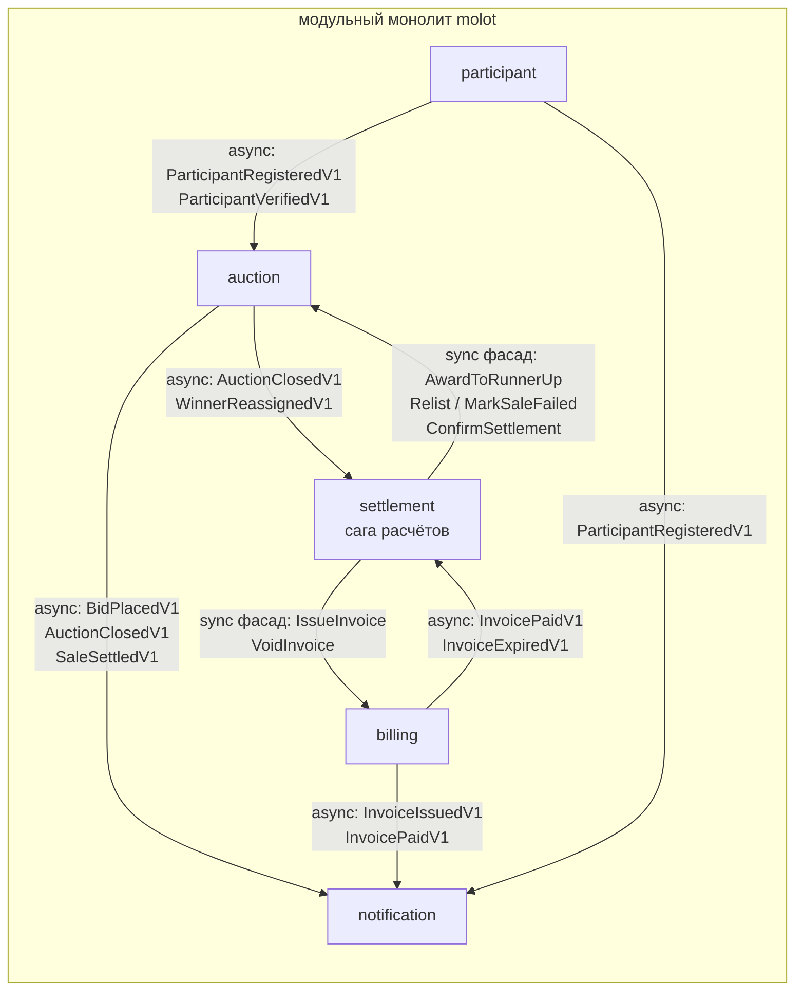

# Глава 2. Стратегический DDD: как находить границы

**Зачем читать эту главу.** Самое дорогое архитектурное решение в системе — не выбор базы и не выбор фреймворка, а то, *где проведены границы между модулями*. Базу вы замените за спринт (если домен от неё отвязан — об этом глава 3); неправильную границу будете выкорчёвывать год. Давайте посмотрим, как в Molot пять bounded contexts были выведены из доменного потока, а не угаданы по существительным, — и почему каждая «странность» на карте контекстов — дублированный `Money`, проекция чужих данных, контекст без domain-слоя — не недосмотр, а осознанная плата за независимость изменений.

---

## 2.1 Проблема: граница — решение, которое почти нельзя откатить

Есть простой способ ранжировать архитектурные решения по важности: спросить, во что обойдётся каждое из них отменить. Большинство решений в проекте обратимы. Слой можно переразбить, репозиторий переписать, транспорт заменить — стоимость локальна: один модуль, одна неделя. Граница модуля в этот список не входит: на неё завязаны контракты событий, схемы БД, владение данными и — что коварнее всего — словарь, на котором команда думает. Перенести инвариант через устоявшуюся границу — значит одновременно мигрировать данные, переиздать события и переучить всех, кто про эту границу уже успел подумать. Если хотите строительную аналогию: слой — перегородка из гипсокартона, граница контекста — несущая стена. Перегородку двигают за выходные; стену — проектом, с расчётами и пылью на полгода.

Как выглядит неверно проведённая стена? Одинаково и в монолите, и в микросервисах — отличается только цена:

- **каждая фича трогает несколько модулей.** «Добавить отсрочку платежа» требует править и auction, и billing, и общий «core» — значит, модулей на самом деле один, и он порезан случайно;
- **модули общаются «всем телом»**: тянут чужие структуры, читают чужие таблицы, вызывают чужую внутреннюю логику. Связность та же, что в большом шаре грязи, только теперь с накладными расходами на «границу»;
- **в микросервисном варианте** это даёт distributed monolith — ту же связность плюс сеть, версионирование API и распределённые транзакции (разбор — [ADR-0001](../adr/0001-modular-monolith.md)).

Отсюда стратегия Molot, и она из двух половин. Границы держим **внутри монолита** — там их дёшево исправлять, пока они не проверены временем. Но проводим их **по домену** и охраняем компилятором и CI, а не дисциплиной — потому что дисциплина имеет свойство заканчиваться на первом дедлайне. Что именно охраняется — в [ARCHITECTURE.md §1](../ARCHITECTURE.md): импорт чужого `domain/` и запрос к чужой Postgres-схеме валят CI; снаружи контекста доступны только пакет `events/` и фасад `service/`.

Эта глава — про то, *как были найдены* эти границы. Механика их удержания (слои, направление зависимостей, `go-cleanarch`) — глава 3.

---

## 2.2 Теория: словарь стратегического DDD

Прежде чем идти в код, договоримся о словах — дальше они будут работать без кавычек и сносок.

Domain-Driven Design делится на тактику и стратегию. Тактические паттерны — агрегаты, value objects, репозитории — отвечают на вопрос «как структурировать код внутри модели». Стратегические — «сколько моделей нужно и где между ними швы». Обратите внимание на порядок: сначала «сколько и где», потом «как внутри». Применять тактику без стратегии — классическая ошибка, и она соблазнительна, потому что тактика — это код, а писать код приятнее, чем спорить о границах. Результат предсказуем: красивые агрегаты, нарезанные по случайным границам, и каждый — наполовину чужой (антипаттерн 11 в [BOOK_AUDIT.md §9](../BOOK_AUDIT.md)).

**Ubiquitous Language (единый язык)** — словарь, на котором о домене говорят и стейкхолдеры, и код. Не «обновить статус записи», а «сделать ставку», «передать лот второму участнику», «зафиксировать провал продажи». Зачем такая строгость? Потому что двойной перевод (с языка бизнеса на техжаргон, а с него — в код) — это место, где теряются требования: разработчик честно решает не ту задачу, которую формулировал бизнес, и узнаёт об этом на демо. Правило 53 BOOK_AUDIT делает язык ревьюируемым артефактом: имена пакетов, типов, команд и событий — только из словаря домена.

**Bounded Context (ограниченный контекст)** — граница, внутри которой конкретная модель и её язык непротиворечивы. Ключевое слово — *модель*: одна и та же сущность реального мира в разных контекстах моделируется по-разному, и это не дефект, а смысл паттерна. В Molot один и тот же человек — это `Bidder` (ставит ли, верифицирован ли) в auction, `debtor` (должник по счёту) в billing и адресат рассылки в notification. Попытка слить их в одну «общую модель пользователя» дала бы тип с тремя десятками полей, который меняется по любому поводу.

Чем bounded context **не является** — три заблуждения, которые встретятся вам чаще, чем само определение:

- **не папка.** Каталог `internal/auction/` — это *проекция* контекста на файловую систему, удобная для enforcement-а. Сам контекст — семантическая граница модели; можно разложить код идеально по папкам и при этом порвать контекст, протащив чужой тип через общий пакет;
- **не сервис.** Контекст не обязан деплоиться отдельно. В Molot все пять живут в одном бинаре; вынос — отдельное решение с отдельной ценой ([ADR-0001](../adr/0001-modular-monolith.md));
- **не таблица и не схема БД.** Схема-на-контекст в Molot — следствие границы (данные принадлежат модели), а не её определение. Граница в первую очередь проходит по языку и инвариантам.

**Context Map (карта контекстов)** — явная фиксация того, какие контексты существуют и *как* они связаны. Видов отношений у классиков целый зоопарк: Shared Kernel (общее ядро кода — два контекста совместно владеют фрагментом модели), Customer–Supplier (потребитель диктует поставщику контракт), Conformist (потребитель принимает чужую модель как есть), Anticorruption Layer (слой-переводчик, защищающий свою модель от чужой), Open Host Service / Published Language (поставщик публикует стабильный общедоступный контракт). Зубрить список необязательно; важно другое — научиться называть отношение вслух. «Мы конформисты по отношению к платёжному провайдеру» звучит неуютно, но честно, а честно названная зависимость управляема. Карта Molot — §2.5.

**Event Storming** — метод discovery: домен раскладывается в хронологический поток *доменных событий* (фактов в прошедшем времени: «ставка сделана», «счёт просрочен»), к событиям подбираются команды, акторы и политики. Зачем этот ритуал, если «и так всё понятно»? Затем, что границы контекстов читаются с готового потока: они проходят там, где **ломается язык и сменяется ответственность**, — а это видно только на разложенной хронологии, не в головах участников. Правило 51 BOOK_AUDIT требует хранить артефакт штурма в репозитории и держать его аудируемым — у нас это [docs/event-storming.md](../event-storming.md), и при изменении домена сначала правится он, потом код.

Словарь собран. Теперь посмотрим, как он выглядит в скомпилированном виде.

---

## 2.3 Как это сделано в Molot: язык бизнеса в коде

Начнём с самого дешёвого для проверки слоя стратегии — имён. Откройте каталог команд Molot: вы не найдёте там ни одного `Create/Update/Delete/Set`. Вместо них — `ListAuction`, `PlaceBid`, `AwardToRunnerUp`, `MarkSaleFailed`, `IssueInvoice`, `DeclineSecondChanceOffer`. Это не косметика. Имя-интент фиксирует *бизнес-операцию целиком*, вместе с её guard-ами; имя-CRUD — лишь факт записи в хранилище, оставляя правила на совести вызывающего. Разница станет осязаемой через минуту, на конкретном switch-е.

Сравните, как читается переход состояния в домене — `internal/auction/domain/auction/auction.go`:

```go
// Guard cascade — order is fixed by §2.1.
if a.status != StatusListed || !a.window.IsOpenAt(now) {
    return Bid{}, ErrAuctionNotOpen
}
if b.ID().UUID() == a.seller.UUID() {
    return Bid{}, ErrSellerCannotBid
}
if !a.leadingBid.IsZero() && a.leadingBid.Bidder() == b.ID() {
    return Bid{}, ErrLeaderCannotOutbidSelf
}
if amount.Currency() != a.startPrice.Currency() {
    return Bid{}, ErrCurrencyMismatch
}
if meetsMin, err := amount.GTE(MinimalNextBid(*a)); err != nil || !meetsMin {
    return Bid{}, ErrBidBelowMinimum
}
if !b.Verified() {
    needsVerification, err := amount.GTE(a.verifyAbove)
    if err != nil || needsVerification {
        return Bid{}, ErrVerificationRequired
    }
}
```

Это фрагмент `PlaceBid`, и главное в нём — что его можно прочитать вслух доменному эксперту без перевода: «аукцион не открыт», «продавец не ставит на свой лот», «лидер не перебивает сам себя», «ставка ниже минимальной», «крупная ставка требует верификации». Заметьте: каждый отказ — именованная sentinel-ошибка из словаря, а не `false` и не `errors.New("validation failed")`. Когда аукционист завтра спросит «а почему ставка не прошла?», ответ в логе будет на его языке, а не на вашем.

Тот же язык поднимается на уровень use case. Команда `AwardToRunnerUp` — `internal/auction/app/command/award_to_runner_up.go`:

```go
func (h AwardToRunnerUpHandler) Handle(ctx context.Context, cmd AwardToRunnerUp) error {
	err := h.repo.UpdateAsSystem(ctx, cmd.AuctionID,
		func(ctx context.Context, a *auction.Auction) (*auction.Auction, error) {
			if _, err := a.AwardToRunnerUp(h.clock.Now()); err != nil {
				return nil, err
			}
			return a, nil
		})
	switch {
	case err == nil:
		return nil
	case errors.Is(err, auction.ErrWinnerAlreadyReassigned):
		return nil // already in the target state — idempotent no-op
	case errors.Is(err, auction.ErrNoQualifyingRunnerUp):
		return errs.NewConflictError("no-qualifying-runner-up").WithCause(err)
	...
	}
}
```

Смотреть здесь нужно на switch — это и есть обещанная осязаемая разница. Различение «уже сделано» (даёт `nil` — идемпотентный no-op для ретраев саги) и «сделать нельзя» (даёт конфликт) возможно *только потому*, что домен говорит различимыми именованными ошибками. С анемичной моделью и `UPDATE auctions SET winner = ...` этой семантики просто не существовало бы — оба случая слились бы в один безликий результат.

Принцип зафиксирован правилом 27 BOOK_AUDIT: имя команды на `Create/Update/Delete` требует на ревью явного обоснования. По умолчанию — глагол из словаря бизнеса.

> **Совет из практики.** Если имя для команды упорно не находится — это не лингвистическая проблема, а сигнал discovery: вы ещё не поняли операцию. Сходите к доменному эксперту и попросите рассказать, что происходит, его словами, не показывая экран. Команда, которую эксперт не может произнести (`ProcessAuctionData`), почти всегда оказывается либо двумя командами, либо половиной чужой.

Имена — это поверхность. Теперь к источнику, из которого они берутся: к потоку событий.

---

## 2.4 Event Storming: из потока — пять контекстов

Доменный поток Molot одной строкой: **лот выставлен, пошли ставки, ударил молоток, выставлен счёт, дальше — оплата или компенсация**. Полная хронология с развилками — в [docs/event-storming.md](../event-storming.md); ядро потока выглядит так:

```
ListAuction ──► AuctionListed
                PlaceBid ──► BidPlaced (×N, анти-снайп: AuctionExtended)
                                  Close ──► AuctionClosed{sold|not_sold}
                                                │ sold
                                                ▼
                            Settlement.Start ──► IssueInvoice ──► InvoiceIssued
                                  PayInvoice ──► InvoicePaid ──► SaleSettled
                                  (таймаут) ──► InvoiceExpired ──► развилка:
                                      ├─ AwardToRunnerUp ──► WinnerReassigned ──► IssueInvoice(attempt=2)
                                      ├─ Relist ──► AuctionRelisted (новый агрегат)
                                      └─ MarkSaleFailed ──► SaleFailed
```

Где на этой ленте границы? Ищите **изломы потока** — точки, где одновременно меняются язык, актор и природа ответственности:

1. До молотка разговор идёт про *торги*: лот, окно, ставка, лидер, резерв, анти-снайп. Актор — продавец и участники. Это **auction**.
2. После `AuctionClosed{sold}` слова резко другие: счёт, комиссия, должник, срок оплаты, PSP. Появляется внешний контрагент (платёжный провайдер) и денежные инварианты. Это **billing** — и заметьте: Invoice не «продолжение» Auction, у него своя жизнь (оплата, просрочка, void) и свои причины меняться (формула комиссии, сроки, провайдер).
3. Между ними — третий язык: *процесс*. «Дождаться оплаты, при таймауте предложить второму, иначе перевыставить, иначе провал». Это не правило лота и не правило счёта — это правило **последовательности**, у него своя машина состояний и свои развилки. Излом дал **settlement** — process manager (сагу), владеющую только хореографией.
4. Регистрация и верификация участников происходят *до и вне* торгов, меняются по своим причинам (KYC-политики) — **participant**.
5. Уведомления слушают всё и не влияют ни на что — **notification**.

> **Нюанс.** Самое ценное на штурме — не аккуратный итоговый поток, а места, где два эксперта при вас заспорили, что происходит после таймаута оплаты. Фиксируйте такие точки (hotspots) прямо в артефакте: спор экспертов сегодня — это ваша сага с развилками завтра. А поток, нарисованный совсем без споров, обычно означает, что спорщиков просто не позвали.

Дальше штурм превращается в аудируемый маппинг «команда, её агрегат, её хендлер» (таблица из [event-storming.md](../event-storming.md), приведена целиком — она же ответ на вопрос «не размазана ли команда по контекстам»):

| Команда (бизнес-язык) | Актор | Агрегат | Go-тип | Хендлер |
|---|---|---|---|---|
| Выставить лот | продавец | Auction | `command.ListAuction` | `internal/auction/app/command/list_auction.go` |
| Сделать ставку | участник | Auction | `command.PlaceBid` | `internal/auction/app/command/place_bid.go` |
| Отменить лот | продавец | Auction | `command.CancelAuction` | `internal/auction/app/command/cancel_auction.go` |
| Закрыть по времени | система (воркер) | Auction | `command.CloseAuction` | `internal/auction/app/command/close_auction.go` |
| Переназначить победителя | сага | Auction | `command.AwardToRunnerUp` | `internal/auction/app/command/award_to_runner_up.go` |
| Перевыставить лот | сага | Auction (новый) | `command.RelistAuction` | `internal/auction/app/command/relist_auction.go` |
| Зафиксировать провал продажи | сага | Auction | `command.MarkSaleFailed` | `internal/auction/app/command/mark_sale_failed.go` |
| Подтвердить расчёт | сага | Auction | `command.ConfirmSettlement` | `internal/auction/app/command/confirm_settlement.go` |
| Зарегистрироваться | гость | Participant | `command.RegisterParticipant` | `internal/participant/app/command/register_participant.go` |
| Верифицировать участника | operations | Participant | `command.VerifyParticipant` | `internal/participant/app/command/verify_participant.go` |
| Выставить счёт | сага | Invoice | `command.IssueInvoice` | `internal/billing/app/command/issue_invoice.go` |
| Оплатить счёт | должник | Invoice | `command.PayInvoice` | `internal/billing/app/command/pay_invoice.go` |
| Просрочить счёт | система (воркер) | Invoice | `command.ExpireInvoice` | `internal/billing/app/command/expire_invoice.go` |
| Аннулировать счёт | сага | Invoice | `command.VoidInvoice` | `internal/billing/app/command/void_invoice.go` |
| Отклонить оферту second chance | runner-up | Settlement | `command.DeclineSecondChanceOffer` | `internal/settlement/app/command/decline_second_chance_offer.go` |

Каждая команда бьёт ровно в один агрегат ровно одного контекста. Если бы при заполнении таблицы какая-то команда «не влезла» в одну строку — это был бы сигнал чинить границу до написания кода, а не подгонять код под кривую границу.

И замечание о дисциплине, чтобы таблица не стала музейным экспонатом. Договорённость проекта (шапка `event-storming.md`): при изменении домена сначала правится артефакт штурма, потом код. Так дрейф «документация ↔ код» становится обнаруживаемым на ревью, а не на археологических раскопках через год.

---

## 2.5 Context Map Molot: события и фасады

Контексты найдены — осталось договориться, как они разговаривают. Карта связей (диаграмма — [ARCHITECTURE.md §1](../ARCHITECTURE.md)):

| Откуда → куда | Канал | Что течёт |
|---|---|---|
| participant → auction | async, события | `ParticipantRegisteredV1/VerifiedV1` → проекция `bidder_profiles` |
| auction → settlement | async, события | `AuctionClosedV1`, `WinnerReassignedV1` — старт и шаги саги |
| billing → settlement | async, события | `InvoicePaidV1`, `InvoiceExpiredV1` — исходы оплаты |
| settlement → auction | **sync, фасад** | `AwardToRunnerUp`, `Relist`, `MarkSaleFailed`, `ConfirmSettlement` |
| settlement → billing | **sync, фасад** | `IssueInvoice`, `VoidInvoice` |
| auction, billing, participant → notification | async, события | всё подряд → письма |

По умолчанию связь асинхронная — интеграционные события через transactional outbox (глава 8). Пакет `events/` каждого контекста — это его **Published Language**: плоские версионированные структуры, единственное, что разрешено импортировать снаружи. Синхронный вызов — исключение, допустимое только когда процесс синхронен *по природе*: шагу саги нужен результат команды до перехода состояния (трейдофф — [ADR-0004](../adr/0004-settlement-saga.md)).

Карта ниже показывает все пять контекстов и характер каждой связи — async-события через outbox или sync-фасад изнутри саги:



Стрелки sync-фасада могут насторожить: не значит ли это, что settlement намертво знает auction? Нет — и вот где это видно. Сага объявляет потребительский интерфейс у себя — `internal/settlement/app/handlers.go`:

```go
// Consumer-side gateways (rule 5, §6, ADR-0004): the slice of the
// foreign sync facades the saga's event handlers need. Adapters bridge
// them to auctionservice.Facade / billingservice.Facade; every command
// is idempotent on the far side ("already in the target state" → nil),
// which makes the effect phase safely repeatable.
type auctionGateway interface {
	AwardToRunnerUp(ctx context.Context, auctionID settlement.AuctionID) error
	Relist(ctx context.Context, originalID, newID settlement.AuctionID, startsAt, endsAt time.Time) error
	MarkSaleFailed(ctx context.Context, auctionID settlement.AuctionID, reason settlement.FailureReason) error
	ConfirmSettlement(ctx context.Context, auctionID settlement.AuctionID) error
}

type billingGateway interface {
	IssueInvoice(ctx context.Context, invoiceID settlement.InvoiceID, auctionID settlement.AuctionID,
		debtor settlement.BidderID, amount settlement.Money, attempt int) error
}
```

Обратите внимание на сигнатуры: все типы — *из settlement*. Сага описывает мир так, как видит его она, и ни словом не упоминает auction. А auction со своей стороны публикует фасад с нарочито примитивными сигнатурами — `internal/auction/service/facade.go`:

```go
// Facade is the synchronous command surface the settlement saga calls
// through its consumer-side auctionGateway (§6, ADR-0004). Signatures
// are deliberately primitive (uuid.UUID, time.Time, string) so the
// settlement adapter needs no auction domain types. Every command is
// idempotent: "already in the target state" returns nil (§2.1), making
// saga retries and redeliveries safe by construction.
type Facade struct {
	award      decorator.CommandHandler[command.AwardToRunnerUp]
	relist     decorator.CommandHandler[command.RelistAuction]
	markFailed decorator.CommandHandler[command.MarkSaleFailed]
	confirm    decorator.CommandHandler[command.ConfirmSettlement]
}
```

Здесь легко пропустить главное слово в комментарии — *idempotent*. Каждая команда фасада безопасна к повтору, и именно это делает ретраи саги тривиальными, а не героическими. Между двумя сторонами — тонкий адаптер в `internal/settlement/adapters`, переводящий типы саги в `uuid.UUID`/`string` фасада. В терминах context map это Customer–Supplier с миниатюрным anticorruption layer: ни один доменный тип не пересекает границу ни в одну сторону. И вот приятное следствие: цена выноса контекста в отдельный сервис при таком устройстве — замена одного адаптера на gRPC-клиент; интерфейс `auctionGateway` и хендлеры саги не меняются.

### Почему participant и notification — осознанно тонкие

Стратегический DDD — это ещё и решение, *где модель не нужна*. Не каждый контекст заслуживает полного стека, и умение это признать — тоже стратегия.

**participant** — почти CRUD: зарегистрировать, верифицировать. Слои есть (домен с `EmailAddress`, sentinel-ошибками и `Verify()`), но без проекций, саг и read-моделей — защищать особо нечего.

**notification** вообще не имеет domain- и app-слоёв — `internal/notification/ports/events.go`:

```go
// Package ports wires the notification context into the platform
// event bus. The context deliberately has no domain or app layer:
// every subscription is a trivial "event → template → send" pipeline
// (BOOK_AUDIT rule 33 exception; rationale and review trigger live in
// internal/notification/README.md), so this package holds both the
// §4.3 subscriptions and the consumer-side interfaces the handlers
// depend on.
package ports
```

Смотреть тут надо не на то, чего нет, а на то, как оформлено отсутствие: исключение названо по имени (rule 33), обоснование и триггер пересмотра вынесены в README. Это применение правила 33 BOOK_AUDIT (CQRS/слои не применяются к тривиальным модулям) и правила 14 TEXTBOOK: паттерн — пропорционально сложности защищаемого. И вторая важная вещь: граница при этом **не ослаблена** — notification так же общается только через `events/`, имеет свою схему и свой dedup-журнал отправок. Тонкая модель ≠ дырявая граница.

---

## 2.6 Проекции чужих данных: bidder_profiles

Теперь конкретная задача на стыке контекстов — из тех, на которых границы обычно и дают течь. `PlaceBid` должен знать, верифицирован ли участник (крупная ставка без верификации отклоняется — guard `ErrVerificationRequired` выше). Но данные о верификации принадлежат participant. Что делать? Два наивных варианта напрашиваются сами:

- **прочитать таблицу participant-а** — `SELECT verified FROM participant.participants ...`. Запрещено и валит CI: чужая схема — приватная деталь; любая её миграция молча ломает ваш SQL, а владелец даже не узнает, что у него появился потребитель;
- **синхронно дёрнуть participant** на каждой ставке — горячий путь торгов получает зависимость от доступности соседнего контекста и лишний хоп; а при выносе participant в сервис — сетевой вызов внутри самой нагруженной операции площадки.

Molot выбирает третий путь: auction держит **свою локальную проекцию** чужих данных, наполняемую подпиской на интеграционные события participant-а. Это как записная книжка о контрагенте: вы не лазаете в его архив и не звоните ему по каждому поводу — вы ведёте у себя ровно те заметки, которые нужны вам, и пополняете их из его официальных писем. Потребность объявлена consumer-side интерфейсом — `internal/auction/app/command/deps.go`:

```go
// bidderProfiles reads the local projection of participant events.
// Contract: a bidder without a profile row is an unverified bidder —
// the projection is eventually consistent and absence must not block
// small bids (the verification guard lives in the domain).
type bidderProfiles interface {
	BidderByID(ctx context.Context, id auction.BidderID) (auction.Bidder, error)
}
```

А наполнение — идемпотентные upsert-ы по событиям — `internal/auction/adapters/bidder_profiles_pg.go`:

```go
// UpsertRegistered records the display name; it never touches
// `verified`, so a redelivery cannot undo a verification.
func (p *BidderProfilesPostgres) UpsertRegistered(ctx context.Context, bidderID uuid.UUID, displayName string) error {
	_, err := p.db.ExecContext(ctx, `
		INSERT INTO auction.bidder_profiles (bidder_id, display_name, verified, updated_at)
		VALUES ($1, $2, false, now())
		ON CONFLICT (bidder_id) DO UPDATE
		SET display_name = excluded.display_name, updated_at = now()`,
		bidderID, displayName)
	...
}
```

В этом upsert-е легко пропустить то, чего в нём нет: он не трогает `verified`. Повторная доставка события регистрации не «разверифицирует» участника — идемпотентность здесь встроена в форму запроса, а не навешана проверками сверху. Разберём, что во всём этом стратегического:

1. **Проекция живёт в схеме auction** (`auction.bidder_profiles`) и содержит ровно те поля, которые нужны *модели auction*: `verified` и display name. Не копия Participant — своя модель чужого факта. Email, статусы KYC, история верификации — не нужны для ставки и не проецируются.
2. **Контракт на отсутствие данных — доменное решение.** Проекция eventually consistent; строка может ещё не доехать. Вместо ошибки — «нет строки = не верифицирован»: мелкие ставки проходят, крупные честно отклоняются guard-ом домена. Решение записано в комментарии интерфейса — это часть контракта, а не фольклор.
3. **Идемпотентность по построению.** `UpsertRegistered` не трогает `verified` — redelivery события регистрации не «разверифицирует» участника; хендлеры Registered/Verified сходятся в любом порядке.
4. **Цена выноса participant — ноль для этого кода.** Проекция питается событиями; откуда они приедут — из соседнего пакета через watermill-sql или из Kafka — вопрос конфигурации шины, не кода auction.

> **Совет из практики.** У eventually consistent проекции должно быть видимое «насколько eventually». Повесьте метрику лага на outbox и подписчиков и алерт на её рост: пока лага не видно, «согласуется со временем» на проде незаметно превращается в «согласуется к четвергу» — и первым это заметит не дашборд, а пользователь с необъяснимо отклонённой ставкой.

Это общий паттерн Molot (правило BOOK_AUDIT §6): каждый контекст держит свои проекции чужих данных, наполняемые только подпиской на чужие `events/`.

Тот же принцип «чужое — только через опубликованный контракт» виден в самом событии. `AuctionClosedV1` из `internal/auction/events/events.go` не раскрывает резервную цену — наружу уходит готовый вердикт:

```go
// AuctionClosedV1 never exposes the reserve price: subscribers get the
// ready-made RunnerUpQualifies verdict instead.
type AuctionClosedV1 struct {
	EventID             string    `json:"event_id"`
	AuctionID           string    `json:"auction_id"`
	...
	RunnerUpBidderID    string    `json:"runner_up_bidder_id"`
	RunnerUpAmountMinor int64     `json:"runner_up_amount_minor"`
	RunnerUpQualifies   bool      `json:"runner_up_qualifies"`
	...
}
```

Ключевое поле — `RunnerUpQualifies`: булево вместо суммы резерва. Если бы сага сама решала «достоин ли runner-up», ей пришлось бы знать резерв — и правило second chance протекло бы из auction в settlement. Вместо этого решение, требующее чужого домена, переносится **в данные события**: граница остаётся герметичной, резерв не покидает агрегат.

---

## 2.7 Дублирование Money: почему это правильно

Дойдя до этого места на карте, почти каждый читатель спотыкается: `Money` существует дважды — в `internal/auction/domain/auction/money.go` и в `internal/billing/domain/invoice/money.go`. Почти одинаковый код, ~70 строк каждый. Рука сама тянется «вынести в common» — и именно этот рефлекс здесь подавлен сознательно. Оба файла объясняют почему прямо в комментариях:

```go
// internal/auction/domain/auction/money.go

// Money is an amount in minor units of a currency. The zero value means
// "no money set" (IsZero), which the aggregate uses instead of pointer
// flags. The type is deliberately duplicated per context (BOOK_AUDIT
// rule 4): this is the auction context's copy.
type Money struct {
	amount   int64
	currency Currency
}
```

```go
// internal/billing/domain/invoice/money.go

// Currency is an ISO-4217-style alphabetic code. Billing deliberately
// owns its copy of the money value objects (BOOK_AUDIT rule 4): common
// holds zero business types and contexts never share domain code.
type Currency struct {
	code string
}
```

Заметьте: обоснование живёт в самих файлах, рядом с типом, — следующий разработчик с рефлексом «вынести в common» прочитает его раньше, чем откроет PR. Аргументация — через цену изменений, а не через эстетику:

- **Общий тип в `common` — это shared kernel**, самое жёсткое из отношений context map: любое изменение требует согласия всех совладельцев. Понадобился auction-у метод сравнения для ставок — и billing обязан пересмотреть его влияние на свои инварианты. Эволюционный замок на самом критичном типе системы.
- **Типы уже разошлись** — и это видно в коде. У auction-овского `Money` есть `GTE` (ставки сравнивают: «не ниже минимальной», «не выше порога верификации»); у billing-ового его нет — счёту сравнения не нужны, зато его `MulBasisPoints` несёт доменный комментарий: *«the platform never rounds a commission up in its own favor»* — округление комиссии вниз как бизнес-обязательство. Даже геттеры разные (`AmountMinor()` vs `Amount()`). Будь тип общим, он накапливал бы объединение потребностей всех контекстов — и каждый видел бы методы, бессмысленные в его модели.
- **DRY здесь не нарушен.** DRY — про единственность *знания*, а не про текстуальную уникальность кода (правило 3 TEXTBOOK: «DRY — про поведение, а не про данные»). «Сумма в минорных единицах с guard-ом валюты» — это два независимых знания двух моделей, которые сегодня совпадают по форме. Совпадение по форме — не основание для сцепки: причины меняться у них разные.
- **Защита от случайной связи через типы.** Раз `auction.Money` и `invoice.Money` — разные типы, нельзя «нечаянно» передать ставку в счёт без явного маппинга на границе (фасад/события переносят `int64 + string`, и принимающий контекст валидирует их своим конструктором). Граница снова enforced компилятором.

Правило 4 BOOK_AUDIT формулирует общий принцип: `internal/common` не содержит ни одного бизнес-типа; общие бизнес-понятия дублируются по контекстам, промоутится в common только инфраструктура (логгер, декораторы, `RunInTx` — у них действительно одна причина меняться на всех).

> **Где вы на это наступите.** Дублированный тип означает дублированный баг-фикс. Найдёте ошибку округления в одной копии `Money` — вторая не починится сама, и вспомнить о ней под инцидентом сложнее, чем кажется. Заведите привычку: фикс в продублированном доменном типе сопровождается grep-ом по остальным контекстам и тестом в каждом, где симптом воспроизводится. Две минуты, которые экономят следующий инцидент.

И честная оговорка о трейдоффе: дублирование — не бесплатно. Найденный в одной копии баг нужно не забыть проверить во второй (в Molot обе копии покрыты независимыми доменными юнитами), а при пяти и более контекстах с деньгами стоило бы пересмотреть решение — но *доказанно идентичная и стабильная* семантика — редкость, и до неё надо дожить, а не предполагать заранее.

---

## 2.8 Литмус-тесты границы

Хорошо, границы проведены. Как понять, что они проведены верно, не дожидаясь года эксплуатации? Правило 52 BOOK_AUDIT даёт операциональный критерий: **новая фича реализуется и тестируется в одном модуле; иначе граница чинится до написания кода.** Это перевод философского «модуль — то, что меняется по одной причине» на язык конкретной проверки: вместо спора о определениях — мысленный эксперимент с конкретным изменением. Эталонные тесты Molot (финал [event-storming.md](../event-storming.md)):

- **«Изменить шаг ставки»** затрагивает только auction. Минимальная следующая ставка — stateless-функция домена `MinimalNextBid` (`internal/auction/domain/auction/auction.go`); ни billing, ни settlement о шаге не знают: до них доезжает только итоговая сумма молотка в `AuctionClosedV1`.
- **«Изменить формулу комиссии»** ложится только в billing. Комиссия считается в `CommissionFor(hammer, policy)` (`internal/billing/domain/invoice/commission.go`); сага передаёт в `IssueInvoice` цену молотка и не знает, что счёт будет больше неё.
- **«Новая ветка компенсации»** (скажем, «после второго таймаута — штраф вместо relist») остаётся целиком в settlement: новая дуга в машине состояний саги. Auction и billing уже предоставляют идемпотентные команды-кирпичи; хореография — собственность саги.
- **«Новый канал уведомлений»** касается только notification. Никто из публикующих контекстов не знает, кому и как доставляются письма.
- **«Новое правило верификации»** уходит в participant, с одной оговоркой: *порог* верификации (`verifyAbove`) снапшотится на агрегат Auction при листинге ([ARCHITECTURE.md §2.1](../ARCHITECTURE.md)) — правила идущего лота детерминированы во времени, смена платформенной политики не дёргает живые торги.

Как пользоваться литмусом на практике? Перед реализацией фичи спросите себя: «какие модули придётся открыть?» Если ответ — больше одного, есть ровно три легальных исхода: (а) фича на самом деле две фичи — разрежьте её; (б) фича добавляет *новую связь* — проведите её через события или фасад, явно, с обновлением карты; (в) граница проведена неверно — чините границу, это дешевле сейчас, чем после десятой фичи, размазанной по тому же шву. Нелегальный исход один: «быстренько дотянуться» до чужого домена импортом или SQL-ом — в Molot он закрыт CI, и это не паранойя, а признание того, что под дедлайном так сделает каждый. Включая вас.

---

## 2.9 Типичные ошибки

Все ошибки ниже мы так или иначе уже встречали по ходу главы — здесь они собраны в форму, удобную для ревью: симптом плюс диагноз.

1. **Границы по существительным.** «Invoice и Bid — оба про деньги, кладём в module `finance`». Существительные группируют по *похожести данных*, а граница должна идти по *причине изменения*: формула комиссии и шаг ставки меняются разными людьми в разное время. Симптом на ревью: модуль, который невозможно назвать глаголом из домена.
2. **Bounded context приравнен к папке/сервису.** Завели каталоги — границ не появилось: общие «утильные» бизнес-типы в `common`, импорт чужих структур «только для DTO», и через полгода всё снова со всем связано. Граница — это контракт (`events/` + фасад) и запреты, проверяемые инструментом, а не структура каталогов.
3. **Чтение чужих таблиц, «это же одна база».** Самая дешёвая в момент написания и самая дорогая потом связь: она не видна ни в одном импортe, не покрыта ни одним контрактом и ломается молча при чужой миграции. Если данные нужны постоянно — заводите проекцию (§2.6); разово в аналитике — читайте реплику вне продакшен-кода.
4. **Shared kernel по умолчанию.** «Один `Money` на всех, DRY же» — см. §2.7. Перед промоутом типа в common задайте вопрос: готовы ли вы созывать совет всех контекстов при каждом его изменении? Для логгера — да. Для бизнес-типа — почти никогда.
5. **Технические имена команд.** `UpdateAuctionStatus(id, "failed")` вместо `MarkSaleFailed{Reason}`. Теряется не красота — теряется семантика: невозможно отличить идемпотентный повтор от запрещённого перехода (сравните switch в §2.3), а словарь бизнеса и словарь кода начинают расходиться, возвращая двойной перевод.
6. **Проекция-ксерокопия.** Подписались на чужие события и складываете *все* поля «на всякий случай». Получили теневую копию чужой модели со всеми её причинами меняться. Проекция — это *своя* модель чужого факта: `bidder_profiles` хранит два поля, потому что модели auction нужны два.
7. **Единая модель пользователя.** Один `User` на auction, billing и notification. Любая правка KYC-полей перекатывается по всем контекстам; тип обрастает nullable-полями «не для всех». В Molot человек — это `Bidder` в auction, `debtor` в billing, recipient в notification: три модели, три словаря, ноль общих типов.
8. **Тактика без стратегии.** Агрегаты и value objects поверх случайных границ. Внутри модуля — образцовый DDD, а фичи всё равно режут по три модуля. Лечится не рефакторингом агрегатов, а возвратом к discovery: восстановить поток событий и проверить, где он ломается на самом деле.

---

## 2.10 Чек-лист главы

Перед тем как считать границы спроектированными, пройдитесь по списку — честно, пункт за пунктом:

- [ ] Границы выведены из доменного потока (event storming или эквивалентный discovery), артефакт лежит в репозитории и правится *раньше* кода ([правило 51](../BOOK_AUDIT.md)).
- [ ] Маппинг «команда, её агрегат, её хендлер» существует, и каждая команда занимает ровно одну строку — без «ну, эта особенная».
- [ ] Литмус проходит: эталонные изменения вашего домена («изменить шаг ставки»-класса) ложатся в один модуль ([правило 52](../BOOK_AUDIT.md)).
- [ ] Имена пакетов, команд и событий — словарь стейкхолдеров; `Create/Update/Delete` — только с обоснованием ([правила 27, 53](../BOOK_AUDIT.md)).
- [ ] Снаружи контекста импортируются только `events/` и фасад `service/`; импорт чужого `domain/` и чужие таблицы валят CI ([правило 3](../BOOK_AUDIT.md)).
- [ ] Постоянная потребность в чужих данных закрыта локальной проекцией минимального состава, наполняемой событиями; поведение при отсутствии строки оговорено контрактом, а не оставлено на волю случая.
- [ ] Решения, требующие чужого домена, перенесены в данные событий (как `RunnerUpQualifies`), а не в логику потребителя.
- [ ] `common` не содержит бизнес-типов; общие бизнес-понятия продублированы по контекстам осознанно ([правило 4](../BOOK_AUDIT.md)).
- [ ] Тонкие контексты остались тонкими, исключение из полного стека задокументировано с условием пересмотра ([правило 33](../BOOK_AUDIT.md)).
- [ ] Карта контекстов (кто с кем, sync/async, что течёт) зафиксирована в архитектурной документации и совпадает с кодом — проверяли недавно, а не «когда-то совпадала».

---

## Ссылки

- [ARCHITECTURE.md §1 «Context map»](../ARCHITECTURE.md) — карта контекстов, диаграмма связей, платформенная валюта; §2.1 — агрегат Auction и снапшот политик.
- [BOOK_AUDIT.md](../BOOK_AUDIT.md) — правила 3–5 (границы и common), 23 (контексты из Event Storming), 26–27, 53 (язык), 33 (исключения для тривиальных модулей), 51–52 (discovery-артефакт и литмус границы).
- [docs/event-storming.md](../event-storming.md) — полный поток, таблицы команд и событий, hotspots, литмус-тесты.
- [ADR-0001 «Модульный монолит, а не микросервисы»](../adr/0001-modular-monolith.md) — почему границы держим в одном бинаре.
- [ADR-0003 «Граница агрегата Auction»](../adr/0003-auction-aggregate-boundary.md) — где проходит граница согласованности внутри контекста.
- [ADR-0004 «Сага settlement»](../adr/0004-settlement-saga.md) — почему команды саги синхронны и что это значит для карты контекстов.

Следующая глава — о том, как найденные границы удерживаются внутри каждого контекста: слои, направление зависимостей и домен, который не знает ничего.
