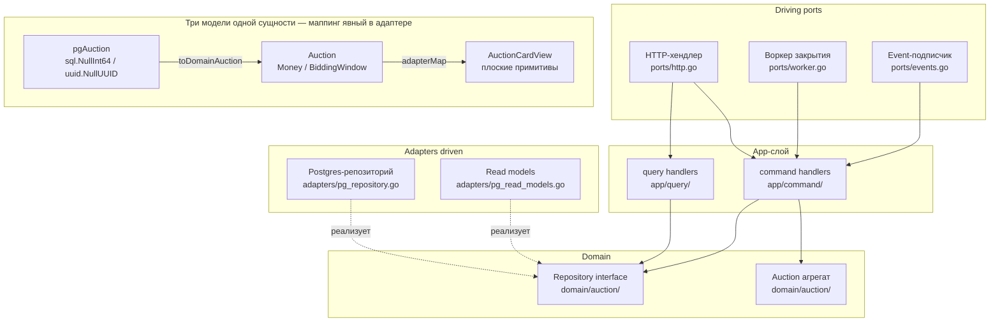

# Глава 4. Слои и направление зависимостей: Clean + Hexagonal

---

## Зачем читать

У этой главы простая цель: чтобы «Clean Architecture» перестала быть для вас
названием диаграммы с кольцами и стала рабочим инструментом. Мы разберём,
почему Clean Architecture, Hexagonal Architecture и Onion Architecture — это
одна и та же идея в трёх разных системах обозначений; как она реализована в
Molot на реальном коде; почему каждый слой требует собственной модели данных;
где должны жить HTTP-хендлеры, воркеры и репозитории; и сколько на самом деле
стоит маппинг. Про цену будем говорить честно, с трейдоффами: слои — не
бесплатная добродетель, а покупка, и стоит понимать, что именно вы покупаете.

---

## Проблема: инфраструктура прорастает в бизнес

Возьмём типичный Go-сервис через год после запуска. В структурах висят теги
`db:` и `json:` одновременно. SQL-запросы рождаются в хендлерах. Сервис
возвращает HTTP-статусы из метода, который «просто проверяет баланс». Поменять
Postgres — квест на неделю, потому что `*sql.Tx` каким-то образом добрался
до use case. Узнаёте? Если да — вы видели, как инфраструктура прорастает в
бизнес. Это происходит не от чьей-то глупости: каждый отдельный шаг был
разумным сокращением пути. Просто никто не ответил явно на вопрос: **что
знает о чём**.

А вопрос этот стоит дорого. Бизнес-правила — самый стабильный код в системе:
они переживают фреймворки, базы данных и версии API. Когда они сцеплены с
инфраструктурой, самый долгоживущий код вынужден умирать вместе с самым
короткоживущим — как если бы несущие балки дома меняли при каждой
перекраске стен.

Реальный пример из первоисточника (BOOK_AUDIT §1): один struct на хранилище
и на транспорт привёл к утечке поля `LastIp` всем пользователям — потому что
у хранения и у HTTP-ответа разные причины меняться, и изменение схемы БД
автоматически изменило API. Заметьте: никто не писал код «отдай IP наружу».
Достаточно было его не написать — сцепка сделала остальное сама.

---

## Теория: три названия одной идеи

Если вы когда-нибудь путались, чем Clean отличается от Hexagonal, — выдохните:
ничем существенным. **Clean Architecture** (Robert Martin), **Hexagonal
Architecture** (Alistair Cockburn, она же «Ports & Adapters»), **Onion
Architecture** (Jeffrey Palermo) — разные визуализации одного принципа:
**зависимости направлены внутрь, к домену**. Домен не знает ни о каком
внешнем мире.

- Clean: концентрические кольца — Entities в центре, вокруг Use Cases, дальше
  Interface Adapters, снаружи Frameworks & Drivers. Стрелки — только внутрь.
- Hexagonal: шестигранник с доменом в центре, «driving ports» (то, что
  инициирует действие) и «driven ports» (то, что система вызывает).
- Onion: те же кольца, акцент на том, что Infrastructure — снаружи всего.

Выбирайте картинку, которая нравится, — спорить о различиях между ними так же
продуктивно, как спорить о шрифте, которым набрано правило. Суть одна:
**инверсия зависимостей**. Абстракции объявляет тот, кто ими пользуется —
потребитель, а не поставщик. Домен описывает розетку; Postgres, in-memory и
всё, что появится после, — вилки, которые в неё втыкаются. Хотите заменить
Postgres — пишете новый адаптер, реализующий интерфейс, объявленный в домене.
Домен и use cases не трогаете вообще: розетка не переделывается под каждую
новую вилку.

### ports ≠ adapters

Граница, которую путают чаще всего, — и стоит один раз разложить её по
полочкам:

- **Ports** — входящая сторона (driving): HTTP-хендлеры, event-подписчики,
  воркеры, CLI-команды. Они _вызываются_ внешним миром и _вызывают_ app-слой.
- **Adapters** — исходящая сторона (driven): репозитории, клиенты платёжных
  шлюзов, email-отправители, проекции. Их _вызывает_ app-слой через
  интерфейсы, объявленные в том же app-слое.

Мнемоника простая: спрашивайте не «насколько это инфраструктурно», а **кто
кого вызывает**. Инициирует действие извне — port; исполняет поручение
app-слоя — adapter. Порты не импортируют адаптеры — это правило проверяется
линтером в CI (`go-cleanarch`, BOOK_AUDIT §2).

Теории достаточно. Дальше — только код Molot и вопросы к нему.

---

## Как в Molot

### Раскладка слоёв

В каждом bounded context — одна и та же структура:

```
internal/auction/
    domain/auction/      # агрегат, VO, доменные события, интерфейс Repository
    app/
        command/         # команды (write use cases)
        query/           # запросы (read use cases)
    ports/               # HTTP-хендлеры, воркер, event-подписчики (driving)
    adapters/            # Postgres-репозитории, проекции, маперы (driven)
    events/              # публичные интеграционные события (импортируемые извне)
    service/             # локальная сборка: NewService(deps) → фасад
```

Правила направления — не конвенция, а CI-барьер. Импорт нарушителя падает в
пайплайне до code review.

Прежде чем нырять в файлы, посмотрите на картину целиком. Диаграмма показывает
направление зависимостей: все стрелки смотрят внутрь — к домену. Три модели
одной сущности существуют в разных слоях и связываются только через маппинг
в адаптере.



Правило: `ports` не импортирует `adapters` — только `app.Application`.

«Три модели одной сущности» в нижнем блоке — место, где новичков обычно
переклинивает: зачем три структуры про один лот? Затем же, зачем у одного
человека есть паспорт, медкарта и зарплатная ведомость: три документа об
одном и том же, но меняются они по разным поводам и разными ведомствами, и
никто не предлагает слить их в один бланк. Давайте посмотрим на лот аукциона
в трёх слоях — и убедимся, что у каждой модели своя причина существовать.

#### 1. Storage-модель: `pgAuction` в адаптере

Файл `internal/auction/adapters/auction_pg_repository.go`, строки 45–78:

```go
// pgAuction is the storage model — never shared with domain or
// transport (rule 7); the domain is rebuilt only through
// auction.UnmarshalFromDatabase.
type pgAuction struct {
    ID                  uuid.UUID
    SellerID            uuid.UUID
    Title               string
    Description         string
    Currency            string
    StartPriceMinor     int64
    IncrementMinor      int64
    ReservePriceMinor   sql.NullInt64
    StartsAt            time.Time
    EndsAt              time.Time
    OriginalEndsAt      time.Time
    SnipeWindowSec      int64
    SnipeExtensionSec   int64
    SnipeMaxExt         int
    VerifyAboveMinor    int64
    ExtensionsUsed      int
    Status              string
    Outcome             sql.NullString
    LeadingBidID        uuid.NullUUID
    LeadingBidderID     uuid.NullUUID
    LeadingAmountMinor  sql.NullInt64
    LeadingPlacedAt     sql.NullTime
    // ... и т.д.
    Version             int64
}
```

Смотреть здесь нужно на типы полей: `sql.NullInt64`, `uuid.NullUUID`,
`sql.NullTime` — это Postgres-специфика, и она живёт здесь и нигде больше.
Поля плоские: нет доменных типов `Money`, `BiddingWindow`, `AntiSnipePolicy`.
Причина изменения этой структуры — изменение схемы базы данных, и только она.

#### 2. Доменный тип: `Auction` в домене

Файл `internal/auction/domain/auction/auction.go`, строки 14–36:

```go
// Auction is the central aggregate of the context (§2.1). The full bid
// history belongs to its consistency boundary but is never loaded:
// bid invariants depend only on the head of state, so the aggregate
// keeps the top two bids denormalized (ADR-0003). All fields are
// unexported (rule 8); state changes go through behavior methods that
// guard the invariant and transition atomically (rule 9).
type Auction struct {
    id               AuctionID
    seller           SellerID
    lot              Lot
    startPrice       Money
    increment        Money
    reserve          ReservePrice // zero = no reserve; hidden from events/API
    window           BiddingWindow
    antiSnipe        AntiSnipePolicy // snapshot taken at listing time
    verifyAbove      Money
    extensionsUsed   int
    status           Status
    outcome          Outcome
    leadingBid       Bid
    runnerUpBid      Bid
    winnerReassigned bool
    bidCount         int
    relistOf         AuctionID
    relistGen        int
    settled          bool
    version          int64
    events           []DomainEvent
}
```

Здесь главное — то, чего нет. Все поля приватные. Нет `db:`-тегов, нет
`json:`-тегов, нет `uuid.UUID` — только доменные типы: `Money`,
`BiddingWindow`, `AntiSnipePolicy`. Ни одного импорта из `database/sql` или
`encoding/json`. Причина изменения этой структуры — изменение бизнес-правил,
и ничто другое её не тронет.

#### 3. Transport-DTO: `AuctionCardView` в query-слое

Файл `internal/auction/app/query/auction_card.go`, строки 16–35:

```go
type AuctionCardView struct {
    AuctionID           string
    Title               string
    Description         string
    SellerID            string
    Status              string
    Outcome             string // empty until closed
    StartPriceMinor     int64
    CurrentPriceMinor   int64
    MinimalNextBidMinor int64
    IncrementMinor      int64
    Currency            string
    HasReserve          bool // the reserve amount itself is always hidden
    StartsAt            time.Time
    EndsAt              time.Time
    ExtensionsUsed      int
    BidCount            int
    LeaderID            string // empty without bids
    RecentBids          []BidView
}
```

Третья ипостась: ни `sql.Null*`, ни доменных типов — плоские поля, удобные
для HTTP-ответа. Самая интересная строка — `HasReserve bool` вместо
`reserve ReservePrice`: наружу уходит факт «резерв есть», но не сумма. Это
намеренное сокрытие (бизнес-правило, не деталь хранения), и оно встроено в
саму форму DTO. `CurrentPriceMinor` и `MinimalNextBidMinor` вычисляются в
адаптере чтения. Причина изменения этой структуры — изменение того, что
нужно показывать клиенту.

Итого: три структуры, три разных причины меняться. Один struct на два слоя —
не DRY, а сцепка причин для изменений. DRY относится к поведению, не к
данным (TEXTBOOK гл. 3, золотое правило 3) — мы уже видели это правило в
действии на дублированном `Money`, и здесь оно же, только в вертикальном
разрезе.

---

### Маппинг явный, в адаптере

Три модели нужно как-то связывать — и вот здесь решается, окупятся слои или
нет. Переход между ними — функция в адаптере, нигде больше. Из хранилища в
домен:

```go
// internal/auction/adapters/auction_pg_repository.go, строки 373–459

func toDomainAuction(p pgAuction) (*auction.Auction, error) {
    id, err := auction.NewAuctionID(p.ID)
    // ...
    currency, err := auction.NewCurrency(p.Currency)
    // ...
    startPrice, err := auction.NewMoney(p.StartPriceMinor, currency)
    // ...
    window, err := auction.UnmarshalBiddingWindow(p.StartsAt, p.EndsAt, p.OriginalEndsAt)
    // ...
    return auction.UnmarshalFromDatabase(
        id, seller, lot,
        startPrice, increment, reserve,
        window, antiSnipe, verifyAbove,
        p.ExtensionsUsed, status, outcome,
        leadingBid, runnerUpBid,
        p.WinnerReassigned, p.BidCount,
        relistOf, p.RelistGeneration, p.Settled,
        p.Version,
    )
}
```

Обратите внимание: каждая строка — не присваивание, а вызов конструктора с
проверкой. Маппер не просто перекладывает поля, он *валидирует* данные из БД
доменными правилами — мусор в таблице не превратится молча в мусорный
агрегат. Да, многословно. Это осознанная цена: при смене схемы БД меняете
только `toDomainAuction` и `toPgAuction` — бизнес-логика не знает, что
что-то поменялось.

> **Совет из практики.** Не поддавайтесь желанию «убрать бойлерплейт»
> авто-маппером на рефлексии или генерацией по совпадению имён. Маппер на
> рефлексии экономит час сегодня и съедает день на проде потом: при
> переименовании поля он не падает на компиляции, а молча пишет нулевое
> значение. Скучный рукописный маппер — это место, где ошибку видно глазами
> и ловит компилятор. Если код совсем затекает — добавьте round-trip-тест
> (из домена в pg-модель и обратно в домен, сравнить), он дешевле любой магии.

---

### Domain не зависит ни от чего: чистота как физическое ограничение

Самое сильное утверждение архитектуры легче всего проверить — достаточно
посмотреть на импорты. Доменный пакет `auction` импортирует только
стандартную библиотеку:

```go
// internal/auction/domain/auction/auction.go, строки 1–6

package auction

import (
    "errors"
    "time"
)
```

Шесть строк, а сказано всё: ни базы, ни транспорта, ни шины. И это не
конвенция, проверяемая на code review. Попытка добавить `database/sql`
или `github.com/google/uuid` сюда упадёт в линтере немедленно. Домен
физически не может знать о Postgres, HTTP или Watermill.

> **Нюанс.** Под запрет попадает даже безобидный `github.com/google/uuid` —
> и первые две недели это раздражает: «это же просто идентификатор!» Но
> граница, в которой есть «безобидные исключения», перестаёт быть границей:
> сегодня uuid, завтра «только драйвер», послезавтра — весь зоопарк. Домен
> оборачивает идентификаторы своими типами (`AuctionID`), а конвертация в
> uuid живёт на краях. Раздражение проходит, физическая невозможность
> протащить зависимость — остаётся.

---

### App зависит только от домена: use case как чистый оркестратор

Поднимемся на слой выше. Если домен решает, *что* можно, то app-слой
отвечает за *последовательность действий* — и больше ни за что. Хендлер
команды `PlaceBid` (файл `internal/auction/app/command/place_bid.go`):

```go
func (h PlaceBidHandler) Handle(ctx context.Context, cmd PlaceBid) error {
    bidder, err := h.profiles.BidderByID(ctx, cmd.Bidder)
    if err != nil {
        return err
    }

    err = h.repo.Update(ctx, cmd.AuctionID, auction.ActorFromBidder(cmd.Bidder),
        func(ctx context.Context, a *auction.Auction) (*auction.Auction, error) {
            if _, err := a.PlaceBid(cmd.BidID, bidder, cmd.Amount, h.clock.Now()); err != nil {
                return nil, err
            }
            return a, nil
        })
    if err != nil {
        return mapPlaceBidError(err)
    }
    return nil
}
```

Пересчитайте, что делает хендлер: достаёт профиль биддера, делегирует
мутацию через `repo.Update`, маппит ошибки домена в транспортно-нейтральные
slug-ошибки. Три действия — и ни одного бизнес-решения. Никакого
`if bid.Amount > 0` здесь нет, и это не упущение: такая проверка была бы
протечкой бизнеса в app-слой. Весь guard-каскад живёт в `a.PlaceBid()`.

Зависимости хендлера — интерфейсы, объявленные в том же пакете `command`
(файл `internal/auction/app/command/deps.go`):

```go
// clock is the consumer-side time source (§10): aggregates take `now`
// as a parameter, handlers obtain it here — deterministic tests, no
// sleeps.
type clock interface {
    Now() time.Time
}

// bidderProfiles reads the local projection of participant events.
type bidderProfiles interface {
    BidderByID(ctx context.Context, id auction.BidderID) (auction.Bidder, error)
}
```

Заметьте размер: интерфейсы крошечные, по одному-два метода, и объявлены не
там, где реализованы, а там, где нужны. Это паттерн `io.Writer` — интерфейс
объявляет потребитель. App-пакет не знает, что за `BidderProfilesPostgres`
стоит за `bidderProfiles`; он знает только контракт. Адаптер реализует его
неявно — никакого `implements` не нужно. Это снимает import cycle по
построению и даёт интерфейсы, для которых тестовый шпион — буквально пара
строк.

---

### Ports: driving-адаптеры — HTTP и воркер

Теперь входящая сторона — те, кто будит систему. **HTTP-хендлер**
(`internal/auction/ports/http.go`, строки 25–34):

```go
// HTTPServer implements the generated StrictServerInterface on top of
// app.Application. The acting user always comes from the JWT context
// (typed auth.User) and is handed to commands as a domain type (§8).
type HTTPServer struct {
    app app.Application
}

func NewHTTPServer(application app.Application) HTTPServer {
    if application.Commands.ListAuction == nil || application.Queries.AuctionCard == nil {
        panic("NewHTTPServer: application is not fully assembled")
    }
    return HTTPServer{app: application}
}
```

Одно поле — и в этом вся суть. `HTTPServer` знает только `app.Application`.
Никаких `adapters.AuctionPostgresRepository` здесь нет — и быть не может:
`ports` не импортирует `adapters`. Задача порта — распаковать HTTP-запрос в
команду, вызвать хендлер, упаковать результат или ошибку в HTTP-ответ.
Скучная работа — и порт должен быть скучным.

**Воркер закрытия** — ещё один driving-адаптер, живущий в `ports/`:

```go
// internal/auction/ports/worker.go, строки 32–46

// ClosingWorker closes auctions by time (§10): tick → scan candidates
// → CloseAuction command per id. Idempotency and races (anti-snipe
// extensions, concurrent replicas) are resolved by the aggregate
// guards plus the row lock — the worker never reasons about state.
type ClosingWorker struct {
    closeAuction decorator.CommandHandler[command.CloseAuction]
    scanner      dueAuctionsScanner
    clock        workerClock
    interval     time.Duration
    logger       *slog.Logger
    // ...
}
```

Ключевая фраза в комментарии — «the worker never reasons about state».
Воркер тикает, сканирует кандидатов и отправляет команды; решает, можно ли
закрывать, — агрегат. Бизнес-логика закрытия живёт в `a.Close()` в домене,
не в воркере. И заметьте, где он лежит: интуиция тянет воркер в `adapters/`
(он же «про инфраструктуру», у него тикер), но критерий — направление
вызова, а не инфраструктурность. Воркер *инициирует* действие так же, как
HTTP-запрос, — значит, он driving port. Положите его в adapters — и он
незаметно начнёт дёргать репозиторий напрямую, в обход декораторов и команд:
соседство развращает.

---

### Adapters: driven-адаптеры — репозиторий и read models

Исходящая сторона. Репозиторий
(`internal/auction/adapters/auction_pg_repository.go`) — driven-адаптер: он
реализует интерфейс `auction.Repository`, объявленный в домене. Ключевой
метод `Update`:

```go
func (r *AuctionPostgresRepository) update(
    ctx context.Context,
    id auction.AuctionID,
    updateFn func(ctx context.Context, a *auction.Auction) (*auction.Auction, error),
) error {
    return postgres.RunInTx(ctx, r.db, func(ctx context.Context, tx *sql.Tx) error {
        row := tx.QueryRowContext(ctx,
            `SELECT `+auctionColumns+` FROM auction.auctions WHERE id = $1 FOR UPDATE`, id.UUID())
        // ...
        a, err := toDomainAuction(p)
        // ...
        updated, err := updateFn(ctx, a)
        // ...
        // UPDATE ... WHERE id = $1 AND version = $17
        // INSERT bid history from BidPlaced events
        // publishMapped — outbox в той же транзакции
    })
}
```

Посмотрите, сколько инфраструктурных решений упаковано в один метод и не
видно снаружи: транзакция — деталь адаптера. `FOR UPDATE` — деталь адаптера.
Optimistic locking по `version` — деталь адаптера. Домен и use case не знают
ни про что из перечисленного: use case передаёт `updateFn` и получает либо
успех, либо доменную ошибку.

> **Где вы на это наступите.** Однажды кому-то понадобится выполнить две
> операции «в одной транзакции», и появится соблазн протащить `*sql.Tx` в
> use case — параметром или, хуже, через `context.Value`. «Разочек», под
> дедлайн. С этого момента app-слой знает о Postgres, тесты требуют базу, а
> «разочек» становится паттерном — его же видно в соседнем файле. Правильный
> ответ — расширить адаптер (как `RunInTx` здесь) или пересмотреть границу
> агрегата: если двум агрегатам постоянно нужна общая транзакция, это
> зачастую один агрегат (ADR-0003).

Read models — тоже adapters, но driven в другом смысле: их вызывает query-
хендлер через consumer-side интерфейс `AuctionCardReadModel`:

```go
// internal/auction/app/query/auction_card.go, строки 46–48

type AuctionCardReadModel interface {
    AuctionCard(ctx context.Context, id auction.AuctionID) (AuctionCardView, error)
}
```

Реализует его `AuctionPostgresReadModels` из `adapters/`. Query-хендлер
не знает, что это Postgres, — и при появлении кэша или реплики для чтения
узнавать не придётся.

---

### Service: composition root контекста

Кто-то должен собрать всё перечисленное воедино — ровно один раз и ровно в
одном месте. Файл `internal/auction/service/service.go` — единственное место,
где конкретные типы встречаются. Сборка use cases (строки 128–157):

```go
application := app.Application{
    Commands: app.Commands{
        PlaceBid: decorator.ApplyCommandDecorators(
            command.NewPlaceBidHandler(repo, profiles, clk), decorators),
        // ...
    },
    Queries: app.Queries{
        AuctionCard: decorator.ApplyQueryDecorators(
            query.NewAuctionCardHandler(readModels), decorators),
        // ...
    },
}
```

Заметьте `ApplyCommandDecorators`: logging, метрики и tracing оборачиваются
вокруг хендлеров здесь, при сборке, — поэтому сами хендлеры остаются чистыми.
Конструкторы паникуют на nil-зависимостях — неправильная сборка падает на
старте, не на первом запросе.

---

### Когда слои не нужны: notification

После такого парада дисциплины — важная оговорка, без которой глава была бы
догмой. Не каждый контекст требует полного стека. Контекст `notification`
сознательно обходится без `domain/` и `app/`
(`internal/notification/README.md`):

> В контексте нет бизнес-инвариантов: ни состояния с переходами, ни команд,
> ни запросов. Единственная «логика» — выбор шаблона, адресата и дедупликация
> доставки; она объявлена декларативно в `ports/events.go` рядом с подписками.
> Вводить domain/app здесь — слои-пустышки (агрегат без инвариантов, app-
> хендлер из одной строки), что чек-лист запрещает так же, как и пропуск
> слоёв там, где они нужны.

Пайплайн `notification` — это «получить событие, подставить шаблон,
отправить». Для него
достаточно `ports/` (подписки, driving) и `adapters/` (хранилище слотов,
driven). Consumer-side интерфейсы объявлены прямо в `ports/events.go`:

```go
// internal/notification/ports/events.go, строки 41–60

type EmailSender interface {
    Send(ctx context.Context, to, subject, body string) error
}

type RecipientDirectory interface {
    UpsertRecipient(ctx context.Context, participantID, email, displayName string) error
    RecipientByID(ctx context.Context, participantID string) (email, displayName string, err error)
}
```

Обратите внимание: принцип consumer-side интерфейсов работает и без
полного стека — изоляция осталась, исчезли только пустые этажи. README
фиксирует **условие пересмотра**: как только появляются пользовательские
предпочтения каналов, digest, расписания тишины, повторные отправки —
контекст получает полноценные `domain/app` по общим правилам, и исключение
удаляется. Паттерн применяется пропорционально сложности (BOOK_AUDIT §1,
правило 28/33). Исключение без условия пересмотра — это дыра; исключение с
условием — управляемое решение.

---

## Трейдоффы

Пора честно подбить счёт: что вы платите и что получаете.

**Цена слоёв:**

- Маппинговый код. В крупном контексте — сотни строк `toDomainAuction` /
  `toPgAuction`. Скучные, но предсказуемые: их пишут один раз и почти не
  трогают.
- Больше файлов. Один write-use-case в Molot = пять файлов (команда,
  хендлер, адаптер, порт, сервис). В CRUD-сценарии ощутимо много, и
  отрицать это бессмысленно.

**Что вы получаете:**

- Замена Postgres — задача одного файла в `adapters/`.
- Домен тестируется unit-тестами без моков, без Docker, без сети: пакет
  `auction` импортирует только `errors` и `time`.
- Инцидент `LastIp` физически невозможен: поле появляется в `pgAuction`,
  не попадая в `AuctionCardView`.
- Декораторы (logging, RED-метрики, tracing) добавляются раз к app-слою,
  бизнес-код остаётся чистым.

> **Совет из практики.** Скорость доменных тестов — актив, который легко
> промотать. Пока пакет `auction` тянет только stdlib, весь его тестовый
> прогон занимает миллисекунды — гоняйте его на каждое сохранение файла, как
> проверку типов. Стоит впустить в доменные тесты testcontainer «для
> реалистичности» — и вы перестанете запускать их рефлекторно, а с ними
> потеряете самую быструю петлю обратной связи в проекте.

**Когда слои не нужны:** CRUD без инвариантов, пайплайны с прямолинейной
трансформацией. Правило Molot вы уже видели на notification: исключение
документируется с условием пересмотра.

---

## Типичные ошибки

Все пять ошибок ниже — это один и тот же грех в разных декорациях: код
оказался не в своём слое. Различаются только направления протечки.

**Бизнес-if в app-слое.** Хендлер `PlaceBid` не проверяет `amount > 0` —
это делает `a.PlaceBid()`. Если в хендлере появляется `if cmd.Amount.IsZero()` —
правило пролезло не в свой слой. BOOK_AUDIT §3 даёт формальный признак:
«Любой бизнес-if в app — переезжает в домен». Удобство признака в том, что
он не требует судейства — увидели условие на доменных данных, переносите.

**HTTP-статусы из use case.** Use case возвращает доменные sentinel-ошибки
(`ErrAuctionNotOpen`). Маппинг в статусы — один раз, в `ports/` через
`httperr.RespondWithSlugError`. Промежуток — slug-ошибки (`errs.NewConflictError`),
транспортно-нейтральные: `mapPlaceBidError` в `command/place_bid.go` собирает
их, HTTP-слой переводит slug в статус. Двухступенчатость не бюрократия: тот
же use case завтра вызовет gRPC-порт или сага, и им нужны не коды, а смысл.

**Импорт `adapters` из `ports`.** Порт вызывает репозиторий напрямую —
бизнес-логика обходит декораторы и транзакционный контекст. `ports` знает
только `app.Application`, и линтер за этим следит.

**Один struct на хранилище и транспорт.** Инцидент `LastIp` в ожидании:
поле в БД автоматически попадает в API-ответ. Каждая причина изменения
тянет все остальные.

**Repository с бизнес-логикой.** Репозиторий проверяет статус — логика
расщеплена, in-memory и Postgres реализации расходятся. Repository глуп:
загрузить, замапить, сохранить (BOOK_AUDIT §4). Умный репозиторий — это
домен, который притворяется инфраструктурой и потому не тестируется как
домен.

---

## Чек-лист

Перед merge пройдитесь по списку — он короче, чем кажется, потому что
половину проверяет CI:

- [ ] `domain/` импортирует только `stdlib` — нет `database/sql`, нет UUID-
      пакетов, нет Watermill.
- [ ] `app/` импортирует только `domain/` и `common/` — нет `adapters/`,
      нет `ports/`.
- [ ] `ports/` не импортирует `adapters/` — только `app.Application`.
- [ ] Каждый слой имеет собственные структуры данных: `pgModel` /
      `DomainType` / `TransportDTO` раздельно, без «временного» шаринга.
- [ ] Маппинг между слоями — в адаптере, явный, с ошибкой при невалидных
      данных из БД.
- [ ] Consumer-side интерфейсы объявлены в пакете-потребителе, не в пакете-
      реализаторе.
- [ ] Конструкторы паникуют на nil-зависимостях — сборка падает на старте,
      а не на первом запросе.
- [ ] Бизнес-if в хендлере отсутствует — только вызов доменного метода.
- [ ] HTTP-статусы не возвращаются из use case — только slug-ошибки.
- [ ] Исключение (без domain/app) задокументировано с условием пересмотра.

---

## Ссылки

- **BOOK_AUDIT.md §1** — сводная таблица принципов, кейс `LastIp`
- **BOOK_AUDIT.md §2** — раскладка репозитория, правила направления, `go-cleanarch`
- **BOOK_AUDIT.md §3** — чистота домена, формальный признак протечки бизнес-if
- **BOOK_AUDIT.md §4** — Repository: интерфейс в домене, updateFn, «Repository глуп»
- **BOOK_AUDIT.md §5–7** — CQRS, consumer-side интерфейсы, события + outbox
- **TEXTBOOK.md гл. 3** — золотые правила 3 и 5; кейс `LastIp`; трейдофф «лишние структуры»

Слои расставлены, стрелки смотрят внутрь. Следующий вопрос — что именно
живёт в центре: агрегаты, value objects и инварианты. Это территория
тактического DDD — глава 5.
