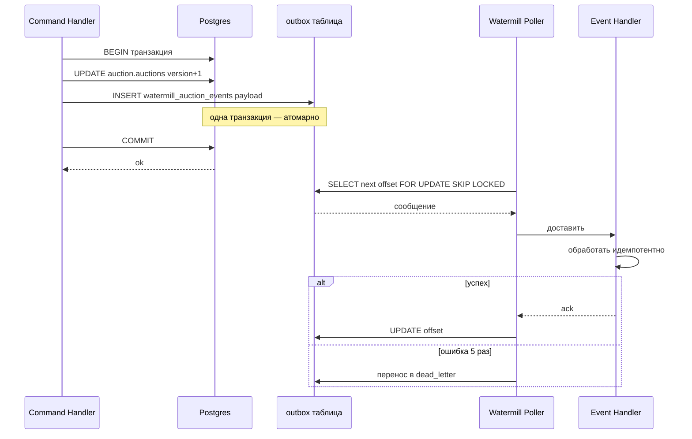

# 9. События, transactional outbox, идемпотентность

> Глава о том, как модули Molot общаются, не зная друг друга: два вида событий,
> почему «сохранили и опубликовали» — это баг, как Postgres становится шиной,
> и почему каждый подписчик обязан переживать дубликаты.

---

## Зачем это читать

Billing должен узнать, что аукцион закрылся. Notification — что счёт оплачен.
Settlement — что победитель не заплатил. Как только в системе больше одного
bounded context, появляется вопрос интеграции — и большинство систем отвечают
на него неправильно дважды. Сначала прямыми вызовами: получается сцепка всех
со всеми. Потом «событиями на словах»: сохранили агрегат, опубликовали
в брокер — и между этими двумя строчками процесс умер. Событие потеряно
навсегда, сага зависла, счёт не выставлен, и никто этого не увидел: все
графики зелёные, всё «работало». Такие баги не находят тестами — их находят
пользователи, неделями позже, по косвенным признакам.

Эта глава разбирает решение Molot слой за слоем: контракты событий, атомарная
публикация, доставка, идемпотентность, эволюция схемы. Для каждого слоя —
реальный код и ответ «почему так, а не иначе», потому что в этой теме каждое
«так принято» когда-то было чьим-то ночным инцидентом.

---

## Проблема

Назовём врагов поимённо — их четыре.

**Сцепка.** Если auction после закрытия синхронно дёргает billing, а billing —
notification, то граф вызовов через год превращается в спагетти. Падение
notification роняет закрытие аукциона — хвост виляет собакой. А каждый новый
потребитель означает правку издателя.

**Dual-write.** Наивный async: `repo.Save(auction)`, затем `broker.Publish(event)`.
У этой пары простая и подлая природа: два коммита в два хранилища без общей
транзакции — и между ними всегда есть щель. Процесс умирает в этой щели редко
(deploy, OOM, kill -9) — может, раз в месяц. Но когда умирает, состояние
изменилось, а события нет. Или зеркально: publish прошёл, транзакция
откатилась — и по шине гуляет событие о том, чего не было. Обе потери
**тихие**: ни ошибки, ни строчки в логах, за которую можно зацепиться, —
просто сага никогда не стартует.

**Дубликаты.** Любая надёжная доставка ретраит, а ретрай — это возможный
дубль. Подписчик, который шлёт email на каждое событие без дедупликации,
отправит победителю три поздравления. Или, что веселее для саппорта,
выставит три счёта.

**Эволюция схемы.** Событие — публичный контракт. Поменяли поле — сломали
подписчика, о существовании которого издатель даже не догадывается. И в
отличие от HTTP API, у шины нет рукопожатия версий: старые сообщения лежат
в хранилище и будут прочитаны когда-нибудь — возможно, кодом, написанным
через год после них.

---

## Теория

### Два вида событий

Первое разделение, которое надо провести, — между событиями «для себя»
и «для всех». Это разные жанры с разными правилами, и попытка обойтись
одним видом портит оба.

**Domain events** — богатые, внутренние. Несут доменные типы (`Bid`, `ClosingResult`),
записываются behavior-методами агрегата, живут в `domain/`. Их потребитель —
сам контекст: адаптер репозитория, тесты домена. Они меняются свободно, вместе
с моделью.

**Integration events** — плоские, версионированные, публичный контракт. Только
примитивы и `time.Time`, JSON-теги, суффикс версии в имени (`AuctionClosedV1`).
Живут в `events/` — единственном пакете контекста, который разрешено
импортировать снаружи.

Почему нельзя публиковать доменные события наружу? Три причины:

- **Сцепка с моделью.** Доменное событие тянет за собой доменные типы. Подписчик,
  десериализующий `auction.Bid`, импортирует домен чужого контекста — граница
  стёрта, рефакторинг модели ломает соседей.
- **Утечка данных.** Богатый агрегат знает лишнее. В Molot резервная цена аукциона —
  секрет продавца: она не должна попасть ни в один payload. Доменное событие
  `AuctionClosed{Result ClosingResult}` её содержит; интеграционное
  `AuctionClosedV1` — нет, наружу уходит только готовый вердикт `RunnerUpQualifies bool`.
- **Эволюция.** Домен меняется каждую итерацию; контракт обязан быть стабильным
  годами. Это разные скорости жизни — значит, разные структуры (тот же аргумент,
  что в главе про «свою модель на каждый слой»).

### Dual-write: три честных решения

- **Transactional outbox.** Событие пишется в ту же БД-транзакцию, что и агрегат —
  в таблицу-«исходящие». Отдельный механизм (поллер, relay) доставляет из таблицы
  подписчикам. Либо коммитится всё, либо ничего.
- **CDC (Change Data Capture).** Читать WAL базы (Debezium и т.п.) и превращать
  изменения строк в события. Атомарность бесплатно, но: события получаются
  «строчные», а не бизнесовые; плюс отдельная инфраструктура с собственными
  failure modes.
- **Event sourcing.** События и есть состояние; публикация = запись. Радикально
  честно, но это другой стиль всей системы, с другой стоимостью запросов
  и миграций.

Molot выбирает outbox: он даёт бизнес-события (не дифф строк), не требует
новой инфраструктуры и оставляет привычную реляционную модель. Если нужен
образ — письмо кладут в конверт в той же комнате, где подписывают договор.
Курьер придёт позже и будет ходить со своей скоростью, но он физически
не может застать подписанный договор без письма в лотке исходящих — и не
может унести письмо о сделке, которая сорвалась: договор и конверт рождаются
одним росчерком пера. А watermill-sql делает outbox почти бесплатным:
outbox-таблица **сама является топиком**, отдельный relay не нужен —
подписчики поллят её напрямую.

### At-least-once и миф exactly-once

Здесь придётся расстаться с приятной иллюзией. Доставка «ровно один раз»
между двумя независимыми системами невозможна без общей транзакции:
подтверждение обработки и сама обработка — снова dual-write, только теперь
на стороне потребителя. Любой «exactly-once» в маркетинге брокеров — это
at-least-once плюс дедупликация, спрятанная внутри, и вы платите за неё,
даже когда о ней не знаете. Честная инженерия называет вещи своими именами:
доставка — at-least-once, а **идемпотентность — обязанность каждого
подписчика**. Не «желательно», не «хорошим тоном» — инвариант с тестом
на повторную доставку для каждого хендлера.

### Версионирование: append-only навсегда

Схема события неизменяема после первой публикации — и причина тут не
эстетическая, а физическая: сообщения **лежат в хранилище**. В outbox-таблице,
в dead-letter, в логах replays. Подписчик с новым кодом однажды прочитает
сообщение годичной давности — и обязан его понять. Отсюда три правила:

- `V1` — в имени структуры, не в metadata: имя = ключ маршрутизации marshaler-а.
- Изменение поля = новая структура `V2` + **dual-publish** (издатель публикует
  обе версии, пока жив хоть один подписчик V1).
- «Поправить поле в V1» запрещено навсегда — даже «безобидное» переименование
  JSON-тега молча обнулит поле у всех подписчиков и во всех лежачих сообщениях.

---

## Как в Molot

### Богатое внутри, плоское снаружи

Доменное событие — `internal/auction/domain/auction/events.go:18`:

```go
// BidPlaced — recorded by PlaceBid. Outbid is the previous leading bid
// (zero for the first bid); Extended reports an anti-snipe extension.
type BidPlaced struct {
	Bid        Bid
	Outbid     Bid
	NewEndsAt  time.Time
	Extended   bool
	OccurredAt time.Time
}
```

Смотрите на поля: `Bid` — доменный тип со своими value objects внутри,
и событие свободно им оперирует, потому что не покидает контекста. Наружу
такое не уходит. Интеграционный двойник — `internal/auction/events/events.go:27`:

```go
type BidPlacedV1 struct {
	EventID        string    `json:"event_id"`
	AuctionID      string    `json:"auction_id"`
	BidID          string    `json:"bid_id"`
	BidderID       string    `json:"bidder_id"`
	AmountMinor    int64     `json:"amount_minor"`
	Currency       string    `json:"currency"`
	BidCount       int       `json:"bid_count"`
	Extended       bool      `json:"extended"`
	NewEndsAt      time.Time `json:"new_ends_at"`
	OutbidBidderID string    `json:"outbid_bidder_id"` // empty if this is the first bid
	OccurredAt     time.Time `json:"occurred_at"`
}
```

Та же информация — но в другом жанре: всё плоское, всё с JSON-тегами, богатый
`Bid` рассыпан на примитивы, а `Outbid` сжался до одного `OutbidBidderID`.
Правила этого жанра зафиксированы прямо в шапке пакета —
`internal/auction/events/events.go:1`:

```go
// Package events defines the auction context's public integration
// events — the ONLY auction package other contexts may import.
//
// Events are flat, versioned and append-only: a breaking change means a
// new V2 struct dual-published next to V1, never a field edit. Payloads
// carry primitives and time.Time only; all timestamps are UTC.
package events
```

Этот комментарий — не украшение, а контракт для ревью: три строки, по которым
отклоняется любой PR с «удобным» доменным типом в payload-е. Перевод между
мирами — один явный маппер в адаптере,
`internal/auction/adapters/events_mapper.go:12`:

```go
// mapDomainEvent translates one rich domain event into its flat
// integration V1 counterpart (§4.2), reading stable attributes off the
// aggregate. A nil return means "domain-only event, not published"
// (AuctionExtended — BidPlacedV1 already carries Extended/NewEndsAt).
// The reserve price never leaves: AuctionClosedV1 ships the ready-made
// RunnerUpQualifies verdict instead.
//
// The default branch panics: DomainEvent is a closed set (rule 12) —
// a new domain event without a mapping decision is a programmer error.
func mapDomainEvent(a *auction.Auction, e auction.DomainEvent) any {
```

Здесь три осознанных решения. Во-первых, `nil` — легальный ответ: не каждое
доменное событие интересно соседям (`AuctionExtended` — внутренняя механика
anti-snipe, его данные уже едут в `BidPlacedV1`). Во-вторых, маппер читает
атрибуты с агрегата, а не только с события — интеграционный payload денормализован
намеренно, чтобы подписчику не пришлось ходить за контекстом. В-третьих,
`default: panic`: появление нового доменного события без решения «публикуем
или нет» — ошибка программиста, и она должна взорваться на первом тесте,
а не молча потерять событие.

### Outbox: публикация в транзакции агрегата

Сердце главы — `internal/auction/adapters/auction_pg_repository.go:289`:

```go
// publishMapped maps domain events to integration V1 payloads and
// publishes them into the outbox bound to the open transaction: the
// event INSERT commits or rolls back together with the business write
// (rule 35).
func (r *AuctionPostgresRepository) publishMapped(ctx context.Context, tx *sql.Tx, a *auction.Auction, events []auction.DomainEvent) error {
	if len(events) == 0 {
		return nil
	}
	publisher, err := cwatermill.NewTxPublisher(tx, r.wmLogger)
	if err != nil {
		return fmt.Errorf("unable to create tx publisher: %w", err)
	}
	bus, err := cwatermill.NewEventBus(publisher,
		func(string) string { return auctionevents.Topic }, r.wmLogger)
	if err != nil {
		return fmt.Errorf("unable to create event bus: %w", err)
	}
	for _, e := range events {
		integration := mapDomainEvent(a, e)
		if integration == nil {
			continue
		}
		if err := bus.Publish(ctx, integration); err != nil {
			return fmt.Errorf("unable to publish %T to outbox: %w", integration, err)
		}
	}
	return nil
}
```

Обратите внимание на сигнатуру: метод принимает `*sql.Tx` — **ту самую**
транзакцию, в которой только что выполнился `UPDATE auction.auctions`.
`Publish` здесь — это `INSERT` в outbox-таблицу через тот же `tx`. Упал процесс
до `COMMIT` — откатились и состояние, и событие. Закоммитились — событие
гарантированно лежит и будет доставлено. Договор и конверт — одним росчерком:
dual-write устранён конструктивно, а не дисциплиной.

**Где вы на это наступите.** Ревью кода с outbox-ом проверяет одну вещь
быстрее всех остальных: откуда у publisher-а транзакция. Если `Publish`
зовётся после `tx.Commit()` или publisher создан от пула, а не от `tx`, —
перед вами dual-write, просто прикинувшийся outbox-ом. И он пройдёт все
тесты: щель между коммитом и publish-ем воспроизводится только убийством
процесса в нужной миллисекунде. Поэтому ищите не по логам, а по сигнатурам:
publisher без `*sql.Tx` в аргументах — повод остановить merge.

Привязка к транзакции — в общем инфраструктурном пакете,
`internal/common/watermill/pubsub.go:68`:

```go
// NewTxPublisher builds a publisher bound to an open *sql.Tx for outbox
// publication: the event INSERT commits or rolls back together with the
// business write. Schema auto-initialization is deliberately off — a
// CREATE TABLE inside the caller's transaction would implicitly commit
// it; topics are initialized by subscribers/pool publishers at startup.
func NewTxPublisher(tx *sql.Tx, logger wm.LoggerAdapter) (message.Publisher, error) {
	publisher, err := wmsql.NewPublisher(
		wmsql.TxFromStdSQL(tx),
		wmsql.PublisherConfig{
			SchemaAdapter:        wmsql.DefaultPostgreSQLSchema{},
			AutoInitializeSchema: false,
		},
		logger,
	)
	if err != nil {
		return nil, fmt.Errorf("create tx publisher: %w", err)
	}
	return NewTracingPublisherDecorator(publisher), nil
}
```

Деталь, которую легко пропустить и больно отлаживать:
`AutoInitializeSchema: false`. DDL в Postgres — транзакционный, но watermill
выполняет `CREATE TABLE IF NOT EXISTS` отдельным statement-ом, и внутри чужой
транзакции это лотерея с имплицитным коммитом и блокировками. Поэтому
tx-publisher схему не трогает никогда; топики инициализируют подписчики
и pool-publisher-ы на старте процесса.

Вся механика — на одной диаграмме. Следите за тем, где проходит граница транзакции: INSERT события в outbox — часть той же транзакции, что и UPDATE агрегата, а поллер и хендлер живут уже за её пределами, в своём ритме.



### Postgres как шина: таблица = топик, группа = хендлер

watermill-sql превращает таблицу `watermill_auction_events`
(`offset bigserial, uuid, payload jsonb, metadata jsonb, created_at`) в топик,
а таблицу `watermill_offsets_<topic>` — в курсоры потребителей (ARCHITECTURE §7).
Подписчик — `internal/common/watermill/pubsub.go:21`:

```go
// NewSQLSubscriber builds a Postgres subscriber for one consumer group.
// Consumer groups track offsets independently, so each event handler
// (group = handler name, see NewEventProcessor) receives every message.
// The first subscription initializes the watermill tables.
//
// pollInterval is the idle wait between SELECTs when no messages are
// pending (BUS_POLL_INTERVAL). It bounds end-to-end event latency per
// hop, so chained flows (participant → auction projection → saga) feel
// it multiplied; the library default of 1s is too sluggish for that.
func NewSQLSubscriber(db *sql.DB, consumerGroup string, pollInterval time.Duration, logger wm.LoggerAdapter) (message.Subscriber, error) {
```

Ключевое решение спрятано во втором аргументе: **consumer group = имя
хендлера**. У каждого хендлера — свой независимый offset, поэтому каждый видит
весь поток. `OnAuctionClosedStartSettlement` и `OnAuctionClosedNotifyOutcome`
читают одно и то же `AuctionClosedV1`, не мешая друг другу: отставание
notification не тормозит сагу. Это та же семантика, что у consumer groups
Kafka — и это не случайность (см. «Эволюция» ниже).

**Нюанс.** `pollInterval` выглядит безобидной настройкой, пока поток один.
Но цепочки событий складывают задержки: participant, за ним проекция auction,
за ней сага — это три хопа, и каждый ждёт своего поллинга. Библиотечный дефолт
в 1 секунду превращается в «почему статус обновился через три секунды?» —
вопрос, который вам зададут на первом же демо. Настраивайте интервал от длины
цепочек, а не от красоты числа.

Сборка в composition root умещается в одну строку — `internal/monolith/app.go:193`:

```go
	subscriberConstructor := func(handlerName string) (message.Subscriber, error) {
		return cwatermill.NewSQLSubscriber(db, handlerName, cfg.BusPollInterval, wmLogger)
	}
```

Но именно эта строка реализует правило «группа = хендлер»: каждый обработчик
получает подписчика со своим именем — и, значит, со своим курсором. Типизацию
хендлеров даёт cqrs-компонент — `internal/common/watermill/cqrs.go:14`:

```go
// Marshaler is the single event (un)marshaler of the platform; the bus
// and every processor must share it so event names match.
var Marshaler = cqrs.JSONMarshaler{GenerateName: cqrs.StructName}
```

Имя события на проводе — голое имя структуры (`AuctionClosedV1`): payload
читается глазами в psql и в dead-letter runbook-е. И один неочевидный флаг
в процессоре (`internal/common/watermill/cqrs.go:56`): `AckOnUnknownEvent: true`.
Топик несёт несколько типов событий, а хендлер потребляет один — сообщения
с чужим именем надо молча ack-ать, иначе каждое из них пройдёт пять ретраев
и засорит dead-letter «ошибками», которых нет.

### Идемпотентность: у каждого хендлера — натуральный ключ

Теперь обязанность потребителя. ARCHITECTURE §6.6 держит таблицу «хендлер,
натуральный ключ, механизм» для каждого подписчика платформы: идемпотентность
здесь не пожелание, а инвентаризованное свойство — у каждого хендлера есть
строка, и пустой она быть не может. Посмотрим на два характерных механизма
крупным планом.

**Upsert-проекция с монотонным guard-ом** —
`internal/auction/adapters/catalog_pg_projection.go:54`:

```go
// ApplyBid advances price/count/deadline. The monotonic guard
// (bid_count < incoming) makes redeliveries and out-of-order updates
// no-ops; the increment for the minimal next bid is joined from the
// context's own write table (the event does not carry it).
func (p *CatalogPostgresProjection) ApplyBid(
	ctx context.Context,
	auctionID uuid.UUID, amountMinor int64, bidCount int, newEndsAt time.Time,
) error {
	res, err := p.db.ExecContext(ctx, `
		UPDATE auction.catalog_items ci SET
			current_price_minor = $2,
			minimal_next_bid_minor = $2 + a.increment_minor,
			bid_count = $3,
			ends_at = $4,
			updated_at = now()
		FROM auction.auctions a
		WHERE ci.auction_id = $1 AND a.id = $1 AND ci.bid_count < $3`,
		auctionID, amountMinor, bidCount, newEndsAt)
```

`ci.bid_count < $3` — и дубликат, и пришедшее не по порядку обновление
становятся no-op: проекция движется только вперёд. Заметьте: `BidPlacedV1`
несёт `BidCount` именно ради этого guard-а — издатель проектировал событие
под идемпотентного потребителя. Это общий приём: монотонный счётчик или
версия в payload-е стоят дёшево, а превращают «обнови, если новее» из
распределённой задачи в одну строку SQL.

**Дедупликация побочного эффекта через `ON CONFLICT DO NOTHING`** — нотификации,
`internal/notification/adapters/sent_log_pg.go:28`:

```go
func (l *SentLogPG) FirstDelivery(ctx context.Context, eventID, kind, recipientID string) (bool, error) {
	res, err := l.db.ExecContext(ctx, `
		INSERT INTO notification.sent_notifications (event_id, kind, recipient_id, sent_at)
		VALUES ($1, $2, $3, now())
		ON CONFLICT DO NOTHING`,
		eventID, kind, recipientID)
	if err != nil {
		return false, fmt.Errorf("unable to record delivery %s/%s to %s: %w", eventID, kind, recipientID, err)
	}
	inserted, err := res.RowsAffected()
	if err != nil {
		return false, fmt.Errorf("unable to read rows affected for delivery %s/%s: %w", eventID, kind, err)
	}
	return inserted == 1, nil
}
```

Натуральный ключ — `(event_id, kind, recipient_id)`: одно событие законно
порождает несколько нотификаций (победителю и продавцу), и каждый слот
дедуплицируется отдельно. Порядок операций в хендлере — это тоже архитектура,
`internal/notification/ports/events.go:287`:

```go
// deliver sends one notification with deduplicated recording:
//  1. resolve the recipient — a failure here must NOT consume the dedup
//     slot, otherwise the notice would be lost forever;
//  2. record the (event, kind, recipient) slot; only the first recorder
//     proceeds (redeliveries become no-ops);
//  3. send the email.
//
// The record commits before the send: a crash between the two loses
// exactly that email (at-most-once-after-dedup, see the context
// README).
func (h EventHandlers) deliver(ctx context.Context, eventID, kind, recipientID, subject, news string) error {
```

Отправка email не транзакционна — значит, идеальной семантики не существует,
и надо **выбрать**, что терять при краше между записью слота и отправкой:
дубликат письма или его отсутствие. Здесь выбрано «потерять одно письмо»
(at-most-once-after-dedup) — и выбор задокументирован, а не случился сам.
Для денег выбор был бы противоположным; нет универсального ответа,
есть осознанный.

Каждый ключ из таблицы §6.6 покрыт тестом повторной доставки: задублируй
событие — состояние не изменится (BOOK_AUDIT, правило 37).

**Совет из практики.** Тест на повторную доставку дешевле всего написать
в том же PR, что и сам хендлер, — пока в голове свежо, какой у него
натуральный ключ. Шаблон всегда один: вызвать хендлер дважды с одним
событием и заассертить, что состояние после второго вызова не изменилось,
а побочный эффект случился ровно один раз. Сделайте его пунктом Definition
of Done для любого подписчика — это та редкая бюрократия, которая
возвращает вложенное при первом же redelivery из dead-letter.

### Порядок middleware и dead-letter

Осталось защитить доставку от падающих хендлеров — и не дать одному ядовитому
сообщению остановить очередь. Роутер один на бинарь, и цепочка его middleware
строго фиксирована — `internal/common/watermill/watermill.go:39`:

```go
// NewRouter builds the single message router of the binary with the
// middleware chain in this strict order:
//
//	CorrelationID → PoisonQueue(deadLetterPublisher, "events.dead_letter")
//	→ Retry{5 attempts, exponential backoff capped at 30s} → retryCounter
//	→ Recoverer → observe
//
// Recoverer sits innermost so panics become errors that Retry retries
// and PoisonQueue ultimately parks. retryCounter sits between Retry and
// Recoverer: each handler error visible at that layer is exactly one
// retry trigger, and it increments molot_bus_retries_total{handler}.
```

```go
	router.AddMiddleware(
		middleware.CorrelationID,
		poisonQueue,
		retry.Middleware,
		retryCounter,
		middleware.Recoverer,
		observe,
	)
```

Почему именно такой порядок — разберём изнутри наружу:

- **Recoverer внутри Retry**: паника хендлера должна стать ошибкой *до* того,
  как её увидит Retry — иначе паника пролетит мимо ретраев и уронит роутер.
- **Retry внутри PoisonQueue**: PoisonQueue реагирует на ошибку, всплывшую
  сквозь Retry, то есть только после исчерпания пяти попыток. Поменяйте их
  местами — и первое же временное падение БД отправит сообщение в dead-letter
  без единого ретрая.
- **PoisonQueue вообще** — потому что SQL-подписчик упорядочен: одно
  вечно-падающее сообщение остановило бы весь поток consumer group. Лучше
  припарковать его и ехать дальше, чем встать колом (ADR-0002).
- **CorrelationID снаружи всего**: id должен быть в контексте до того, как
  любой слой что-то залогирует — включая сам PoisonQueue, который кладёт
  metadata в dead-letter.

Что попадает в dead-letter **by design** (ARCHITECTURE §6.8): повреждённый
payload, инфраструктурная деградация дольше ретрай-бюджета (~1 мин), программный
баг хендлера. Что **не попадает**: бизнес-невалидные переходы — дубликаты
и неожиданные состояния ack-аются guard-ами как штатный no-op. Из этого
следует жёсткое правило мониторинга: `molot_bus_dead_letter_size > 0` —
**всегда инцидент, алерт немедленно**. Если бы в dead-letter сыпался бизнес-шум,
алерт быстро бы «оглох» — поэтому шум туда не пускают на уровне дизайна
хендлеров, а не фильтров алертинга.

### Trace propagation: один трейс от HTTP до email

Шина асинхронна, но трейс — сквозной: producer-спан инъецирует W3C trace
context в metadata сообщения — `internal/common/watermill/pubsub.go:101`:

```go
func (p tracingPublisher) Publish(topic string, messages ...*message.Message) error {
	tracer := otel.Tracer(tracerName)
	propagator := otel.GetTextMapPropagator()

	spans := make([]trace.Span, 0, len(messages))
	for _, msg := range messages {
		// cqrs buses set the publish context on the message; fall back
		// to a fresh root span when a caller publishes raw messages.
		ctx, span := tracer.Start(msg.Context(), "publish "+topic,
			trace.WithSpanKind(trace.SpanKindProducer))
		propagator.Inject(ctx, metadataCarrier(msg.Metadata))
		spans = append(spans, span)
	}
```

а consumer-сторона (`observe`, innermost-middleware,
`internal/common/watermill/watermill.go:114`) извлекает контекст из metadata
и стартует спан `events/<HandlerName>`, парентя его к публикующему. Итог: весь
путь от HTTP через команду, БД и publish в `auction-events` до
`events/OnAuctionClosedStartSettlement`
виден одним трейсом, хотя между publish и handle могли пройти секунды и рестарт
процесса. Metadata сообщения — это и есть «заголовки» шины; кладите туда
traceparent и correlation id, а не в payload: контракт события — про бизнес,
транспортные заботы едут отдельно.

### Эволюция к Kafka: что меняется, а что нет

ADR-0002, раздел «Последствия»:

> - (+) Миграция на Kafka = замена publisher/subscriber (+ Watermill forwarder
>   как мост); контракты `events/`, хендлеры и тесты не трогаются.
> - (−) Пропускная способность ограничена (polling, сотни msg/s) и есть задержка
>   доставки — для reference-системы достаточно; узкое место заранее обложено
>   метриками (`molot_bus_oldest_message_age_seconds`, lag offsets, retries) —
>   сигнал к миграции виден до боли.

Это и есть выигрыш правильной слоистости: хендлеры зависят от `cqrs.EventHandler`
и типов из `events/`, а не от `watermill-sql`. Замена транспорта — это новая
пара publisher/subscriber в `common/watermill` плюс forwarder (publish по-прежнему
идёт в Postgres-outbox транзакционно, forwarder перекачивает в Kafka — outbox
никуда не девается, потому что dual-write никуда не девается). Семантика
consumer groups совпадает по построению. А момент миграции подскажут метрики
лага, а не продакшен-инцидент.

---

## Трейдоффы

У каждого решения этой главы есть ценник. Вот он, без мелкого шрифта:

| Решение | Платим | Получаем |
|---|---|---|
| Postgres как шина | Сотни msg/s потолок, polling-задержка на каждый хоп, шина делит бэкапы/нагрузку с данными | Ноль новой инфраструктуры; outbox тривиально корректен; дев-окружение = прод по код-путям |
| Outbox vs CDC | Маппер и publish-код руками в каждом репозитории | Бизнес-события вместо диффа строк; никакого Debezium в on-call |
| At-least-once + идемпотентность | Каждый хендлер думает о дубликатах; тест на redelivery — обязателен | Честная семантика без магии; redelivery из dead-letter всегда безопасен |
| Append-only V1/V2 | Dual-publish и жизнь двух схем на время миграции | Лежачие сообщения читаемы всегда; подписчики не ломаются молча |
| Два вида событий + маппер | Дублирование полей domain/integration структур | Граница контекста реальна; домен меняется без согласования с соседями |
| Денормализованные payload-ы | События толще, издатель знает нужды подписчиков | Подписчик не ходит за контекстом → нет sync-сцепки в обратную сторону |

Отдельно про consumer groups «каждому хендлеру — своя»: это умножает offset-строки
и SELECT-ы поллинга, зато ни один медленный подписчик не тормозит остальных,
а отключение хендлера не теряет его позицию.

---

## Типичные ошибки

Все восемь — из реальных ревью; каждую хотя бы раз пытались закоммитить
умные люди с хорошими намерениями.

1. **Publish после commit.** Сначала `tx.Commit()`, потом `publisher.Publish(...)` — это
   dual-write, просто переставленный. Признак в ревью: publisher, которому
   не передали `*sql.Tx`/`updateFn`-контекст транзакции.
2. **Доменное событие в брокере.** «Быстрее же» — а через год подписчики
   импортируют чужой домен, и `Bid` нельзя переименовать без релиз-поезда
   трёх команд.
3. **Правка V1 «по-тихому».** Переименовали JSON-тег, «никто же не заметит» —
   заметят: все сообщения, уже лежащие в outbox/dead-letter, при чтении дадут
   zero value. Append-only — без исключений.
4. **Идемпотентность «на глазок».** Хендлер «вроде безопасен при дубле», теста
   нет. После первого redelivery из dead-letter — двойной email или двойной счёт.
   Правило: нет теста на повторную доставку — хендлер не существует.
5. **Retry снаружи PoisonQueue.** Перепутанный порядок middleware: сообщения
   улетают в dead-letter с первой временной ошибки, алерт орёт на каждый
   blip БД, команда выключает алерт — и пропускает настоящий poison.
6. **Бизнес-отказы в dead-letter.** «Аукцион не найден» из проекции возвращается
   как ошибка — дальше пять ретраев, dead-letter, шум. Невалидный *переход* — это ack
   (guard решил «не применять»), ошибка — это «не смог узнать/записать» (retry).
   Различайте на уровне типа ошибки, как `errProjectionLag` в catalog-проекции.
7. **Авто-DDL внутри чужой транзакции.** `AutoInitializeSchema: true`
   в tx-publisher-е: работает на дев-стенде, в проде ловите имплицитные коммиты
   и взаимоблокировки на ровном месте.
8. **Контекст в payload вместо metadata.** traceparent/correlation_id полями
   события — контракт замусорен транспортом, а смена observability-стека
   становится «миграцией схемы событий».

---

## Чек-лист

Сверяйте свою шину по списку — каждый пункт здесь закрывает конкретную потерю
данных или ночной алерт:

- [ ] Интеграционные события — отдельные плоские структуры в `events/`,
      только примитивы + `time.Time`, JSON-теги, `V1` в имени.
- [ ] `events/` — единственный пакет контекста, импортируемый снаружи;
      доменные события не покидают контекст.
- [ ] Маппер из domain в integration — один, в адаптере; `default: panic`
      на неизвестное доменное событие; чувствительные поля (резервная цена)
      не публикуются — наружу уходят готовые вердикты.
- [ ] Publish — только внутри транзакции агрегата (`NewTxPublisher(tx, …)`);
      нет ни одного `Publish` после `Commit`.
- [ ] У tx-publisher-а авто-инициализация схемы выключена.
- [ ] Consumer group = имя хендлера; каждый хендлер получает весь поток
      независимо.
- [ ] У каждого хендлера — натуральный ключ идемпотентности, записанный
      в таблицу (§6.6), и тест повторной доставки.
- [ ] Проекции — upsert с монотонным guard-ом; побочные эффекты —
      `ON CONFLICT DO NOTHING`-леджер с осознанным выбором, что терять при краше.
- [ ] Middleware строго в порядке: CorrelationID, затем PoisonQueue, Retry, Recoverer;
      порядок зафиксирован в одном `NewRouter` на бинарь.
- [ ] Dead-letter: бизнес-невалидное ack-ается guard-ами и туда не попадает;
      алерт на size > 0 — немедленно; runbook redelivery написан.
- [ ] Trace context и correlation id — в metadata сообщения, не в payload;
      путь от HTTP через outbox до handler-а виден одним трейсом.
- [ ] Изменение схемы события = V2 + dual-publish; правка V1 заблокирована
      ревью навсегда.
- [ ] Метрики лага шины (`oldest_message_age`, retries, dead_letter_size)
      сняты заранее — сигнал к миграции на Kafka приходит из дашборда.

---

## Ссылки

- `docs/ARCHITECTURE.md` §4 (события: §4.1 domain, §4.2 integration,
  §4.3 матрица publish/subscribe, §4.4 инфраструктура шины); §6.6 (таблица
  натуральных ключей идемпотентности); §6.8 (dead-letter и runbook);
  §7 (watermill-таблицы).
- `docs/BOOK_AUDIT.md`, правила 34–38: плоские версионированные события;
  outbox в одной транзакции; один router и порядок middleware; идемпотентность
  с тестом; sync/async по природе процесса.
- `docs/adr/0002-watermill-sql-bus.md` — почему Postgres как шина, почему
  PoisonQueue снаружи Retry, путь миграции на Kafka.
- `docs/TEXTBOOK.md`, гл. 8 — краткая версия этой главы и золотое правило 8:
  «Состояние и факт о его изменении должны фиксироваться одной транзакцией».
- Код: `internal/auction/events/events.go`,
  `internal/auction/adapters/events_mapper.go`,
  `internal/auction/adapters/auction_pg_repository.go` (`publishMapped`),
  `internal/common/watermill/{watermill,pubsub,cqrs,metrics}.go`,
  `internal/auction/adapters/catalog_pg_projection.go`,
  `internal/notification/ports/events.go`,
  `internal/notification/adapters/sent_log_pg.go`.
