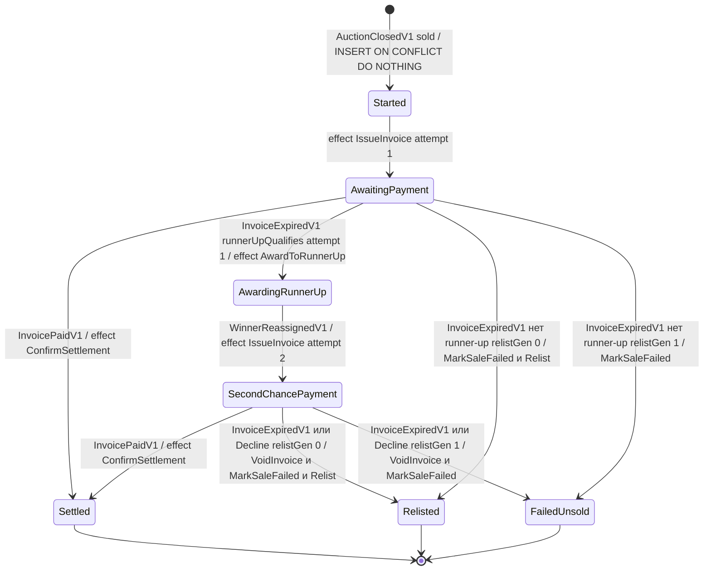

# 10. Сага: распределённый процесс без распределённой транзакции

> Файлы главы: `internal/settlement/domain/settlement/*.go`, `internal/settlement/app/handlers.go`, `internal/settlement/app/command/*.go`, `internal/settlement/adapters/*_facade_adapter.go`. Документы: `docs/ARCHITECTURE.md` §6 (целиком), `docs/adr/0004-settlement-saga.md`, `docs/TEXTBOOK.md` гл. 9.

Это центральная глава книги. Всё, что было до неё — слои, агрегаты, repository, события, outbox —
здесь собирается в одну конструкцию: длинный бизнес-процесс через три bounded context-а, который
живёт часами и обязан пережить crash в любой точке, не потеряв ни денег, ни лота. Поймёте
settlement — остальная архитектура перестанет казаться набором правил.

## Зачем

После удара молотка начинается процесс: выставить счёт победителю → дождаться оплаты или
таймаута → при неоплате предложить лот второму бидеру (second chance) → при отказе или
повторной неоплате перевыставить лот → если и это не помогло — признать продажу
несостоявшейся. Три контекста (`auction`, `billing`, `settlement`), длительность — часы
или дни, и на каждом шаге процесс может упасть: деплой, OOM, обрыв сети, рестарт пода.

Вопрос главы: как гарантировать, что процесс **всегда доходит до терминала** (`Settled`,
`Relisted`, `FailedUnsold`) и никогда не зависает в «победитель назначен, счёт не выставлен»?

## Проблема: транзакцией это не обернуть

Первый рефлекс — «нужна распределённая транзакция». Почему 2PC (two-phase commit) здесь
не работает — не из-за моды, а по физике процесса:

1. **Локи на время процесса.** 2PC держит ресурсы заблокированными между prepare и commit.
   Наш процесс ждёт оплаты счёта часами — row lock на агрегате аукциона на часы остановит
   все остальные операции над ним. Транзакция — инструмент для миллисекунд.

2. **Участник процесса — человек.** Победитель, который платит (или не платит) счёт,
   не голосует в prepare/commit. Процесс с человеческим шагом принципиально не атомарен.

3. **Координатор — единая точка отказа.** Упавший координатор 2PC оставляет участников
   в prepared-состоянии с удержанными локами до ручного вмешательства: мы меняем «процесс
   может упасть» на «процесс может упасть и заблокировать всех».

4. **Границы контекстов.** Каждый контекст Molot владеет своей схемой Postgres, cross-schema
   запросы запрещены ревью и CI (ARCHITECTURE §7). Транзакция через две схемы — дыра в границе,
   контексты срастаются на уровне данных. ADR-0004 отклоняет этот вариант прямо: «ломает
   границы контекстов (правило 3)».

Второй рефлекс — «сделаем цепочку синхронных вызовов и обработаем ошибки». TEXTBOOK гл. 9
называет цену честно:

> **Почему болит.** Упадёт. Между любыми двумя шагами. И система останется в «полусостоянии»:
> победитель назначен, счёт не выставлен. Без явного процесса такие зависания находят пользователи.

## Теория: сага

Сага (Garcia-Molina & Salem, 1987) — замена одной длинной транзакции на
**последовательность коротких локальных транзакций**, каждая коммитится самостоятельно,
плюс **компенсации** — действия, семантически отменяющие уже закоммиченные шаги, если
процесс не может продолжиться.

Ключевая смена гарантий. Транзакция обещает atomicity: «всё или ничего». Сага обещает
слабее, но достижимо: **процесс всегда довершится — вперёд до конца или через компенсации**.
Промежуточные состояния видимы («счёт выставлен, не оплачен» — наблюдаемый факт, не грязное
чтение), и это нормально: они и в реальном бизнесе видимы.

Второй сдвиг TEXTBOOK фиксирует золотым правилом 9:

> В распределённом процессе нельзя гарантировать «ровно один раз» — можно гарантировать
> «как минимум один раз + идемпотентность». Сага — это машина состояний плюс честность
> по поводу того, где она может упасть.

«Честность по поводу того, где она может упасть» — не фигура речи. Дальше мы увидим, что
в Molot каждая точка возможного падения (crash seam) перечислена в таблице §6.7 и закрыта
отдельным тестом.

### Оркестрация vs хореография

Сагу можно построить двумя способами:

- **Хореография**: нет центрального координатора. Каждый контекст подписан на события соседей
  и реагирует сам: billing слышит `AuctionClosed` и выставляет счёт, auction слышит
  `InvoiceExpired` и перевыставляет лот. Процесс — эмерджентное свойство подписок.
- **Оркестрация**: выделенный process manager хранит состояние процесса и раздаёт команды.
  Процесс — явная машина состояний, которую можно прочитать одним SELECT.

Хореография подкупает слабой связностью и хорошо работает для **линейных** потоков из 2–3
шагов без ветвлений («заказ создан → письмо отправлено»). Но у settlement ветвящиеся
компенсации (second chance → relist → fail), бизнес-лимит (`relistGen` cap) и потребность
ops-инженера ответить «где сейчас процесс по аукциону X». ADR-0004 отклоняет хореографию
ровно по этим причинам:

> **Хореография без process manager** — отклонено: ветвящиеся компенсации размазываются
> по подписчикам, нет единого состояния для ops, cap relist-ов негде держать.

Третий пункт важнее, чем кажется: счётчик перевыставлений — **состояние процесса**, а не
какого-то из агрегатов. В хореографии его пришлось бы прятать в auction (который не должен
знать про политику расчётов) или в billing (которому он не нужен). Состоянию процесса нужен
дом — это и есть аргумент за process manager. Цена — оркестратор знает о соседях; Molot
платит её осознанно (см. «Трейдоффы»).

## Как в Molot

### 10.1. Состояние процесса — богатый агрегат

Settlement — не таблица с колонкой `status`, а агрегат со state machine. Состояния —
закрытый enum (`internal/settlement/domain/settlement/state.go`):

```go
// State is the closed lifecycle enum of the settlement saga (§2.4,
// state diagram §6.2). Settled, Relisted and FailedUnsold are terminal.
type State struct{ s string }

var (
	StateStarted             = State{"started"}
	StateAwaitingPayment     = State{"awaiting_payment"}
	StateAwardingRunnerUp    = State{"awarding_runner_up"}
	StateSecondChancePayment = State{"second_chance_payment"}
	StateSettled             = State{"settled"}
	StateRelisted            = State{"relisted"}
	StateFailedUnsold        = State{"failed_unsold"}
)
```

Классификация терминальности (`IsTerminal`, там же) написана switch-ем с паникой в default:
новое состояние нельзя добавить, не решив осознанно, терминально ли оно (правило 12). Сам
агрегат (`settlement.go:24`) несёт всё, что нужно для решений процесса: текущего должника
(`winner` — сперва победитель, после award — runner-up), номер попытки (`attempt` 1/2),
квалификацию второго бидера (`runnerUpQualifies`), счётчик перевыставлений (`relistGen`) и
ожидаемый счёт (`invoiceID`). Переходы — отдельные guard-ящие методы commit-фазы; вот
простейший (`internal/settlement/domain/settlement/settlement.go`):

```go
// InvoiceIssued commits Started → AwaitingPayment after the attempt-1
// IssueInvoice effect.
func (s *Settlement) InvoiceIssued(inv InvoiceID) error {
	if s.state != StateStarted || inv.IsZero() || inv != s.invoiceID {
		return ErrUnexpectedTransition
	}
	s.state = StateAwaitingPayment
	return nil
}
```

Полная таблица переходов — ARCHITECTURE §6.3; диаграмма — §6.2. Важно: `Relisted` —
терминал. Перевыставленный аукцион — **новый** аукцион со своей сагой при закрытии. Процесс
не зацикливается внутри одной саги, а порождает следующую — и `relistGen` нового лота
гарантирует, что цепочка оборвётся после первого перевыставления.

Полная машина состояний саги — все рёбра и все терминалы:



### 10.2. Decide-фазы — чистые функции

Принципиальное решение: **решение отделено от исполнения**. Все decide-методы агрегата —
value receiver, без мутаций, без I/O: `DecideOnPaymentTimeout` guard-ит вход
(`guardLiveInvoice`: тот ли счёт, то ли состояние) и отдаёт развилку компенсаций — сердце
всей саги (`internal/settlement/domain/settlement/settlement.go`):

```go
// nextStepOnFailure is the compensation decision (§6.2): a qualifying
// runner-up gets the second chance on the first attempt; otherwise the
// auction is relisted once (relistGen 0) and then fails for good.
func (s Settlement) nextStepOnFailure() NextStep {
	if s.attempt == 1 && s.runnerUpQualifies {
		return StepAwardRunnerUp
	}
	if s.relistGen == 0 {
		return StepRelist
	}
	return StepFailUnsold
}
```

Результат решения — тоже доменный тип: `NextStep`, закрытый enum из трёх шагов
(`StepAwardRunnerUp | StepRelist | StepFailUnsold`,
`internal/settlement/domain/settlement/nextstep.go`) с паникой на неизвестном значении.

Зачем такая аскеза? Три причины:

1. **Тестируемость без инфраструктуры.** Вся политика компенсаций — «кому second chance,
   когда relist, когда сдаться» — проверяется конструированием `Settlement` в нужном
   состоянии и одним вызовом функции. Ни БД, ни моков, ни event bus.
2. **Решение видно целиком.** Развилка `nextStepOnFailure` — 8 строк; в хореографии она
   была бы размазана по подписчикам двух контекстов.
3. **Переиспользование.** Та же развилка обслуживает и таймаут оплаты
   (`DecideOnPaymentTimeout`), и явный отказ от оферты (`DecideOnDecline`) — два входа,
   одно доменное решение, два разных `FailureReason`.

Commit-фаза — отдельные методы с pointer receiver (`InvoiceIssued`, `PaymentReceived`,
`ApplyNextStep`, …), которые **guard-ят и выполняют** переход. Граница между «решить» и
«изменить» проведена прямо в сигнатурах: value receiver — решение, pointer receiver — переход.

### 10.3. Протокол шага: decide → effect → commit

Теперь главное. Каждый обработчик события и команда саги исполняется в три фазы — это
зафиксировано в ADR-0004 как «фикс транзакционной структуры»:

> 1. *decide* — короткое чтение + чистая доменная функция решения; «состояние уже дальше» → ack (дубликат).
> 2. *effect* — gateway-вызовы **строго вне какой-либо транзакции settlement** (никогда внутри updateFn:
>    иначе чужая транзакция коммитится под row-lock-ом саги). Каждый фасад идемпотентен:
>    «уже в целевом состоянии» → sentinel → no-op.
> 3. *commit* — короткая `repo.Update` (FOR UPDATE + version): переход state machine. Конфликт → ack,
>    эффекты были идемпотентны.

Посмотрим на живой код. Старт саги — обработчик `AuctionClosedV1`
(`internal/settlement/app/handlers.go`):

```go
	// decide: idempotent insert (PK auction_id), then the authoritative
	// stored state decides — a crash after the insert is continued here.
	started, err := settlement.Start(closing)
	if err != nil {
		return err
	}
	if err := h.repo.Add(ctx, started); err != nil {
		return err
	}
	current, err := h.repo.Get(ctx, closing.AuctionID())
	if err != nil {
		return err
	}
	needIssue, err := current.DecideOnInvoiceIssue()
	if err != nil {
		return ackUnexpected(err) // past Started: a duplicate delivery
	}
	if !needIssue {
		return nil
	}

	// effect: idempotent on the billing side — the deterministic id and
	// UNIQUE(auction_id, attempt) turn a repeat into a no-op.
	if err := h.billing.IssueInvoice(ctx,
		current.InvoiceID(), current.AuctionID(), current.Winner(), current.Hammer(), current.Attempt(),
	); err != nil {
		return err
	}

	// commit.
	return ackUnexpected(h.repo.Update(ctx, closing.AuctionID(),
		func(_ context.Context, s *settlement.Settlement) (*settlement.Settlement, error) {
			if err := s.InvoiceIssued(current.InvoiceID()); err != nil {
				return nil, err
			}
			return s, nil
		}))
```

**Почему gateway-вызовы нельзя звать внутри updateFn.** Соблазн велик: обернуть
`IssueInvoice` и переход состояния в одну транзакцию — «атомарно же». Но `IssueInvoice` —
вызов фасада billing, который **коммитит свою транзакцию в своей схеме**. Внутри `updateFn`
это даёт два эффекта разом:

1. *Чужая транзакция под чужим локом.* `repo.Update` держит `SELECT ... FOR UPDATE` на строке
   саги; внутри лока исполняется и коммитится транзакция billing — со своими локами,
   длительностью, ретраями. Время удержания лока саги зависит теперь от здоровья соседнего
   контекста: рецепт каскадных деградаций и дедлоков.
2. *Side effect опережает состояние.* Транзакция billing закоммитилась — счёт существует,
   `InvoiceIssuedV1` в outbox соседа — а транзакция саги ещё может откатиться. Мир изменён,
   сага «не знает», протокола восстановления для такой раскладки нет. Атомарности всё равно
   не вышло — вышла её иллюзия, что хуже.

Поэтому порядок жёсткий: **сначала эффект, потом фиксация**. Crash между ними — не баг
протокола, а его рабочий режим (см. 10.4).

**Commit — короткая транзакция под локом.** `repo.Update` (контракт —
`internal/settlement/domain/settlement/repository.go:24`) исполняет updateFn под
`SELECT ... FOR UPDATE` с проверкой `version` поверх (belt-and-suspenders в
`settlement_pg_repository.go:108`); ошибка updateFn откатывает всё и возвращается как есть —
`ErrUnexpectedTransition` остаётся распознаваемым для ack. Внутри updateFn — только переход
state machine: миллисекунды под локом вместо часов.

**ack как ответ на дубликат.** Шина доставляет at-least-once, значит каждый хендлер обязан
уметь съесть повтор. Этим занят финальный аккорд каждого хендлера — `ackUnexpected`
(`handlers.go:350`): он превращает `settlement.ErrUnexpectedTransition` в `nil`, и шина
подтверждает сообщение. «Сага уже дальше этого шага» — не ошибка, а нормальный исход
дубликата. Ack-ается **только** этот sentinel: `ErrWinnerMismatch` (межконтекстная аномалия)
не ack-ается никогда и через ретраи уезжает в dead letter к оператору (§6.8).

**Идемпотентные фасады — предусловие протокола.** Протокол работает, только если фазу effect
можно повторять сколько угодно раз. Это контракт consumer-defined интерфейсов саги
(`internal/settlement/app/handlers.go`):

```go
// Consumer-side gateways (rule 5, §6, ADR-0004): the slice of the
// foreign sync facades the saga's event handlers need. Adapters bridge
// them to auctionservice.Facade / billingservice.Facade; every command
// is idempotent on the far side ("already in the target state" → nil),
// which makes the effect phase safely repeatable.
type auctionGateway interface {
	AwardToRunnerUp(ctx context.Context, auctionID settlement.AuctionID) error
	Relist(ctx context.Context, originalID, newID settlement.AuctionID, startsAt, endsAt time.Time) error
	MarkSaleFailed(ctx context.Context, auctionID settlement.AuctionID, reason settlement.FailureReason) error
	ConfirmSettlement(ctx context.Context, auctionID settlement.AuctionID) error
}
```

«Уже в целевом состоянии → nil» — повторный `ConfirmSettlement` по settled-аукциону,
повторный `IssueInvoice` с тем же детерминированным id, повторный `MarkSaleFailed` — всё
no-op; адаптеры (`internal/settlement/adapters/billing_facade_adapter.go:48`) проговаривают
контракт явно. И деталь, замыкающая протокол: интеграционные события чужих контекстов
публикуются только транзакциями, **реально совершившими** переход (outbox, гл. 8) — повторный
no-op-эффект не порождает дублей событий.

### 10.4. Карта швов: любой обрыв лечится redelivery

Теперь — обещанная «честность по поводу того, где она может упасть». ARCHITECTURE §6.7 —
таблица всех точек падения (crash seams) с предписанным поведением redelivery, и **на каждый
шов есть тест**. Тесты — лучшая документация протокола; разберём четыре
(`internal/settlement/app/handlers_test.go`).

**Шов 1: после INSERT саги, до IssueInvoice.** Сага создана, счёт не выставлен — то самое
«полусостояние», которым нас пугала наивная цепочка вызовов:

```go
	t.Run("seam: crash after the insert before IssueInvoice", func(t *testing.T) {
		t.Parallel()
		f := newFixture(t)
		e := soldAuction(soldOpts{})

		// First delivery dies in the effect: the saga row exists, the
		// invoice does not.
		f.billing.issueErr = errors.New("billing is down")
		require.Error(t, f.handlers.OnAuctionClosed(ctx, e))
		assert.Equal(t, settlement.StateStarted, f.repo.mustGet(t, auctionIDOf(t, e)).State())

		// Redelivery continues from Started: issue → commit (§6.7).
		f.billing.issueErr = nil
		require.NoError(t, f.handlers.OnAuctionClosed(ctx, e))
		assert.Equal(t, settlement.StateAwaitingPayment, f.repo.mustGet(t, auctionIDOf(t, e)).State())
	})
```

Хендлер вернул ошибку → шина не подтвердила → redelivery проходит тот же путь: `Add` — no-op
(`INSERT ... ON CONFLICT (auction_id) DO NOTHING`), `Get` возвращает `Started`, decide
говорит «счёт ещё нужен», effect выставляет, commit довершает. Сага не «восстанавливается»
особым кодом — она **продолжается** тем же хендлером. Это и есть idempotent continuation.

**Шов 2: после IssueInvoice, до commit.** Зеркальный случай — эффект совершён, фиксация
потеряна. Тест `"seam: crash after IssueInvoice before the commit"` (`handlers_test.go:88`)
скриптует ошибку на `repo.Update`: после первого прогона счёт выставлен, но сага всё ещё
в `Started`. Redelivery повторяет effect — и вот где окупается идемпотентность фасада:
billing видит знакомый детерминированный id, отвечает «уже выставлен» → nil, хендлер
довершает commit. Ассерт фиксирует суть:

```go
		assert.Len(t, f.billing.issues, 2, "the repeated effect is a no-op by the deterministic id")
		assert.Equal(t, settlement.StateAwaitingPayment, f.repo.mustGet(t, auctionIDOf(t, e)).State())
```

Фасад вызван **дважды**, но счёт в системе один.

**Шов 3: между двумя эффектами компенсации (MarkSaleFailed и Relist).** Ветка relist делает
два gateway-вызова подряд — значит, есть шов и между ними:

```go
	t.Run("seam: crash between MarkSaleFailed and Relist", func(t *testing.T) {
		t.Parallel()
		f := newFixture(t)
		e := soldAuction(soldOpts{noRunnerUp: true})
		f.closeSold(t, e)

		f.auctions.relistErr = errors.New("crashed between the two effects")
		require.Error(t, f.handlers.OnInvoiceExpired(ctx, e.AuctionID, firstInvoiceOf(t, e).UUID()))
		assert.Equal(t, settlement.StateAwaitingPayment, f.repo.mustGet(t, auctionIDOf(t, e)).State())

		// Redelivery repeats BOTH effects: FailSale → no-op, Relist runs.
		f.auctions.relistErr = nil
		require.NoError(t, f.handlers.OnInvoiceExpired(ctx, e.AuctionID, firstInvoiceOf(t, e).UUID()))
		assert.Len(t, f.auctions.markFails, 2)
		assert.Len(t, f.auctions.relists, 2)
		assert.Equal(t, f.auctions.relists[0].newID, f.auctions.relists[1].newID,
			"the deterministic relist id makes the repeat a no-op on the auction side")
		assert.Equal(t, settlement.StateRelisted, f.repo.mustGet(t, auctionIDOf(t, e)).State())
	})
```

Хендлер не запоминает, «докуда дошёл» — никаких чекпоинтов между эффектами. Redelivery
повторяет **оба** вызова: `MarkSaleFailed` — no-op (продажа уже провалена), `Relist` —
выполняется. Одинаковый `newID` в обоих вызовах (см. 10.8) гарантирует: упади и второй
прогон, третий не создал бы лота-двойника.

**Шов 4: version-конфликт на commit — конкурентный дубль.** Два экземпляра обработчика (или
хендлер против воркера) добежали до commit одновременно. Проигравший получает
`ErrUnexpectedTransition` из updateFn — состояние уже изменено победителем:

```go
	t.Run("seam: a concurrent commit between decide and commit is acked", func(t *testing.T) {
		t.Parallel()
		f := newFixture(t)
		e := soldAuction(soldOpts{noRunnerUp: true, relistGen: 1})
		f.closeSold(t, e)
		id := auctionIDOf(t, e)

		// A competing expiry handler commits FailedUnsold right before
		// our updateFn runs — the duplicate's commit must ack (§6.3 last row).
		f.repo.onUpdate = func() {
			f.repo.mutateLocked(t, id, func(s *settlement.Settlement) error {
				return s.ApplyNextStep(settlement.StepFailUnsold, settlement.ReasonPaymentTimeout)
			})
		}
		require.NoError(t, f.handlers.OnInvoicePaid(ctx, e.AuctionID, firstInvoiceOf(t, e).UUID()))
		assert.Equal(t, settlement.StateFailedUnsold, f.repo.mustGet(t, id).State())
	})
```

Проигравший **ack-ает**, а не ретраит: его эффекты были идемпотентны, состояние консистентно,
повторять нечего. Принцип всей карты один: **любой обрыв лечится повторной доставкой входа** —
decide увидит фактическое состояние, эффекты повторятся как no-op, commit довершит переход.
Ни одна точка падения не требует ручного вмешательства или специального recovery-кода.

### 10.5. Fast-forward: событие как доказательство эффекта

Самый тонкий случай протокола. Сценарий: сага в `AwaitingPayment`, счёт истёк, decide выбрал
`StepAwardRunnerUp`, effect `AwardToRunnerUp` **совершён** — аукцион переназначил победителя
и опубликовал `WinnerReassignedV1` через свой outbox — а commit `AwardingRunnerUp` погиб
вместе с процессом. `WinnerReassignedV1` прилетает в сагу, которая по своим данным всё ещё
в `AwaitingPayment`.

Наивный guard «принимаю `WinnerReassignedV1` только из `AwardingRunnerUp`» дал бы
`ErrUnexpectedTransition` → ack — и событие потеряно навсегда: redelivery `InvoiceExpiredV1`
со временем дотащит сагу до `AwardingRunnerUp`, но `WinnerReassignedV1` уже подтверждён шине
и не придёт — счёт attempt-2 не выставится никогда. ARCHITECTURE §6.3 фиксирует это отдельной
строкой таблицы переходов:

> | **AwaitingPayment** | **WinnerReassignedV1** | **fast-forward**: событие — доказательство,
> что AwardToRunnerUp совершён (крах до commit AwardingRunnerUp) | IssueInvoice(attempt=2) |
> SecondChancePayment | без fast-forward событие ack-ается и сага зависает в AwardingRunnerUp
> после redelivery таймаута |

Решение — в decide-фазе домена: `AwaitingPayment` принимается наравне с `AwardingRunnerUp`,
потому что **само событие — неподделываемое доказательство совершённого эффекта**. Аукцион
не публикует `WinnerReassignedV1` без закоммиченного переназначения
(`internal/settlement/domain/settlement/settlement.go`):

```go
// DecideOnWinnerReassigned guards WinnerReassignedV1 before the
// attempt-2 IssueInvoice effect. StateAwaitingPayment is the
// fast-forward seam (§6.3): the event proves AwardToRunnerUp committed
// before our own AwardingRunnerUp commit landed. A winner or price that
// does not match the recorded runner-up is a cross-context anomaly —
// ErrWinnerMismatch, never acked.
func (s Settlement) DecideOnWinnerReassigned(newWinner BidderID, price Money) error {
	switch s.state {
	case StateAwaitingPayment, StateAwardingRunnerUp:
		if newWinner.IsZero() || newWinner != s.runnerUp || price != s.runnerUpAmount {
			return ErrWinnerMismatch
		}
		return nil
	default:
		return ErrUnexpectedTransition
	}
}
```

Тест закрепляет ровно этот сценарий (`internal/settlement/app/handlers_test.go`):

```go
	t.Run("fast-forward: the event at AwaitingPayment proves the award", func(t *testing.T) {
		t.Parallel()
		f := newFixture(t)
		e := soldAuction(soldOpts{qualifies: true})
		f.closeSold(t, e)

		// The AwardingRunnerUp commit was lost — the saga still says
		// AwaitingPayment when WinnerReassignedV1 arrives (§6.3).
		require.NoError(t, f.handlers.OnWinnerReassigned(ctx, e.AuctionID, e.RunnerUpID, e.RunnerUpMinor, e.Currency))
		saga := f.repo.mustGet(t, auctionIDOf(t, e))
		assert.Equal(t, settlement.StateSecondChancePayment, saga.State())
		assert.Equal(t, 2, saga.Attempt())
	})
```

Тот же принцип работает на шве `Started`: событие `InvoicePaidV1`/`InvoiceExpiredV1` с
**совпадающим детерминированным** id счёта attempt-1 доказывает, что `IssueInvoice` совершён,
даже если commit `AwaitingPayment` потерян (`guardLiveInvoice`, принимающий `StateStarted`).
И заметьте различение внутри guard-а: совпавший runner-up — перемотка, несовпавший —
`ErrWinnerMismatch` в dead letter. Fast-forward — не «принимаем всё подряд», а строго
верифицированное доказательство.

### 10.6. Компенсации — бизнес-решения, а не rollback

В классических описаниях саги компенсация — технический «анти-шаг»: был `INSERT` — делаем
`DELETE`. В реальном бизнесе так почти не бывает. Победитель не оплатил счёт — мы не
«откатываем закрытие аукциона» (молоток был, ставки были), мы принимаем **следующее
бизнес-решение**: предложить лот второму бидеру, перевыставить, признать несостоявшимся.
Компенсация — движение вперёд по другой ветке, и решает её домен (`nextStepOnFailure`, 10.2).

У развилки два входа. Первый — таймаут оплаты (`OnInvoiceExpired`). Второй — явный отказ
runner-up-а от second-chance оферты: HTTP-команда `DeclineSecondChanceOffer`
(`internal/settlement/app/command/decline_second_chance_offer.go`). Она следует тому же
протоколу decide → effect → commit и добавляет два поучительных момента.

**Гонка с оплатой.** Между decide и effect runner-up мог успеть оплатить счёт. Поэтому
первый эффект — `VoidInvoice` — спрашивает разрешения у billing, и оплаченный счёт побеждает:
получив `settlement.ErrOfferAlreadyPaid` (адаптер переводит конфликт billing в язык саги,
`billing_facade_adapter.go:67`), хендлер возвращает 409 `offer-already-paid`, компенсация
не запускается, сагу довершит `InvoicePaidV1` до `Settled` (`decline_second_chance_offer.go:93`).
Гонку разрешает **агрегат Invoice под своим локом** — не сага; сага лишь получает вердикт.

**Доброкачественная гонка с expiry-воркером.** Срок оферты истекает в тот момент, когда
runner-up жмёт «отказаться». Оба пути ведут в одну развилку `nextStepOnFailure`. Проигравший
commit получает `ErrUnexpectedTransition` — и хендлер не паникует, а **перечитывает
и отвечает по фактическому исходу**:

```go
	// commit: the state transition under FOR UPDATE + version. Losing
	// the benign race against the expiry worker yields
	// ErrUnexpectedTransition — re-read and answer by the final state
	// (§6.4): the same outcome is the idempotent 204.
	err = h.repo.Update(ctx, cmd.AuctionID,
		func(_ context.Context, current *settlement.Settlement) (*settlement.Settlement, error) {
			if err := current.ApplyNextStep(step, settlement.ReasonSecondChanceDeclined); err != nil {
				return nil, err
			}
			return current, nil
		})
	if errors.Is(err, settlement.ErrUnexpectedTransition) {
		current, getErr := h.repo.Get(ctx, cmd.AuctionID)
		if getErr != nil {
			return mapNotFound(getErr)
		}
		_, decideErr := current.DecideOnDecline(cmd.Actor)
		return declineOutcome(decideErr)
	}
	return err
```

Совпавший исход (сага уже `Relisted`/`FailedUnsold` стараниями воркера) — это **идемпотентный
успех**, 204: пользователь хотел отказаться, лот перевыставлен — какая разница, чей commit
победил. Тест фиксирует гонку хуком в репозитории (`decline_second_chance_offer_test.go`):

```go
	t.Run("losing the race against expiry is benign: same outcome, 204", func(t *testing.T) {
		t.Parallel()
		f := newDeclineFixture(t)
		s := secondChanceSaga(t, f, 0)

		// The expiry worker commits its own relist between our effect
		// and commit phases (§6.4).
		f.repo.onUpdate = func() {
			f.repo.mutateLocked(t, s.AuctionID(), func(st *settlement.Settlement) error {
				return st.ApplyNextStep(settlement.StepRelist, settlement.ReasonPaymentTimeout)
			})
		}

		require.NoError(t, f.handler.Handle(ctx, declineCmd(s)), "the matching outcome is an idempotent success")
		final := f.repo.mustGet(t, s.AuctionID())
		assert.Equal(t, settlement.StateRelisted, final.State())
		assert.Equal(t, settlement.ReasonPaymentTimeout, final.FailureReason(), "the expiry won the benign race")
	})
```

А если за время гонки сагу успели **оплатить** (`Settled`) — `DecideOnDecline` возвращает
`ErrOfferAlreadyPaid` → 409. Один re-read различает «исход совпал» и «исход противоположный»,
и HTTP-ретрай пользователя проходит тот же continuation-путь, что и redelivery события у
шины. Симметрия протокола для событий и команд — свойство дизайна, не случайность.

### 10.7. Таймауты: сага не спит

Где живёт «не оплатил за N часов»? Интуитивный ответ — «сага управляет процессом, пусть
держит и таймер». Molot отвечает иначе (ARCHITECTURE §6.5):

> Единственный таймер — срок оплаты счёта, и он принадлежит billing (инвариант счёта), не саге:
> `due_at = issued_at + PAYMENT_TERM`; сага не спит и не хранит дедлайнов — только реагирует.
> Гонка «Paid vs Expired» разрешается на агрегате Invoice (row lock + guard-таблица §2.2):
> проигравший путь не публикует событие — сага никогда не видит оба сигнала.

Логика такая. Срок оплаты — **инвариант счёта**: счёт без дедлайна неполноценен независимо
от того, есть ли сага. Значит, владелец дедлайна — billing; там же expiry-воркер. Сага —
чистый reactor: ни `time.Sleep`, ни собственного шедулера, ни строки с дедлайном — только
реакции на `InvoicePaidV1` и `InvoiceExpiredV1`. Что это даёт:

- **Гонка Paid vs Expired не существует для саги.** Оплата и экспирация конкурируют на
  агрегате Invoice под row lock-ом; проигравший переход не совершается и не публикует
  событие. Сага физически не может получить оба сигнала по одному счёту — класс конкурентных
  сценариев отрезан до того, как достиг оркестратора.
- **Сагу можно рестартовать когда угодно.** Нет in-memory таймеров — нечего терять при
  деплое. Всё состояние — строка в Postgres, все входы — redelivery-able события.
- **Один владелец каждого факта.** «Когда истекает счёт» знает billing, «что делать после» —
  settlement. Ни один факт не продублирован.

### 10.8. Детерминированные UUID — идемпотентность по построению

Последний слой защиты. Идемпотентность фасадов должна на чём-то держаться — на каком ключе
billing поймёт, что «такой счёт уже есть»? Molot выводит идентификаторы **детерминированно**
из бизнес-ключей (`internal/settlement/app/command/deterministic_ids.go`):

```go
// Deterministic saga identities (§6.3, §6.6): derived with uuidv5
// (uuid.NewSHA1) from stable namespaces, so every retry and redelivery
// re-computes the SAME id — idempotency by construction, with the
// database UNIQUE constraints as the second line. The namespace
// constants live in the app layer per the architecture; they must never
// change once data exists.
var (
	nsInvoice = uuid.MustParse("0e2f47a1-5b3c-4a8d-9e6f-1c7b2d4a8e90")
	nsRelist  = uuid.MustParse("7c1d9b30-2e4f-4c6a-8b5d-9f0a3e6c1d72")
)

// InvoiceIDForAttempt is the saga's invoice id for the given attempt:
// uuidv5(nsInvoice, auctionID+":"+attempt).
```

`uuid.New()` здесь был бы тихой бомбой: каждый ретрай генерировал бы **новый** id, и billing
честно создавал бы второй счёт за тот же лот. С uuidv5 повтор любого шага пересчитывает
**тот же** id: счёт attempt-1 одного аукциона имеет ровно одну возможную идентичность,
как и его relist-двойник (`RelistIDFor`). Заметьте «UNIQUE constraints as the second line»:
ADR-0004 называет это тремя слоями идемпотентности — state-machine guard-ы, детерминированные
UUID, UNIQUE-constraints (`(auction_id, attempt)`, `UNIQUE(relist_of)`); каждый слой ловит
просочившееся сквозь предыдущий и покрыт отдельным тестом. Бонус детерминизма —
наблюдаемость: зная auctionID, оператор вычисляет id обоих счетов и relist-лота **до** их
появления в системе.

## Трейдоффы

Решения этой главы — не бесплатные. ADR-0004 фиксирует, что и почём.

**Sync-фасады vs all-async команды.** Команды соседям сага шлёт синхронно — через
consumer-defined интерфейсы к in-process фасадам (правило 38 BOOK_AUDIT). Альтернатива
(контраргумент Д2 в ADR) — «чистый async»: команды-события + reply-события. Плюсы async:
нет цикла settlement→auction, единая модель доставки. Минусы, из-за которых отклонено:
удваивается число событий и контрактов, идемпотентность размазывается по парам
команда/ответ, трейс и отладка дробятся. Решающий аргумент — **природа шага**: без
результата `IssueInvoice` переход состояния бессмыслен, шаг саги синхронен по сути;
in-process вызов дёшев и попадает в тот же трейс. ADR прописывает условия пересмотра:
вынос auction/billing в отдельный сервис, рост числа шагов больше ~6, деградация фасадных
вызовов в метриках `molot_saga_transitions_total`.

**Оркестратор знает о соседях.** Settlement зависит от фасадов двух контекстов — принятая
цена оркестрации. Смягчение (Д3): зависимость односторонняя — auction не знает о
существовании саги, только исполняет фасадные команды с доменной семантикой
(`MarkSaleFailed`, а не `OnSettlementStepFailed`); знание «квалифицируется ли runner-up»
перенесено в **данные** события (`RunnerUpQualifies` в `AuctionClosedV1`).

**Протокол требует дисциплины.** «Все фасады идемпотентны» — не свойство фреймворка,
а контракт, который легко нарушить новым кодом. Он закреплён таблицами §2.1/§6.6 и тестами
швов, но команда, не понимающая протокола, сломает его первым же фасадом без sentinel-а
«уже в целевом состоянии».

**Промежуточные состояния видимы.** Сага не даёт isolation: между шагами мир наблюдаем
в «недоделанном» виде. Для settlement это не баг («выставлен, не оплачен» — легитимный
бизнес-факт), но в домене, где промежуточное состояние показывать нельзя, саге нужны
семантические локи — и это сигнал перепроверить границы агрегатов.

## Типичные ошибки

1. **Gateway-вызов внутри транзакции саги.** Чужой коммит под своим локом + side effect,
   опережающий состояние (10.3). Внешне выглядит как «больше атомарности», по факту даёт
   меньше.
2. **Случайные ID в эффектах.** `uuid.New()` на пути ретрая = дубликат счёта при каждом
   redelivery. Ключ идемпотентности — детерминированный (uuidv5 от бизнес-ключа), подпёртый
   UNIQUE-constraint-ом.
3. **Ack всего подряд.** «Поймал ошибку → ack, чтобы не зациклиться» хоронит аномалии.
   Ack-ается только распознанный дубликат (`ErrUnexpectedTransition`); межконтекстное
   расхождение (`ErrWinnerMismatch`) обязано доехать до dead letter.
4. **Компенсация как технический rollback.** «Удалить то, что вставили» — мышление
   транзакций. Компенсация — следующее бизнес-решение (second chance, relist, fail),
   и решает его домен.
5. **Таймер внутри саги.** In-memory шедулер в оркестраторе не переживает рестарт и плодит
   двойные срабатывания. Дедлайн — инвариант агрегата-владельца (здесь Invoice); сага
   только реагирует.
6. **Guard без fast-forward.** Строгий guard «событие N — только из состояния M» ack-ает
   легитимное событие, пришедшее раньше потерянного commit-а, и сага зависает навсегда.
   Событие, доказывающее совершённый эффект, должно перематывать сагу вперёд.
7. **Швы без тестов.** «Мы везде идемпотентны» — гипотеза, пока на каждый шов карты §6.7
   нет теста «упали здесь → redelivery → правильный терминал». Непротестированный шов
   почти наверняка не идемпотентен.
8. **Хореография для ветвящегося процесса.** Когда компенсации ветвятся, а у процесса есть
   счётчики и лимиты, хореография размазывает state machine по подписчикам — её никто
   не видит целиком, пока она не сломается.

## Чек-лист

Проектируете сагу — проверьте:

- [ ] Состояние процесса — явный агрегат со state machine; новое состояние нельзя добавить
      молча (panic в default классификации).
- [ ] Decide-фазы — чистые функции (value receiver): решение тестируется без инфраструктуры.
- [ ] Каждый шаг — decide → effect → commit; gateway-вызовы строго вне транзакции саги.
- [ ] Каждый эффект идемпотентен: «уже в целевом состоянии» → no-op; ключи детерминированные
      (uuidv5 от бизнес-ключа) + UNIQUE-constraints второй линией.
- [ ] Дубликат распознаётся state-machine guard-ом и ack-ается; аномалии НЕ ack-аются
      и доезжают до dead letter.
- [ ] Карта crash seams написана; на каждый шов — тест idempotent continuation
      («упали здесь → redelivery → корректный терминал»).
- [ ] События, доказывающие совершённый эффект, перематывают сагу вперёд (fast-forward).
- [ ] Компенсации — доменные решения с бизнес-семантикой, не технический rollback.
- [ ] Таймеры — у агрегатов-владельцев дедлайнов; сага не спит и не хранит расписаний.
- [ ] Гонки конкурирующих исходов разрешаются на агрегате под локом; совпавший исход —
      идемпотентный успех.
- [ ] Выбор оркестрация/хореография и sync/async зафиксирован в ADR с условиями пересмотра.

## Ссылки

- `docs/ARCHITECTURE.md` §6 — сага расчётов целиком: §6.1 протокол шага, §6.2 диаграмма
  состояний, §6.3 полная таблица переходов (включая fast-forward строки), §6.4
  DeclineSecondChanceOffer, §6.5 таймауты, §6.6 ключи идемпотентности, §6.7 crash-seam карта,
  §6.8 dead-letter и runbook.
- `docs/adr/0004-settlement-saga.md` — решение «оркестрация + sync-фасады + decide → effect →
  commit», трейдофф против all-async (Д2/Д3), условия пересмотра.
- `docs/BOOK_AUDIT.md` — правило 38 (sync-вызов чужого контекста — только consumer-defined
  интерфейс + адаптер к фасаду); правила 5, 12, 41, на которые ссылается код главы.
- `docs/TEXTBOOK.md` гл. 9 — конспект темы и золотое правило 9; гл. 10 — денежные швы протокола
  оплаты (PayInvoice, refund-компенсация), парные к этой главе.
- Код: `internal/settlement/domain/settlement/{state,settlement,nextstep,errors,repository}.go`,
  `internal/settlement/app/handlers.go`, `internal/settlement/app/command/{decline_second_chance_offer,deterministic_ids}.go`,
  `internal/settlement/adapters/{auction,billing}_facade_adapter.go`. Тесты швов:
  `internal/settlement/app/handlers_test.go`, `internal/settlement/app/command/decline_second_chance_offer_test.go`.
