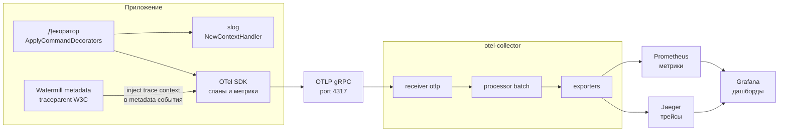

# Глава 14. Observability: три сигнала из одной точки

## Зачем читать

Три часа ночи. Телефон вибрирует. Продавцы пишут в поддержку, что расчёты «зависли». Вы открываете ноутбук — и не видите ничего. CPU спокоен. Memory в норме. В логах тишина, потому что ошибку никто не записал. Трейсов нет вовсе. А ведь тесты были зелёные, CI прошёл, деплой состоялся ещё днём. Система сломана, и единственный источник информации об этом — рассерженные пользователи.

Эта глава о том, как сделать, чтобы в такую ночь у вас были ответы. Мы разберём, почему три сигнала — логи, трейсы и метрики — должны рождаться в одном месте кода, а не размазываться по хендлерам; как сквозной трейс собирает четырёхконтекстную цепочку от молотка через счёт и оплату до расчёта в одну временну́ю шкалу в Jaeger; и какие именно метрики отвечают на главный вопрос дежурного: «где и почему».

Сам этот вопрос — «что я захочу узнать первым в три часа ночи?» — будет сквозной линзой главы. Каждую метрику и каждый сигнал мы проверим им. Если сигнал на него не отвечает, это украшение дашборда, а не инструмент.

---

## Проблема: разрозненная диагностика убивает время

Молодой проект почти всегда выглядит одинаково. Логи пишутся `fmt.Println` там, где разработчику было удобно в момент отладки. Из метрик — CPU и memory, потому что они «красивые» и идут из коробки. Трейсов нет. Пока всё работает, никто не замечает. А потом сага зависает между контекстами — и дежурный читает логи трёх сервисов вручную, восстанавливая причинность по timestamp-ам, как археолог по слоям почвы.

Из этой картины растут три конкретные беды.

Первая — разрыв причинности. HTTP-запрос выставил лот; через минуту упал event handler в settlement. Эти два события связаны напрямую, но без общего trace_id доказать это — упражнение на удачу. В три часа ночи удача обычно не на вашей стороне.

Вторая — тихие деградации. WaterMill retry loop исправно проглатывает ошибки, dead-letter растёт, а система снаружи выглядит здоровой. Дежурный узнаёт о проблеме на пятой жалобе пользователя — то есть от людей, а не от мониторинга. Это худший из возможных источников алертов.

Третья — алерты не на симптомы. Алерт на CPU срабатывает раз в квартал, и обычно зря. Зависшая сага не поднимет его никогда: метрики «возраст незавершённой саги» просто не существует, а значит, не существует и вопроса, на который она отвечает.

Соблазнительный ответ — «добавить побольше логов в хендлеры». Но это лечение симптома. Настоящее решение архитектурное: cross-cutting observability живёт в одном месте, и дальше мы посмотрим, как именно.

---

## Теория: три сигнала и их роли

Полезно думать о трёх сигналах как о врачебной диагностике. Метрики — это пульс и температура: быстрый ответ на вопрос «пациенту плохо?». Трейс — рентгеновский снимок: «где именно?». Логи — история болезни: «что конкретно произошло с этим пациентом?». По отдельности каждый из них полезен ограниченно; сила — в том, что они указывают друг на друга.

**Логи** отвечают на вопрос «что произошло с конкретным запросом». Структурированный JSON с `trace_id`, `correlation_id` и `handler` превращает поиск в точечный запрос, а не в `grep` по тексту наугад.

**Трейсы** отвечают на вопрос «где в цепочке потерялось время или появилась ошибка». Распределённый трейс — это граф спанов с временными метками, и в асинхронной системе он единственный инструмент, показывающий причинность через шину событий.

**Метрики** отвечают на вопрос «что происходит с системой в целом прямо сейчас». Они сжимают тысячи запросов в одно число — и именно по ним строятся алерты.

Ключевая идея — **корреляция**. Запись в логе несёт `trace_id`. Трейс ведёт к конкретному span-у с ошибкой. Метрика показывает, насколько ошибка распространена. Дежурный прыгает между сигналами в три клика, а не в три часа — и в этой фразе нет преувеличения: разница именно такого порядка.

**RED-метод** (Rate / Errors / Duration) на каждый use case — стандартный ответ на вопрос «что мониторить»: сколько запросов в секунду, сколько из них ошибочных, как долго они выполняются. Заметьте: на уровне отдельного хендлера, а не всего сервиса целиком. «Сервис в среднем здоров» — бесполезное знание, когда болит один конкретный use case.

---

## Как в Molot

### Декораторы: один источник для всех трёх сигналов

Центральная идея Molot: cross-cutting concerns не живут в хендлерах. Каждый command/query хендлер проходит через `ApplyCommandDecorators` / `ApplyQueryDecorators` из `internal/common/decorator/decorator.go` — и получает логирование, RED-метрики и трейсинг автоматически, не зная об их существовании.

```go
// internal/common/decorator/decorator.go

// ApplyCommandDecorators wraps handler with tracing (outermost, so log
// records and metrics observe the span context), logging and metrics
// (innermost, measuring pure handler time).
func ApplyCommandDecorators[C any](handler CommandHandler[C], d *Decorators) CommandHandler[C] {
    name := useCaseName[C]()
    return commandTracingDecorator[C]{
        base: commandLoggingDecorator[C]{
            base: commandMetricsDecorator[C]{base: handler, deps: d, name: name},
            deps: d,
            name: name,
        },
        deps: d,
        name: name,
    }
}
```

На что смотреть: вложенность — это матрёшка, и её порядок несёт смысл. Трейсинг — внешняя кукла, метрики — внутренняя, и это не эстетика: когда metrics-декоратор записывает длительность, span-контекст уже установлен, и `trace_id` попадёт в атрибуты. А метрики, будучи внутри, меряют чистое время хендлера, без накладных расходов самих декораторов.

> **Нюанс.** Если поменять трейсинг и метрики местами, ничего не упадёт — ни тест, ни компиляция. Просто метрики тихо потеряют связь со span-контекстом, а вы узнаете об этом через полгода, когда попытаетесь от метрики перейти к трейсу и не сможете. Порядок обёртки — из тех решений, которые стоят одного внимательного ревью один раз, потому что потом их никто не перепроверяет.

Logging-декоратор сидит между ними: он видит span-контекст (через `slog` handler, который читает его из context) и навешивает defer на named error:

```go
// internal/common/decorator/decorator.go

func (d commandLoggingDecorator[C]) Handle(ctx context.Context, cmd C) (err error) {
    logger := handlerLogger(d.deps, d.name)
    defer func() {
        if err != nil {
            logger.ErrorContext(ctx, "command handler failed", slog.Any("error", err))
            return
        }
        logger.InfoContext(ctx, "command handler succeeded")
    }()

    return d.base.Handle(ctx, cmd)
}

func handlerLogger(d *Decorators, name string) *slog.Logger {
    return d.logger.With(
        slog.String("context", d.contextName),
        slog.String("handler", name),
    )
}
```

На что смотреть: `handlerLogger` добавляет `context` (bounded context: «auction», «billing») и `handler` (имя use case: «PlaceBid», «IssueInvoice») к каждой записи. В логах всегда известно, кто именно выполнял работу — без единой строчки в самом хендлере. Named return `err` в сигнатуре — не случайность: без него defer не увидел бы итоговую ошибку.

Tracing-декоратор открывает span с именем `"commands/" + name` — и именно поэтому трейс в Jaeger читается как оглавление `app.Application`: спаны `commands/PlaceBid`, `commands/IssueInvoice`, `queries/AuctionCard`.

```go
// internal/common/decorator/decorator.go

func (d commandTracingDecorator[C]) Handle(ctx context.Context, cmd C) (err error) {
    ctx, span := d.deps.tracer.Start(ctx, "commands/"+d.name)
    defer span.End()

    err = d.base.Handle(ctx, cmd)
    recordSpanResult(span, err)
    return err
}
```

На что смотреть: три строки — `Start`, `defer End`, `recordSpanResult` — это ровно тот код, который иначе копировался бы в каждый хендлер. Здесь он написан один раз и не может быть забыт.

Metrics-декоратор пишет histogram с тремя лейблами: `context`, `handler`, `result` (ok/err). Обратите внимание, чего в лейблах *нет*: никаких UUID, user_id или slug-а ошибки. Это граница кардинальности, и она проведена сознательно — оба лейбла принимают значения из конечных множеств, известных при инициализации.

```go
// internal/common/decorator/decorator.go

func (d commandMetricsDecorator[C]) Handle(ctx context.Context, cmd C) (err error) {
    start := time.Now()
    defer func() {
        d.deps.commandDuration.Record(
            ctx,
            time.Since(start).Seconds(),
            metric.WithAttributes(durationAttributes(d.deps.contextName, d.name, err)...),
        )
    }()

    return d.base.Handle(ctx, cmd)
}

func durationAttributes(contextName, handlerName string, err error) []attribute.KeyValue {
    result := "ok"
    if err != nil {
        result = "err"
    }
    return []attribute.KeyValue{
        attribute.String("context", contextName),
        attribute.String("handler", handlerName),
        attribute.String("result", result),
    }
}
```

На что смотреть: `durationAttributes` — единственное место, где формируются лейблы метрик. Хотите добавить лейбл — придёте сюда, и здесь же вам придётся ответить на вопрос «конечно ли множество значений?». Это удачное сужение: дисциплина кардинальности сосредоточена в одной функции.

Практическое следствие всей конструкции: добавление нового use case — это новый файл в `app/command/`. Ни одной строчки observability-кода. Дашборд появляется сам.

> **Совет из практики.** Используйте это как маркер на ревью: если в PR с новым use case появился вызов логгера, `tracer.Start` или запись метрики — что-то пошло не так, человек продирается мимо декораторов. И наоборот: после мержа откройте Grafana и убедитесь, что новый хендлер появился в переменной `handler` дашборда. Тридцать секунд, которые проверяют всю цепочку от декоратора до Prometheus.

### Домен не логирует. Почему

Доменный код в Molot — stdlib only, без внешних зависимостей. Если бы `auction.Auction.PlaceBid` делал `slog.Info(...)`, домен получил бы зависимость от конкретного логгера, а каждый domain-unit-тест — обязанность этот логгер настраивать. Инверсия зависимостей сломалась бы в самом охраняемом месте.

Но есть и более глубокий аргумент. Домен возвращает ошибки с богатой типизацией — `ErrBidBelowMinimum`, `ErrVerificationRequired`. Это *информация*, а не лог. Превращать её в записи журнала — работа декоратора: он видит ошибку на выходе `Handle` и пишет запись с нужным уровнем. Домен сообщает, что случилось; инфраструктура решает, как об этом рассказать.

Единственное исключение задокументировано явно: `ForbiddenInvoiceAccessError` логируется на уровне WARN в декораторе **до** маппинга в 404. Наружу уходит «invoice-not-found» (анти-enumeration — подробно в главе 15), а в логах остаётся аудит-трейл с реальным `actor` и `debtor` — для безопасников.

### Логи: slog с контекстным обогащением

`internal/common/logs/logs.go` собирает logger один раз: JSON в prod (`LOG_FORMAT=json`), text локально. Но главная деталь — `NewContextHandler`, который оборачивает любой `slog.Handler` и при каждой записи дополняет её атрибутами из context:

```go
// internal/common/logs/logs.go

func (h contextHandler) Handle(ctx context.Context, rec slog.Record) error {
    if id, ok := CorrelationIDFromContext(ctx); ok {
        rec.AddAttrs(slog.String("correlation_id", id))
    }
    if spanCtx := trace.SpanContextFromContext(ctx); spanCtx.IsValid() {
        rec.AddAttrs(
            slog.String("trace_id", spanCtx.TraceID().String()),
            slog.String("span_id", spanCtx.SpanID().String()),
        )
    }
    return h.next.Handle(ctx, rec)
}
```

На что смотреть: два независимых источника обогащения. `trace_id`/`span_id` приходят из OTel span context (его установил tracing-декоратор или otelhttp), `correlation_id` — из Watermill CorrelationID middleware. Ни один хендлер в кодовой базе не пишет эти атрибуты сам — они едут через context, и забыть их невозможно.

### Трейсы: сквозной путь через шину

Самый интересный вопрос в event-driven системе: как трейс выживает при асинхронной передаче? HTTP-запрос завершился, ответ ушёл клиенту, а событие лежит в outbox и будет обработано позже, возможно другой горутиной. Связь, казалось бы, разорвана.

Ответ: W3C `traceparent` header кладётся в metadata сообщения при публикации и извлекается при обработке. `internal/common/watermill/watermill.go` реализует `metadataCarrier`, который адаптирует Watermill `message.Metadata` к интерфейсу `propagation.TextMapCarrier`. Middleware `observe` использует его для Extract:

```go
// internal/common/watermill/watermill.go

func observe(h message.HandlerFunc) message.HandlerFunc {
    return func(msg *message.Message) ([]*message.Message, error) {
        ctx := msg.Context()

        if correlationID := middleware.MessageCorrelationID(msg); correlationID != "" {
            ctx = logs.ContextWithCorrelationID(ctx, correlationID)
        }

        ctx = otel.GetTextMapPropagator().Extract(ctx, metadataCarrier(msg.Metadata))

        handlerName := message.HandlerNameFromCtx(ctx)
        if handlerName == "" {
            handlerName = "unknown"
        }

        ctx, span := otel.Tracer(tracerName).Start(ctx, "events/"+handlerName)
        defer span.End()

        msg.SetContext(ctx)

        produced, err := h(msg)
        // ...
        return produced, err
    }
}
```

На что смотреть: строка с `Extract` — сердце всей сквозной трассировки. Она восстанавливает span context из metadata сообщения, и открываемый следом span становится дочерним к publishing-спану. Один и тот же `traceID` — в HTTP-запросе, в командном хендлере, в outbox publish и в event handler-е Settlement, хотя между ними прошли минуты и границы горутин.

`internal/common/tracing/tracing.go` при инициализации регистрирует W3C composite propagator:

```go
// internal/common/tracing/tracing.go

otel.SetTextMapPropagator(propagation.NewCompositeTextMapPropagator(
    propagation.TraceContext{},
    propagation.Baggage{},
))
```

На что смотреть: без этой регистрации `Extract` выше молча вернёт пустой контекст — и трейсы развалятся на несвязанные куски без единой ошибки в логах. Если у вас «трейс обрывается на шине», первым делом проверяйте, что propagator зарегистрирован.

Итоговая карта спанов для операции «ставка» (из ARCHITECTURE.md §11):

| Слой | Span |
|---|---|
| HTTP-вход | `POST /api/auctions/{auctionID}/bids` (otelhttp + spanRouteNamer) |
| Команда | `commands/PlaceBid` (tracing-декоратор) |
| БД | `db.query`, `db.tx` (otelsql) |
| Outbox publish | `publish auction-events` |
| Event handler | `events/OnAuctionClosedStartSettlement` |
| Фасад саги | `facade/auction.AwardToRunnerUp` |
| PSP | `psp.Charge` (атрибут idempotency_key) |

Путь от молотка через счёт и оплату до расчёта — это один трейс с 67 спанами. В Jaeger видно: Settlement handler стартовал через 12 мс после закрытия аукциона, PSP Charge занял 340 мс, а вся сага от AuctionClosedV1 до ConfirmSettlement — 1.2 с.

Вернёмся к ночному дежурному. Если PSP начинает тормозить, он увидит это на спане `psp.Charge` раньше, чем ухудшится какая-либо RED-метрика команды PayInvoice — потому что трейс показывает конкретный участок цепи, а метрика — только агрегат поверх него. Это и есть разделение труда: метрика будит, трейс показывает где.

### Метрики: каждая отвечает на вопрос дежурного

Прежде чем читать описания, держите в голове критерий из начала главы: каждая метрика существует, потому что отвечает на конкретный вопрос человека, которого разбудил алерт. Не наоборот — не «что мы умеем измерять», а «что нам понадобится узнать».

**`molot_command_duration_seconds{context, handler, result}`** — histogram из metrics-декоратора, рабочая лошадка RED. Три часа ночи, жалобы на «всё медленно» — и три вопроса в голове: сколько PlaceBid в секунду обрабатывает billing (rate)? Где именно появились ошибки — в auction или settlement (errors rate)? Стал ли IssueInvoice медленнее после вчерашнего деплоя (p95/p99)? Grafana-дашборд `molot-contexts-red` строит три панели на каждый тип — rate, error rate, p95/p99 — с переменными `context` и `handler`, сужающими картину до одного use case. Это первый экран, который открывает дежурный.

**`molot_bus_dead_letter_size`** — gauge по таблице `watermill_events_dead_letter` и единственная метрика в системе, у которой нет нормального ненулевого значения. Туда по построению не попадает бизнес-шум — только сообщения, не пережившие 5 ретраев: повреждённые payload-ы и настоящие баги (ARCHITECTURE.md §6.8). Поэтому алерт «> 0 — немедленно» — не перестраховка: если там лежит хоть одно сообщение, где-то уже случилось то, чего случаться не должно, и оно терпеливо ждёт, пока вы заметите. В дашборде `molot-bus-saga` — stat-панель с красным фоном при любом ненулевом значении. Вопрос дежурного здесь бинарный, и это его сила.

**`molot_bus_oldest_message_age_seconds{topic}`** — возраст старейшего необработанного сообщения в outbox по топику. Вопрос дежурного: «шина справляется с текущей нагрузкой?» Растёт — консьюмер не успевает; стоит около нуля — норма. Заметьте, что «размер очереди» ответил бы на тот же вопрос хуже: большая, но быстро движущаяся очередь — не проблема, а маленькая и застывшая — проблема.

**`molot_bus_retries_total{handler}`** — счётчик из middleware `retryCounter`, который сидит между Retry и Recoverer в цепочке:

```go
// internal/common/watermill/watermill.go

retryCounter := func(h message.HandlerFunc) message.HandlerFunc {
    return func(msg *message.Message) ([]*message.Message, error) {
        produced, err := h(msg)
        if err != nil {
            handlerName := message.HandlerNameFromCtx(msg.Context())
            if handlerName == "" {
                handlerName = "unknown"
            }
            retriesTotal.Add(msg.Context(), 1, metric.WithAttributes(
                attribute.String("handler", handlerName),
            ))
        }
        return produced, err
    }
}
```

На что смотреть: счётчик инкрементируется на каждую неудачную попытку, а не на сообщение — поэтому его rate чувствителен к самым ранним признакам деградации. Вопрос дежурного: «есть ли систематические ошибки в каком-то хендлере?» База начала подтормаживать, ретраи пошли — но до dead-letter ещё далеко. Это та самая метрика, которая будит вас за час до настоящего пожара, а не во время него.

**`molot_saga_transitions_total{from, to, reason}`** — counter из settlement repo-адаптера. В норме большинство transitions — из `AwaitingPayment` в `Settled`. Вопрос дежурного (а чаще — продакта утром): «какой процент аукционов не завершается оплатой с первой попытки?» Рост `reason=second_chance_declined` говорит о поведении пользователей; рост переходов из `AwaitingPayment` в `Relisted` с `reason=payment_timeout` — о проблемах с PSP или UX оплаты. Одна метрика, два очень разных диагноза — поэтому лейбл `reason` здесь не роскошь.

**`molot_settlement_nonterminal_age_seconds`** — максимальный возраст саги, не достигшей терминального состояния (Settled / Relisted / FailedUnsold). Вопрос дежурного: «есть ли зависшие саги?» — тот самый вопрос, на который в начале главы некому было ответить. Алерт: > 2×PAYMENT_TERM. В дашборде — stat с оранжевым при 1×PAYMENT_TERM и красным при 2×. Если метрика растёт монотонно — сага застряла: событие потеряно или лежит в dead-letter. Первый шаг расследования прописан заранее: открыть `molot-bus-saga`, проверить dead-letter.

**`molot_worker_due_backlog{worker}`** — накопленный backlog воркеров закрытия (ClosingWorker) и экспирации (ExpiryWorker). Вопрос дежурного: «не накапливаются ли просроченные закрытия, которые блокируют старт саги?» Рост означает, что воркер не успевает обработать все due-аукционы/инвойсы за тик — аукционы формально истекли, но саги по ним ещё даже не начались.

### Pipeline: от приложения до Grafana

Теперь соберём картинку целиком — путь сигналов от приложения до дашбордов и механизм сквозной трассировки через шину:



`internal/common/metrics/metrics.go` и `internal/common/tracing/tracing.go` инициализируют OTLP gRPC экспортеры на один endpoint (local collector). Пакеты намеренно независимы друг от друга (комментарий в `newResource()`) — по той же логике, по которой `Money` дублируется в auction и billing: небольшое дублирование дешевле случайной связности.

`deploy/otel-collector.yaml` описывает pipeline:

```yaml
receivers:
  otlp:
    protocols:
      grpc:
        endpoint: 0.0.0.0:4317

processors:
  batch:

exporters:
  otlp/jaeger:
    endpoint: jaeger:4317
    tls:
      insecure: true
  prometheus:
    endpoint: 0.0.0.0:8889

service:
  pipelines:
    traces:
      receivers: [otlp]
      processors: [batch]
      exporters: [otlp/jaeger]
    metrics:
      receivers: [otlp]
      processors: [batch]
      exporters: [prometheus]
```

На что смотреть: приложение знает один-единственный адрес — OTLP gRPC на 4317. Всё ветвление (трейсы в Jaeger по OTLP, метрики на Prometheus scrape endpoint 8889, дальше Grafana) живёт в конфиге коллектора. Сменить бэкенд наблюдаемости можно, не трогая ни строчки Go-кода.

Go runtime instrumentation (GC pauses, goroutines, heap) стартует в `NewMeterProvider` через `runtime.Start(runtime.WithMeterProvider(provider))` — базовая гигиена, достающаяся бесплатно.

### Readiness: гейтирование на реальном состоянии

`/healthz` — liveness, всегда 200: «процесс жив». `/readyz` — readiness с двумя пробами: ping DB и `router.Running()`. Вторая проба — то, о чём почти все забывают: Watermill router поднимается асинхронно, *после* HTTP-сервера. Пока `router.Running()` не вернул true, event handler-ы не обрабатывают сообщения — и принимать трафик, который генерирует события, попросту рано.

```go
// internal/common/server/server.go

r.Get("/readyz", func(w http.ResponseWriter, req *http.Request) {
    for _, probe := range readiness {
        if err := probe.Check(req.Context()); err != nil {
            logger.WarnContext(req.Context(), "readiness probe failed",
                slog.String("probe", probe.Name), slog.Any("error", err))
            http.Error(w, probe.Name+" not ready", http.StatusServiceUnavailable)
            return
        }
    }
    w.WriteHeader(http.StatusOK)
})
```

На что смотреть: `RegisterHealthEndpoints` принимает slice именованных `ReadinessProbe` — сервер ничего не знает о том, *что* проверяется. Composition root в `cmd/monolith/main.go` передаёт две пробы: `postgres.Ping` и `router.Running`. Появится Redis — добавится третья, без изменения сервера.

> **Где вы на это наступите.** Деплой прошёл, под поднялся, readyz зелёный (он же проверяет только базу) — и Kubernetes направил трафик. Команды выполняются, события исправно ложатся в outbox… и лежат там, потому что router ещё стартует. Через минуту всё «само починилось», и вы списали это на сетевой глюк. Такая плавающая минутная дыра после каждого деплоя — классическая цена отсутствия `router.Running()` в readiness, и без инструментации шины её почти невозможно отловить.

---

## Трейдоффы

Честный разговор о цене принятых решений — потому что цена есть всегда.

**Зависимость от OTel SDK везде.** `internal/common` импортирует `go.opentelemetry.io/otel` — и это осознанный выбор, а не недосмотр. OTel — стандарт отрасли, SDK стабилен, а самописный tracer проигрывает ему по всем осям, включая ту, о которой забывают: его придётся объяснять каждому новому человеку в команде. Трейдофф принят в ADR-0005.

**Вес docker-compose.** Четыре дополнительных контейнера (otel-collector, Jaeger, Prometheus, Grafana) утяжеляют локальный стенд. Для reference-системы цена принята сознательно: наблюдаемость нельзя добавить «потом» — «потом» наступает в три часа ночи.

**Дисциплина кардинальности меток.** `context` и `handler` — конечные множества, определённые при инициализации. Стоит кому-то добавить `auction_id` в лейбл — и cardinality Prometheus взорвётся. Важно понимать природу этого риска: он организационный, не технический. Код не защищает от нарушения автоматически — защищает только договорённость и ревью.

**Отсутствие sampling.** OTLP-экспортер в `tracing.go` использует default `AlwaysSample`. Для production с высоким RPS понадобится `TraceIDRatioBased` sampler или head-based sampling в collector. В Molot это не настроено — reference-система работает на низком RPS, и здесь честнее оставить пробел с пометкой, чем изображать тюнинг, который никто не проверял под нагрузкой.

---

## Типичные ошибки

**Логи `fmt.Println` «для скорости».** Ни формата, ни уровня, ни `trace_id`. В production это означает поиск по тексту руками, невозможность join-а с трейсом и случайный порядок concurrent записей. Самое обидное — цена правильного варианта: замена на `slog.InfoContext` стоит одну строку. Это редкий случай, когда лень не экономит даже время.

**Метрики без лейблов — или с бесконечными лейблами.** Две крайности с одинаковым исходом. Без `context`/`handler` дашборд показывает суммарный rate всего приложения — красиво и бесполезно. С лейблом `auction_id` Prometheus умрёт от исчерпания памяти через час нагрузочного теста. Рабочее правило: лейбл допустим, только если его мощность измеряется десятками, а не тысячами.

**Span в каждом хендлере вручную.** Три строки копипаста — `tracer.Start`, `defer span.End()`, `recordSpanResult` — умножить на 15 хендлеров. Получается 45 мест, где можно забыть `defer`, записать неверный статус или потерять ошибку. Декоратор делает это один раз, корректно, навсегда.

**Алерты на CPU/memory вместо симптомов.** CPU растёт при нагрузке — это здоровая система делает свою работу. Dead-letter > 0 при любой нагрузке — это всегда инцидент. Сага старше 2×PAYMENT_TERM — проблема, никак не связанная с CPU. Алёрты на RED-метрики и бизнес-индикаторы (dead-letter, saga age) будят дежурного до того, как начали жаловаться пользователи, — а это и есть вся разница между инцидентом и репутационной историей.

**`router.Running()` не в readiness probe.** Если readyz смотрит только на ping DB, Kubernetes начнёт лить трафик до готовности Watermill. Запросы придут, команды выполнятся, события лягут в outbox — и застрянут до старта router-а. Та самая плавающая рассинхронизация из врезки выше: без инструментации шины её можно искать неделями.

---

## Чек-лист

- [ ] Все command/query хендлеры обёрнуты `ApplyCommandDecorators` / `ApplyQueryDecorators` — проверить `service/service.go` каждого контекста.
- [ ] `NewContextHandler` используется в `NewLogger` — `trace_id` и `correlation_id` присутствуют в каждой prod-записи.
- [ ] Watermill router использует `observe` middleware — `correlation_id` доступен в event handler-ах.
- [ ] Publisher-обёртка кладёт W3C `traceparent` в metadata сообщения (inject перед публикацией) — иначе трейс оборвётся на шине.
- [ ] `W3C TraceContext + Baggage` зарегистрированы в `otel.SetTextMapPropagator` при инициализации.
- [ ] Лейблы метрик — только конечные множества (`context`, `handler`, `result`). Никаких ID в лейблах.
- [ ] Алерт на `molot_bus_dead_letter_size > 0` настроен и проверен — у этой метрики нет нормального ненулевого значения.
- [ ] Алерт на `molot_settlement_nonterminal_age_seconds > 2×PAYMENT_TERM` настроен.
- [ ] `/readyz` включает `router.Running()` — не только ping DB.
- [ ] Домен не содержит ни одного import логгера или метрик.
- [ ] `ForbiddenInvoiceAccessError` логируется на WARN до маппинга в 404 — audit trail сохраняется.
- [ ] `AlwaysSample` заменён на ratio-based sampler перед выходом в production с высоким RPS.

---

## Ссылки и источники

- **ARCHITECTURE.md §11** — полная карта спанов: слой, имя спана, кто создаёт; таблица метрик с назначением и алертами; readiness endpoint.
- **ADR-0005** (`docs/adr/0005-observability.md`) — решение, трейдоффы, отклонённые альтернативы (только логи, logrus в хендлерах, метрики без трейсинга).
- **BOOK_AUDIT.md правила 47–50** — требования к observability в контракте ревью: правило 47 (cross-cutting в одном месте), 48 (домен без логов), 49 (RED per use case), 50 (операционка: runbook, rollback).
- `internal/common/decorator/decorator.go` — `ApplyCommandDecorators`, `ApplyQueryDecorators`, `commandMetricsDecorator`, `commandTracingDecorator`, `commandLoggingDecorator`.
- `internal/common/logs/logs.go` — `NewLogger`, `NewContextHandler`, `ContextWithCorrelationID`.
- `internal/common/watermill/watermill.go` — `NewRouter`, `observe` middleware, `metadataCarrier`, `retryCounter`.
- `internal/common/tracing/tracing.go` — `NewTracerProvider`, W3C propagator.
- `internal/common/metrics/metrics.go` — `NewMeterProvider`, runtime instrumentation.
- `internal/common/server/server.go` — `RegisterHealthEndpoints`, `ReadinessProbe`, `spanRouteNamer`.
- `deploy/otel-collector.yaml` — pipeline из приложения через collector в Jaeger / Prometheus.
- `deploy/grafana/dashboards/molot-contexts-red.json` — RED-дашборд команд/запросов: rate, error rate, p95/p99 per handler.
- `deploy/grafana/dashboards/molot-bus-saga.json` — дашборд шины и саги: dead-letter (stat + time series), oldest message age, retries by handler, saga transitions, nonterminal age, worker backlog.
